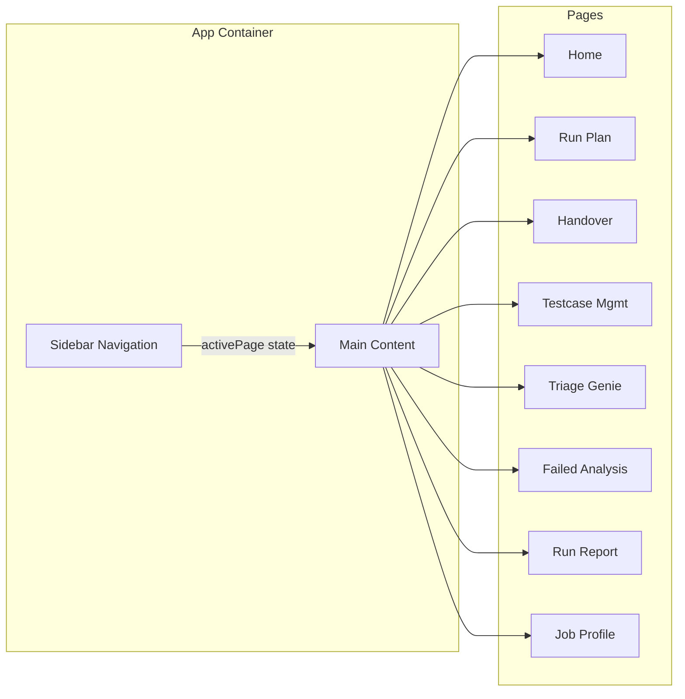
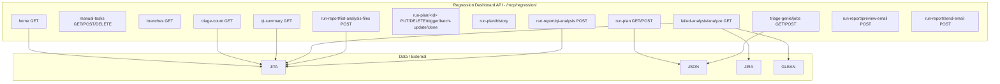
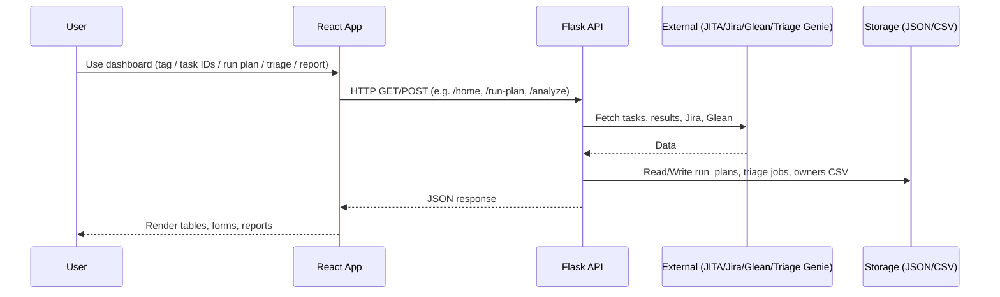
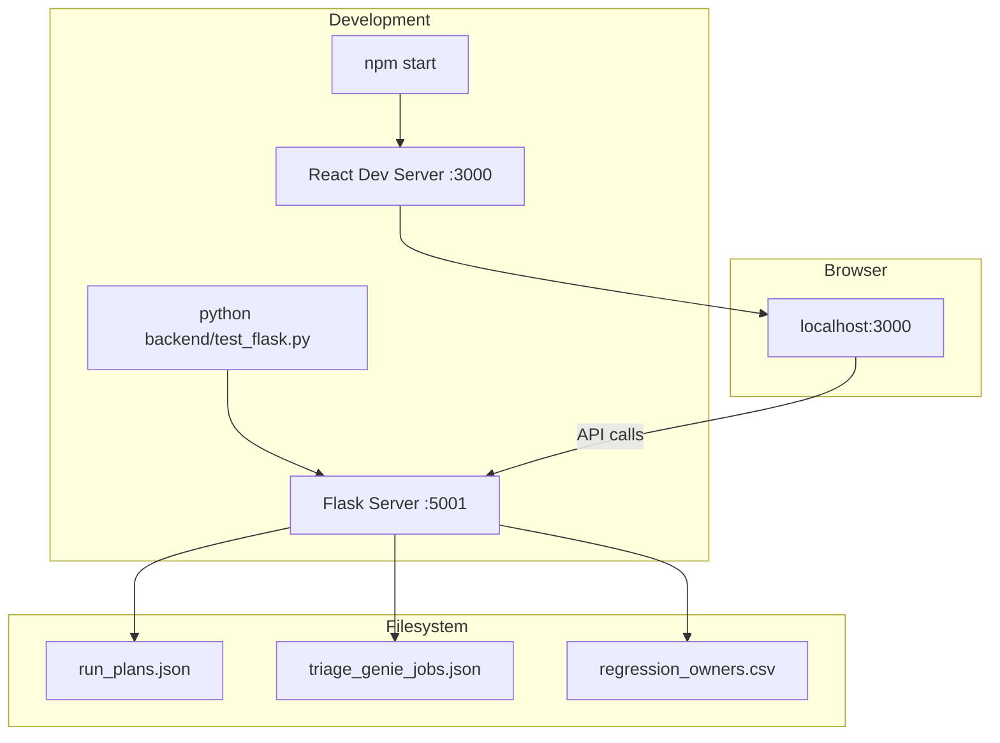
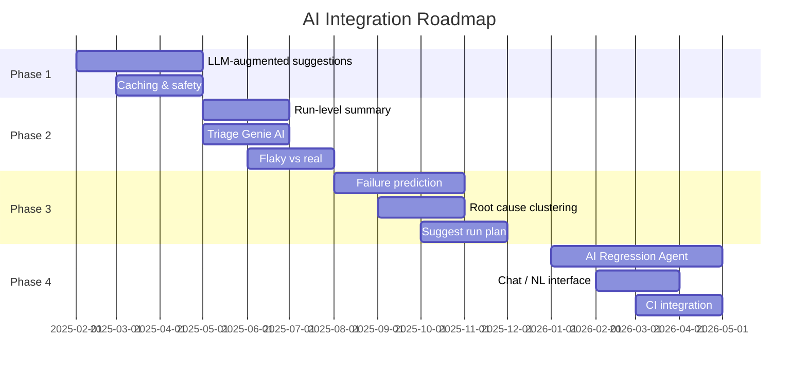

# Regression Dashboard — Project Documentation & Architecture

**Version:** 1.0  
**Last Updated:** February 2025  
**Status:** Living document — current implementation + improvement suggestions + AI roadmap

---

## Table of Contents

1. [Project Overview](#1-project-overview)
2. [Technology Stack](#2-technology-stack)
3. [Features & Modules](#3-features--modules)
4. [Architecture Diagrams](#4-architecture-diagrams)
5. [Improvement Suggestions](#5-improvement-suggestions)
6. [AI Integration Roadmap](#6-ai-integration-roadmap)
7. [Related Documents](#7-related-documents)

---

## 1. Project Overview

The **Regression Dashboard** is a web application for managing and analyzing regression test runs. It provides:

- **Regression overview** by tag or task IDs (Home)
- **Run planning** and scheduling with job profiles
- **Handover** and testcase onboarding
- **Testcase management**
- **Triage Genie** — automated failure triage
- **Failed Testcase Analysis** — rule-based failure analysis with Jira/Glean integration
- **Run Report** — QI analysis, email reports
- **Dynamic Job Profile** — job profile creation

The system follows a **client–server** architecture: a **React** frontend (port 3000) and a **Flask** backend (port 5001), with integrations to JITA/Agave, Jira, Glean, and Triage Genie.

---

## 2. Technology Stack

| Layer        | Technology                    | Purpose                          |
|-------------|-------------------------------|----------------------------------|
| Frontend    | React 19, React Scripts 5     | SPA, UI components               |
| HTTP client | Axios                         | API calls to backend             |
| Styling     | CSS (App.css, page-level CSS) | Layout and theming               |
| Backend     | Flask 3.0, flask-cors         | REST API, CORS                   |
| Data        | pandas, openpyxl              | CSV/Excel, data processing       |
| HTTP        | requests, urllib3             | Outbound API calls               |
| Storage     | JSON files, CSV               | Run plans, triage jobs, owners   |

**External services:** JITA API, Agave/PHX API, Jira API, Glean API, Triage Genie API.

---

## 3. Features & Modules

| Module                    | Route/Page        | Backend APIs (prefix `/mcp/regression/`)     | Description                          |
|---------------------------|-------------------|----------------------------------------------|--------------------------------------|
| Home                      | `home`            | `home`, `manual-tasks`, `branches`, `triage-count`, `qi-summary` | Overview by tag/task IDs, manual tasks, triage/QI |
| Run Plan                  | `run-plan`        | `run-plan`, `run-plan/<id>/trigger`, batch-update, history, clone, delete, tags, search-job-profiles | Scheduling, triggers, history        |
| Handover                  | `handover`        | —                                            | New testcase onboarding (UI)         |
| Testcase Management       | `testcase`        | —                                            | Testcase management (UI)             |
| Triage Genie              | `triage-genie`    | `triage-genie/jobs`                          | Automated failure triage jobs        |
| Failed Testcase Analysis  | `failed-analysis` | `failed-analysis/analyze`                    | Failure stage, classification, Jira/Glean, suggestions |
| Run Report                | `run-report`      | `run-report/list-analysis-files`, `qi-analysis`, `preview-email`, `send-email` | QI analysis, email reports           |
| Dynamic Job Profile       | `job-profile`     | (via run-plan search-job-profiles)           | Job profile creation                 |

---

## 4. Architecture Diagrams

### 4.1 Full System Overview

```mermaid
graph TB
    subgraph "Users"
        U[User / Browser]
    end

    subgraph "Frontend - React (Port 3000)"
        APP[App.jsx]
        HOME[RegressionHome]
        RUNPLAN[RunPlan]
        HANDOVER[Handover]
        TESTCASE[TestcaseManagement]
        TRIAGE[TriageGenie]
        FAILED[FailedTestcaseAnalysis]
        REPORT[RunReport]
        JOBPROFILE[DynamicJobProfile]
        APP --> HOME
        APP --> RUNPLAN
        APP --> HANDOVER
        APP --> TESTCASE
        APP --> TRIAGE
        APP --> FAILED
        APP --> REPORT
        APP --> JOBPROFILE
    end

    subgraph "Backend - Flask (Port 5001)"
        API[test_flask.py]
        API --> R1[/home]
        API --> R2[/manual-tasks]
        API --> R3[/run-plan]
        API --> R4[/triage-genie/jobs]
        API --> R5[/failed-analysis/analyze]
        API --> R6[/run-report/*]
        API --> R7[/branches, triage-count, qi-summary]
    end

    subgraph "Local Storage"
        JSON1[run_plans.json]
        JSON2[triage_genie_jobs.json]
        CSV1[regression_owners.csv]
    end

    subgraph "External Services"
        JITA[JITA / Agave API]
        JIRA[Jira API]
        GLEAN[Glean API]
        TG[Triage Genie API]
    end

    U --> APP
    HOME --> API
    RUNPLAN --> API
    TRIAGE --> API
    FAILED --> API
    REPORT --> API
    API --> JSON1
    API --> JSON2
    API --> CSV1
    API --> JITA
    API --> JIRA
    API --> GLEAN
    API --> TG
```

---

### 4.2 Frontend Structure & Navigation



---

### 4.3 Backend API Map



---

### 4.4 Data Flow — High Level



---

### 4.5 Deployment / Runtime View



---

## 5. Improvement Suggestions

### 5.1 Code & Structure

| Area | Suggestion | Benefit |
|------|------------|--------|
| **Backend size** | Split `test_flask.py` into blueprints or modules (e.g. `routes/home.py`, `routes/run_plan.py`, `routes/failed_analysis.py`, `services/jira.py`, `services/glean.py`) | Easier maintenance, testing, and onboarding |
| **Configuration** | Move all config to environment variables or a config module (base URLs, tokens, limits, ports); avoid hardcoded `HEADERS`, `JITA_BASE`, etc. | Security, different environments (dev/stage/prod) |
| **API base URL** | Use a single base URL in frontend (e.g. `process.env.REACT_APP_API_URL` or `config.js`) instead of hardcoding `http://localhost:5001` in each component | Easier deployment and env switching |
| **Duplication** | Remove duplicate `useEffect` in `App.jsx` (two identical `setActivePage` listeners) | Cleaner code, no confusion |

### 5.2 Security

| Area | Suggestion | Benefit |
|------|------------|--------|
| **Secrets** | Never commit tokens; use `TRIAGE_GENIE_TOKEN`, `JIRA_TOKEN`, `GLEAN_TOKEN` (or similar) from env; document in README | No leaked credentials |
| **CORS** | Restrict CORS in production to known frontend origins instead of open `CORS(app)` | Reduce cross-origin abuse |
| **Auth** | Add authentication/authorization for API (e.g. API key, JWT, or SSO) so only authorized users can access regression data | Access control |

### 5.3 Testing & Quality

| Area | Suggestion | Benefit |
|------|------------|--------|
| **Backend tests** | Add pytest (or similar) for critical endpoints: home, run-plan, failed-analysis, run-report | Regression safety, refactoring confidence |
| **Frontend tests** | Add unit tests for key components (e.g. RegressionHome, RunPlan, FailedTestcaseAnalysis) and integration tests for critical flows | Fewer UI regressions |
| **Linting** | Use ESLint and Prettier in frontend; use flake8/black/ruff in backend | Consistent style and early bug detection |

### 5.4 User Experience & Frontend

| Area | Suggestion | Benefit |
|------|------------|--------|
| **Loading & errors** | Consistent loading indicators and error messages (and retry) for all API calls | Clear feedback, fewer “blank” states |
| **Routing** | Use React Router so each page has a URL (e.g. `/run-plan`, `/failed-analysis`); preserve state on refresh | Shareable links, better navigation |
| **State** | Consider React Context or a small state library for shared data (e.g. selected tag, run plan id) instead of only local state and localStorage | Less prop drilling, clearer data flow |

### 5.5 Performance & Scalability

| Area | Suggestion | Benefit |
|------|------------|--------|
| **Pagination** | Use cursor/offset pagination for large lists (e.g. run plan history, failed tests) and lazy load or virtualize long tables | Faster first load, less memory |
| **Caching** | Cache Jira/Glean responses or analysis results (in-memory or Redis) with TTL for repeated tag/task queries | Lower latency, fewer external calls |
| **Async** | For long-running operations (e.g. full analysis, report generation), use background jobs (Celery, RQ) and poll status or WebSockets | No timeouts, better UX |

### 5.6 Data & Storage

| Area | Suggestion | Benefit |
|------|------------|--------|
| **Persistence** | Replace or supplement JSON/CSV with a proper DB (e.g. SQLite for single instance, PostgreSQL for multi-instance) for run plans, triage jobs, and metadata | Durability, queries, backups |
| **Schema** | Version run_plans and triage_genie_jobs schema; support migration if format changes | Safe evolution of stored data |

### 5.7 Observability

| Area | Suggestion | Benefit |
|------|------------|--------|
| **Logging** | Structured logging (JSON) with request id, user/tag, and duration for key endpoints | Easier debugging and analytics |
| **Health** | Add `/health` or `/mcp/regression/health` that checks DB/disk and optionally external services | Monitoring and alerting |
| **Metrics** | Expose basic metrics (request count, latency, error rate) for critical routes | Capacity planning and SLOs |

---

## 6. AI Integration Roadmap

This section suggests a phased plan for integrating AI into the Regression Dashboard. It aligns with the existing “Phase-2 (Coming Soon): AI Regression Agent” idea in the sidebar.

### 6.1 Current State

- **Failed Testcase Analysis** uses a **rule-based** engine: keyword matching, scoring, and templates for failure stage, issue classification, Jira validation, and suggestions.
- **No LLM or ML models** today; “AI” in the UI refers to automated, rule-based intelligence.
- See `AI_Suggestion_Implementation_Guide.md` and `Architecture_and_Enhancement_Plan.md` for detailed current behavior and diagrams.

### 6.2 Phase 1 — LLM-Augmented Suggestions (Short-term, 1–3 months)

| Goal | Actions | Outcome |
|------|--------|--------|
| **Hybrid suggestions** | Keep existing rules for simple cases; call an LLM (OpenAI/Claude/Ollama) for complex or ambiguous failures. Send context: exception summary, stack trace snippet, Jira summary, issue type. | Richer, context-aware suggestions without replacing current logic. |
| **Prompt engineering** | Maintain a small set of prompts (e.g. “suggest fix for test failure”) and version them. Include few-shot examples from past triages. | Stable quality and easier iteration. |
| **Safety** | Sanitize inputs to LLM (no PII/secrets); cap token usage; fallback to rule-based suggestion on LLM failure or timeout. | Safe and reliable UX. |
| **Caching** | Cache LLM responses by a hash of (exception_summary + issue_type + jira_summary) with TTL to reduce cost and latency. | Cost control and faster repeat queries. |

**Deliverables:** Optional LLM toggle in Failed Testcase Analysis; backend flag or env to enable/disable LLM path; logging of LLM usage.

### 6.3 Phase 2 — Smarter Triage & Summarization (3–6 months)

| Goal | Actions | Outcome |
|------|--------|--------|
| **Run-level summary** | After collecting failed test analysis, call LLM to produce a short “run summary” (main themes, suggested owners, top 3 actions). | Quick human-readable overview for Run Report and Home. |
| **Triage Genie integration** | Use LLM to suggest Jira ticket title/description or link to existing ticket from exception + test name. | Faster, more consistent triage. |
| **Flaky vs real failure** | Use LLM or a small classifier (e.g. “flaky” vs “real” from history) to tag failures; surface in UI. | Better prioritization. |

**Deliverables:** Run summary in Run Report and/or Home; optional AI-assisted triage in Triage Genie; flaky/real badge in Failed Testcase Analysis or Home.

### 6.4 Phase 3 — Predictive & Proactive (6–12 months)

| Goal | Actions | Outcome |
|------|--------|--------|
| **Failure prediction** | Train a lightweight model (or use LLM over historical data) to predict “likely to fail” tests per branch/tag based on code/config changes and past runs. | Proactive alerts or “risk score” on Run Plan. |
| **Root cause clustering** | Group failures by root cause (e.g. embedding + clustering or LLM-based grouping) and suggest a single Jira or fix for a cluster. | Less duplicate triage. |
| **Recommendations** | “Suggest run plan” or “suggest tests to run” based on changed files and past failures (LLM or retrieval). | Smarter Run Plan and resource use. |

**Deliverables:** Risk or “likely to fail” indicator; root-cause groups in Failed Testcase Analysis; optional “suggest run plan” in Run Plan.

### 6.5 Phase 4 — Full “AI Regression Agent” (12+ months)

| Goal | Actions | Outcome |
|------|--------|--------|
| **Agent loop** | An agent that can: read run results → analyze failures → suggest/create Jira tickets → suggest code/test changes (with links to Glean/docs). | One place to “ask” the dashboard to triage and suggest next steps. |
| **Chat / natural language** | Allow questions like “Why did test X fail on branch Y?” or “Summarize last week’s regressions”; answer using analysis + LLM. | Easier for new users and ad-hoc analysis. |
| **CI integration** | Webhook or API for CI: post run results, get back summary + suggested actions; optional auto-create Jira or comments. | Regression intelligence inside pipeline. |

**Deliverables:** Agent API and optional UI (chat or “Ask Agent”); CI integration doc and reference implementation.

### 6.6 AI Roadmap — Visual Timeline



### 6.7 Dependencies & Prerequisites

- **API keys:** OpenAI/Anthropic or self-hosted LLM (e.g. Ollama) and secure storage (env/secrets manager).
- **Infra:** Optional queue (Celery/Redis) for async LLM calls in Phase 2+; optional vector DB if you add semantic search.
- **Governance:** Review usage, cost, and PII; ensure prompts and model outputs align with security and compliance.

---

## 7. Related Documents

| Document | Content |
|----------|--------|
| **README.md** | Setup, run instructions, npm scripts, environment variables. |
| **Architecture_Diagrams.md** | Mermaid diagrams focused on **Failed Testcase Analysis** (data flow, analysis engine, external APIs, future phases, scalability). |
| **Architecture_and_Enhancement_Plan.md** | Detailed current architecture, component tables, data flow, and enhancement plan for Failed Testcase Analysis. |
| **AI_Suggestion_Implementation_Guide.md** | How the rule-based “AI” suggestion works, code structure, and how to enhance it with real LLM/AI. |

For **Failed Testcase Analysis** specifically, use the diagrams and tables in **Architecture_Diagrams.md** and **Architecture_and_Enhancement_Plan.md**. This document gives the **full project** view, **improvement suggestions**, and a **high-level AI integration roadmap** that can be refined with your team and priorities.
