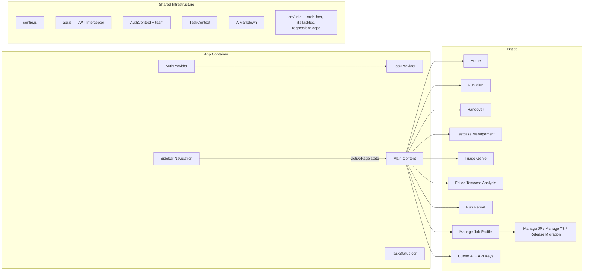
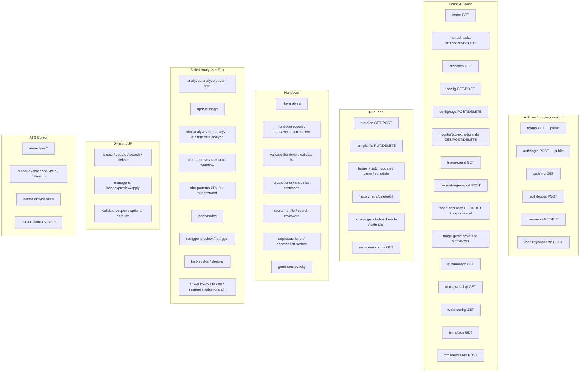
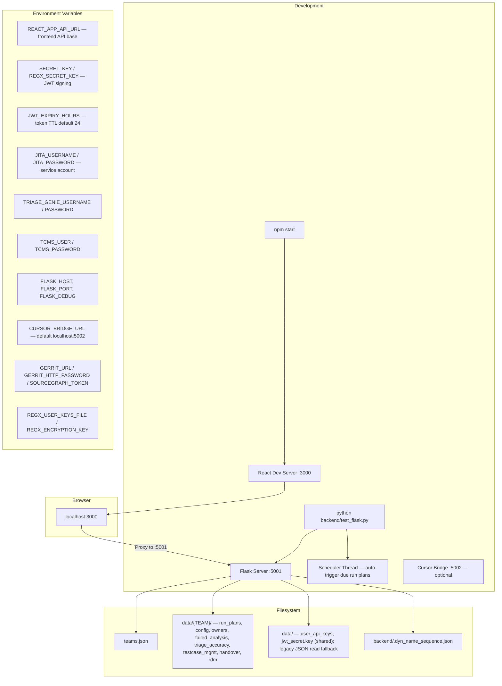
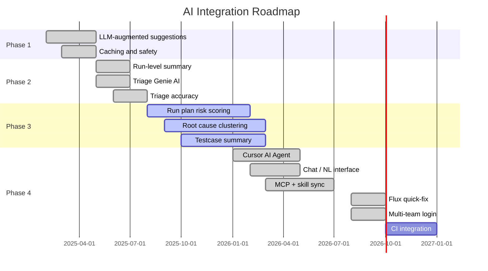

# Regression Dashboard — Project Documentation & Architecture

**Version:** 3.0  
**Last Updated:** September 2026  
**Status:** Living document — current implementation + improvement suggestions + AI roadmap

---

## Table of Contents

1. [Project Overview](#1-project-overview)
2. [Technology Stack](#2-technology-stack)
3. [Features & Modules](#3-features--modules)
4. [Architecture Diagrams](#4-architecture-diagrams)
5. [Authentication & Multi-Team](#5-authentication--multi-team)
6. [Improvement Suggestions](#6-improvement-suggestions)
7. [AI Integration Roadmap](#7-ai-integration-roadmap)
8. [Related Documents](#8-related-documents)

---

## 1. Project Overview

The **Regression Dashboard** (RegX-AI) is a web application for managing and analyzing regression test runs. It provides:

- **Regression overview** by tag or task IDs (Home) with triage counts, owner triage report, QI summary, triage accuracy, Triage Genie coverage, extra task IDs per tag, and TCMS overall QI
- **Run planning** and scheduling with job profiles, calendar view, bulk triggers, batch image updates, and automated scheduling
- **Handover** — new-testcase onboarding from JITA results: LST file suggest/search, Jira validation, Gerrit CR create/deprecate, and handover records
- **Testcase management** — browse, tag, resolve job profiles, and download resource specs via TCMS
- **Triage Genie** — automated failure triage jobs (prefill from Run Plan)
- **Failed Testcase Analysis** — rule-based and AI-powered failure analysis with RDM skill triage, pattern management, streaming results, saved tags, retrigger, Jarvis nodes, and Flux Jira quick-fix
- **Run Report** — QI analysis, email preview and sending
- **Manage Job Profile** — create/clone/update job profiles and test sets, bulk-manage JP/TS, coupon validation, and **release migration** of JPs to a new NOS version
- **Cursor AI** — interactive AI chat with multi-model/mode support, per-user API keys, skill sync from Sourcegraph, and MCP server integration
- **AI Analysis** — bulk issue analysis, deep triage, owner ticket lookup, testcase summarization, and run plan risk scoring

The system follows a **client–server** architecture: a **React** frontend (port 3000) and a **Flask** backend (port 5001), with **LDAP + JWT authentication**, **team-scoped login**, and integrations to JITA/Agave/PHX, TCMS, Jira, Glean, Triage Genie, Gerrit, Sourcegraph, Flux, and Cursor SDK MCP servers.

---

## 2. Technology Stack

| Layer | Technology | Purpose |
|-------|-----------|---------|
| Frontend | React 19, React Scripts 5 | SPA, UI components |
| HTTP client | Axios (centralized `src/api.js` with JWT interceptor) | Authenticated API calls to backend |
| Markdown | react-markdown, remark-gfm | Render AI/markdown responses |
| Excel | xlsx (SheetJS) | Excel export in Testcase Management and Triage Accuracy |
| Styling | CSS (`App.css`, page-level CSS) | Layout and theming |
| State | React Context (`AuthContext`, `TaskContext`) | Auth + team, background task tracking |
| Config | `src/config.js` (`REACT_APP_API_URL`, JITA web URLs) | Centralized API / JITA manage URLs |
| Backend | Flask 3.0, flask-cors | REST API, CORS |
| Auth | ldap3, PyJWT | LDAP authentication, JWT token management |
| Secrets | cryptography (Fernet) | Encrypted per-user API keys |
| Data | pandas, openpyxl | CSV/Excel, data processing |
| HTTP | requests, urllib3 | Outbound API calls |
| Email | smtplib (stdlib) | Send run report emails |
| Storage | JSON files, CSV | Team-scoped run plans/config, analysis caches, owners |
| Tests | pytest (`backend/tests/`), Jest/CRA (`src/**/*.test.jsx`) | Backend helpers/routes and frontend page tests |

**External services:** JITA / Agave / PHX, TCMS, Jira, Glean, Triage Genie, Gerrit, Sourcegraph, Flux, LDAP / Active Directory, Cursor Bridge + MCP servers.

---

## 3. Features & Modules

| Module | Route/Page | Backend APIs (prefix `/mcp/regression/`) | Description |
|--------|-----------|------------------------------------------|-------------|
| Home | `home` | `home`, `manual-tasks`, `branches`, `config`, `config/tags`, `config/tag-extra-task-ids`, `triage-count`, `owner-triage-report`, `triage-accuracy`, `triage-accuracy/export-excel`, `triage-genie-coverage`, `qi-summary`, `tcms-overall-qi`, `team-config`, `tcms/tags`, `tcms/testcases` | Overview by tag/task IDs, extra task IDs, owner triage table, triage/QI, coverage, TCMS QI |
| Run Plan | `run-plan` | `run-plan`, `run-plan/<id>` (PUT/DELETE), `run-plan/<id>/trigger`, `run-plan/<id>/batch-update`, `run-plan/<id>/history`, `run-plan/<id>/clone`, `run-plan/<id>/schedule`, `run-plan/<id>/delete-tag`, `run-plan/search-job-profiles`, `run-plan/tags`, `run-plan/bulk-trigger`, `run-plan/bulk-schedule`, `run-plan/calendar`, `run-plan/history/<id>/retry`, `run-plan/history/<id>` (DELETE), `run-plan/history/<id>/kill`, `run-plan/service-accounts` | Scheduling, triggers, batch image update, history retry/kill, calendar, bulk ops |
| Handover | `handover` | `jita-analysis`, `handover-record`, `handover-record-delete`, `validate-jira-ticket`, `validate-lst`, `search-reviewers`, `gerrit-connectivity`, `create-lst-cr`, `check-lst-testcases`, `search-lst-file`, `deprecate-lst-cr`, `deprecation-search` | Onboard passing tests into LST files via Gerrit CR; deprecate old entries; persist handover records |
| Testcase Management | `testcase` | `testcase-mgmt/fetch-data`, `testcase-mgmt/testcases`, `testcase-mgmt/tags/add`, `testcase-mgmt/tags/delete`, `testcase-mgmt/resource-spec/download`, `testcase-mgmt/resolve-job-profiles`, `testcase-mgmt/branches` | Browse testcases, tag management, resource spec download, job profile resolution via TCMS |
| Triage Genie | `triage-genie` | `triage-genie/jobs` (GET/POST) | Automated failure triage jobs with prefill from Run Plan |
| Failed Testcase Analysis | `failed-analysis` | `analyze`, `analyze-stream`, `update-triage`, `rdm-analyze`, `rdm-analyze-ai`, `rdm-skill-analyze`, `rdm-approve`, `rdm-auto-workflow`, `rdm-patterns` (GET/PUT), `rdm-patterns/suggest`, `rdm-patterns/add`, `jarvis/nodes` (GET/PUT), `ai-summary-single`, `glean-search-single`, `history`, `saved-tags`, `saved-tags/<tag>/results`, `retrigger-preview`, `retrigger`, `first-level-ai`, `deep-ai` | Rule-based + AI analysis, SSE, RDM skill/auto workflow, patterns, retrigger, Flux quick-fix |
| Flux Quick Fix | (Failed Analysis) | `flux/quick-fix`, `flux/tickets/<id>`, `flux/tickets/<id>/resume`, `flux/nutest-branch` | Queue/resume Flux Jira auto-fix using user Flux + Cursor/Gerrit keys (never sent to the browser) |
| Run Report | `run-report` | `run-report/list-analysis-files`, `qi-analysis`, `preview-email`, `send-email` | QI analysis, email preview and sending |
| Manage Job Profile | `job-profile` | `dynamic-jp/test-execution-history`, `testcase-history`, `check-existing`, `fetch-testset`, `resolve-names`, `search-node-pools`, `search-branches`, `search-clusters`, `validate-coupon`, `optional-defaults`, `create`, `update`, `search`, `delete`, `manage-ts/inspect`, `manage-ts/preview`, `manage-ts/apply` | Create/clone JPs and test sets; bulk-delete; bulk TS arg edits; **release migration** (embedded `ReleaseMigration` reuses `search` + `create`) |
| Cursor AI | `cursor-ai` | `cursor-ai/analyze-testcase`, `analyze-batch`, `status/<job_id>`, `result`, `follow-up`, `chat`, `mcp-servers`, `sync-skills`; `user-keys`, `user-keys/validate` | Chat (Agent/Plan/Debug/Ask), skill sync, MCP toggles, per-user API keys in settings |
| AI Analysis | (cross-cutting) | `ai-analysis/bulk-issues`, `deep-triage`, `owner-tickets`, `testcase-summary`, `run-plan-risk`, `jira-ticket-details` | Bulk issue analysis, deep triage, owner tickets, testcase summary, run plan risk |
| Authentication | (login gate) | `teams` (GET, no JWT), `auth/login`, `auth/me`, `auth/logout` | Team list for login dropdown; LDAP login; JWT with `team`; session management |

Sidebar navigation is defined in `src/App.jsx`. **Manage JP / TS is not a separate top-level page**; create, Manage JP, Manage TS, and Release Migration are sub-views of **Manage Job Profile**.

---

## 4. Architecture Diagrams

### 4.1 Full System Overview

```mermaid
graph TB
    subgraph "Users"
        U[User / Browser]
    end

    subgraph "Frontend - React (Port 3000)"
        APP[App.jsx]
        AUTH_GATE[AppGate — Auth Guard]
        LOGIN[LoginPage + team dropdown]
        DASH[Dashboard]
        AUTH_GATE --> LOGIN
        AUTH_GATE --> DASH
        APP --> AUTH_GATE
        DASH --> HOME[RegressionHome]
        DASH --> RUNPLAN[RunPlan]
        DASH --> HANDOVER[Handover]
        DASH --> TESTCASE[TestcaseManagement]
        DASH --> TRIAGE[TriageGenie]
        DASH --> FAILED[FailedTestcaseAnalysis]
        DASH --> REPORT[RunReport]
        DASH --> JOBPROFILE[DynamicJobProfile]
        JOBPROFILE --> MANAGEJP[ManageJobProfile]
        JOBPROFILE --> MANAGETS[ManageTestSets]
        JOBPROFILE --> RELMIG[ReleaseMigration]
        DASH --> CURSORAI[CursorAI]
        CURSORAI --> KEYS[KeyManagementPanel]
    end

    subgraph "Frontend Infrastructure"
        CONFIG[config.js — API_BASE_URL]
        API_CLIENT[api.js — Axios + JWT Interceptor]
        AUTH_CTX[AuthContext — login/logout/user/team]
        TASK_CTX[TaskContext — background tasks]
    end

    subgraph "Backend - Flask (Port 5001)"
        FLASK[test_flask.py]
        AUTH_MOD[auth.py — LDAP + JWT + team]
        KEYS_MOD[user_keys.py / key_manager.py]
        FLUX[flux_client.py]
        OWNERS[regression_owners.py]
        AGENTS[backend/agents]
        FLASK --> AUTH_MOD
        FLASK --> KEYS_MOD
        FLASK --> FLUX
        FLASK --> OWNERS
        FLASK --> AGENTS
        FLASK --> R_AUTH[/auth/*, /teams]
        FLASK --> R_HOME[/home, /config, /branches, /owner-triage-report]
        FLASK --> R_RUNPLAN[/run-plan/*]
        FLASK --> R_HANDOVER[/jita-analysis, /create-lst-cr, ...]
        FLASK --> R_FAILED[/failed-analysis/*, /flux/*]
        FLASK --> R_DYNAMIC[/dynamic-jp/*]
        FLASK --> R_AI[/ai-analysis/*, /cursor-ai/*, /user-keys]
        FLASK --> SCHEDULER[Run Plan Scheduler Thread]
    end

    subgraph "Local Storage"
        TEAMS[teams.json]
        TEAMDIR["data/{TEAM}/ — run_plans, config, triage jobs, owners CSV"]
        SHARED["data/ — failed analysis, triage accuracy, testcase mgmt, user keys"]
        SEQ[backend/.dyn_name_sequence.json]
    end

    subgraph "External Services"
        JITA[JITA / Agave / PHX]
        TCMS[TCMS]
        JIRA[Jira]
        GLEAN[Glean]
        TG[Triage Genie]
        GERRIT[Gerrit]
        SG[Sourcegraph]
        FLUXAPI[Flux]
        LDAP[LDAP / Active Directory]
        CURSOR_MCP[Cursor Bridge + MCP]
    end

    U --> APP
    HOME --> API_CLIENT
    RUNPLAN --> API_CLIENT
    HANDOVER --> API_CLIENT
    FAILED --> API_CLIENT
    JOBPROFILE --> API_CLIENT
    CURSORAI --> API_CLIENT
    API_CLIENT --> FLASK
    AUTH_MOD --> TEAMS
    FLASK --> TEAMDIR
    FLASK --> SHARED
    FLASK --> SEQ
    AUTH_MOD --> LDAP
    FLASK --> JITA
    FLASK --> TCMS
    FLASK --> JIRA
    FLASK --> GLEAN
    FLASK --> TG
    FLASK --> GERRIT
    FLASK --> SG
    FLUX --> FLUXAPI
    FLASK --> CURSOR_MCP
```

---

### 4.2 Frontend Structure & Navigation

```mermaid
graph LR
    subgraph "App Container"
        AUTH_PROVIDER[AuthProvider]
        TASK_PROVIDER[TaskProvider]
        SIDEBAR[Sidebar Navigation]
        MAIN[Main Content]
        TASK_ICON[TaskStatusIcon]
    end

    subgraph "Shared Infrastructure"
        CONFIG[config.js]
        API[api.js — JWT Interceptor]
        AUTH_CTX[AuthContext + team]
        TASK_CTX[TaskContext]
        AI_MD[AiMarkdown]
        UTILS[src/utils — authUser, jitaTaskIds, regressionScope]
    end

    subgraph "Pages"
        P1[Home]
        P2[Run Plan]
        P3[Handover]
        P4[Testcase Management]
        P5[Triage Genie]
        P6[Failed Testcase Analysis]
        P7[Run Report]
        P8[Manage Job Profile]
        P8A[Manage JP / Manage TS / Release Migration]
        P9[Cursor AI + API Keys]
    end

    AUTH_PROVIDER --> TASK_PROVIDER
    SIDEBAR -->|activePage state| MAIN
    MAIN --> P1
    MAIN --> P2
    MAIN --> P3
    MAIN --> P4
    MAIN --> P5
    MAIN --> P6
    MAIN --> P7
    MAIN --> P8
    P8 --> P8A
    MAIN --> P9
```

---

### 4.3 Backend API Map

```mermaid
graph TD
    subgraph "Auth — /mcp/regression/"
        TEAMS[teams GET — public]
        AUTH_LOGIN[auth/login POST — public]
        AUTH_ME[auth/me GET]
        AUTH_LOGOUT[auth/logout POST]
        USER_KEYS[user-keys GET/PUT]
        USER_KEYS_V[user-keys/validate POST]
    end

    subgraph "Home & Config"
        A[home GET]
        B[manual-tasks GET/POST/DELETE]
        C[branches GET]
        CFG[config GET/POST]
        CFG_TAGS[config/tags POST/DELETE]
        CFG_X[config/tag-extra-task-ids GET/POST/DELETE]
        D[triage-count GET]
        OTR[owner-triage-report POST]
        TA[triage-accuracy GET/POST + export-excel]
        TGC[triage-genie-coverage GET/POST]
        E[qi-summary GET]
        OQI[tcms-overall-qi GET]
        TC[team-config GET]
        TCMS_T[tcms/tags GET]
        TCMS_TC[tcms/testcases POST]
    end

    subgraph "Run Plan"
        F[run-plan GET/POST]
        G[run-plan/id PUT/DELETE]
        G2[trigger / batch-update / clone / schedule]
        H[history retry/delete/kill]
        F4[bulk-trigger / bulk-schedule / calendar]
        F7[service-accounts GET]
    end

    subgraph "Handover"
        HO1[jita-analysis]
        HO2[handover-record / handover-record-delete]
        HO3[validate-jira-ticket / validate-lst]
        HO4[create-lst-cr / check-lst-testcases]
        HO5[search-lst-file / search-reviewers]
        HO6[deprecate-lst-cr / deprecation-search]
        HO7[gerrit-connectivity]
    end

    subgraph "Failed Analysis + Flux"
        J[analyze / analyze-stream SSE]
        J3[update-triage]
        J4[rdm-analyze / rdm-analyze-ai / rdm-skill-analyze]
        J5[rdm-approve / rdm-auto-workflow]
        J8[rdm-patterns CRUD + suggest/add]
        J13[jarvis/nodes]
        J12[retrigger-preview / retrigger]
        J14[first-level-ai / deep-ai]
        FX[flux/quick-fix / tickets / resume / nutest-branch]
    end

    subgraph "Dynamic JP"
        DJ9[create / update / search / delete]
        DJ13[manage-ts inspect/preview/apply]
        DJ14[validate-coupon / optional-defaults]
    end

    subgraph "AI & Cursor"
        AI1[ai-analysis/*]
        C1[cursor-ai/chat / analyze-* / follow-up]
        C8[cursor-ai/sync-skills]
        C7[cursor-ai/mcp-servers]
    end
```

---

### 4.4 Data Flow — High Level

```mermaid
sequenceDiagram
    participant U as User
    participant L as LoginPage
    participant R as React App (api.js + JWT)
    participant F as Flask API
    participant AD as LDAP / Active Directory
    participant E as External (JITA/TCMS/Jira/Glean/Gerrit/Flux/MCP)
    participant S as Storage (data/{TEAM} + data/)

    U->>L: Enter LDAP credentials + team
    L->>F: GET /teams
    F-->>L: teams + default_team
    L->>F: POST /auth/login {username, password, team}
    F->>AD: LDAP bind + attribute lookup
    AD-->>F: User info
    F-->>L: JWT (includes team) + user
    L->>R: Store token in localStorage

    U->>R: Use dashboard
    R->>F: HTTP with Authorization: Bearer JWT
    F->>F: jwt_required sets g.current_user and g.team
    F->>E: Fetch tasks, Jira, Glean, TCMS, Gerrit, Flux, MCP
    E-->>F: Data
    F->>S: Team-scoped run plans/config; shared analysis caches
    F-->>R: JSON (or SSE for analyze-stream)
    R-->>U: Render tables, forms, reports, AI responses
```

---

### 4.5 Authentication Flow

```mermaid
sequenceDiagram
    participant B as Browser
    participant AC as AuthContext
    participant API as api.js (Axios)
    participant F as Flask /auth/* and /teams
    participant AD as LDAP Server
    participant JWT as JWT Module (auth.py)

    Note over B,JWT: Login Flow
    B->>F: GET /teams
    F-->>B: teams.json list
    B->>AC: login(username, password, team)
    AC->>F: POST /auth/login {username, password, team}
    F->>AD: LDAP bind
    AD-->>F: Success + user attributes
    F->>JWT: create_jwt(..., team=team)
    JWT-->>F: JWT (HS256, 24h expiry, team claim)
    F->>F: Cache LDAP password for JITA passthrough
    F-->>AC: {token, user including team}
    AC->>B: Store token in localStorage

    Note over B,JWT: Subsequent Requests
    B->>API: Any API call
    API->>API: Interceptor attaches Authorization: Bearer
    API->>F: Request with JWT
    F->>JWT: decode_jwt
    JWT-->>F: Payload; g.team from claim (validated against teams.json)
    F-->>API: Response
    API->>API: On 401: clear token, reload → LoginPage
```

---

### 4.6 Deployment / Runtime View

```mermaid
graph TB
    subgraph "Development"
        NPM[npm start]
        PY[python backend/test_flask.py]
        NPM --> REACT[React Dev Server :3000]
        PY --> FLASK[Flask Server :5001]
        PY --> SCHEDULER[Scheduler Thread — auto-trigger due run plans]
        BRIDGE[Cursor Bridge :5002 — optional]
    end

    subgraph "Browser"
        REACT --> BROWSER[localhost:3000]
        BROWSER -->|Proxy to :5001| FLASK
    end

    subgraph "Environment Variables"
        ENV1[REACT_APP_API_URL — frontend API base]
        ENV2[SECRET_KEY / REGX_SECRET_KEY — JWT signing]
        ENV3[JWT_EXPIRY_HOURS — token TTL default 24]
        ENV4[JITA_USERNAME / JITA_PASSWORD — service account]
        ENV5[TRIAGE_GENIE_USERNAME / PASSWORD]
        ENV6[TCMS_USER / TCMS_PASSWORD]
        ENV7[FLASK_HOST, FLASK_PORT, FLASK_DEBUG]
        ENV8[CURSOR_BRIDGE_URL — default localhost:5002]
        ENV9[GERRIT_URL / GERRIT_HTTP_PASSWORD / SOURCEGRAPH_TOKEN]
        ENV10[REGX_USER_KEYS_FILE / REGX_ENCRYPTION_KEY]
    end

    subgraph "Filesystem"
        FLASK --> teams_json[teams.json]
        FLASK --> team_dir["data/{TEAM}/ — run_plans, config, owners, failed_analysis, triage_accuracy, testcase_mgmt, handover, rdm"]
        FLASK --> data_dir["data/ — user_api_keys, jwt_secret.key (shared); legacy JSON read fallback"]
        FLASK --> dyn_seq["backend/.dyn_name_sequence.json"]
    end
```

---

## 5. Authentication & Multi-Team

### 5.1 Overview

The dashboard uses **LDAP (Active Directory) authentication** with **JWT tokens** for session management. Login also requires a **team** (`CDP_FT` or `CDP_ST` by default, from `teams.json`).

Protected API routes use `@jwt_required`. **Unauthenticated** routes are:

- `GET /mcp/regression/teams` (login dropdown)
- `POST /mcp/regression/auth/login`

### 5.2 Components

| Component | File | Purpose |
|-----------|------|---------|
| Teams config | `teams.json` | Team ids/names and `default_team` |
| LDAP Auth | `backend/auth.py` → `LDAPAuth` | AD bind; displayName/mail/title |
| JWT helpers | `backend/auth.py` → `create_jwt`, `decode_jwt` | HS256 tokens; **team claim** |
| `@jwt_required` | `backend/auth.py` | Sets `g.current_user` and `g.team` |
| Credential cache | `backend/test_flask.py` | In-memory LDAP passwords for JITA passthrough (TTL = JWT expiry) |
| User API keys | `backend/user_keys.py` | Fernet-encrypted per-user keys (Cursor, Jira, Gerrit, Sourcegraph, Flux) |
| Key manager | `backend/key_manager.py` | Alternate per-user encrypted file store under `data/user_keys/` |
| AuthContext | `src/context/AuthContext.jsx` | login(username, password, **team**); token in `localStorage` key `regx_auth_token` |
| LoginPage | `src/components/LoginPage.jsx` | Credentials + team dropdown |
| api.js | `src/api.js` | Bearer token; 401 clears session |

### 5.3 Token Lifecycle

1. Frontend loads teams from `GET /teams`
2. User submits credentials + team → `POST /auth/login` → LDAP bind; invalid team is rejected
3. Backend issues JWT (HS256, `JWT_EXPIRY_HOURS` default 24h) including `team`
4. Token stored in `localStorage` under `regx_auth_token`
5. Every `api.js` request sends `Authorization: Bearer <token>`
6. On 401, token is cleared and the page reloads to login
7. JWT signing secret is `SECRET_KEY` / `REGX_SECRET_KEY`, or a persisted file at `data/jwt_secret.key`

### 5.4 Team-scoped storage

`g.team` selects `data/{TEAM}/` for:

| File | Purpose |
|------|---------|
| `data/{TEAM}/run_plans.json` | Run plan definitions and schedules |
| `data/{TEAM}/triage_genie_jobs.json` | Triage Genie job records |
| `data/{TEAM}/regression_config.json` | Input mode, default tag, added tags |
| `data/{TEAM}/regression_owners.csv` | Test name → owner mapping (`regression_owners.py`) |
| `data/{TEAM}/failed_analysis_*.json` | Cached failed-analysis results |
| `data/{TEAM}/failed_analysis_saved_tags.json` | Saved analysis tags |
| `data/{TEAM}/triage_accuracy_data*.json` | Triage accuracy results |
| `data/{TEAM}/testcase_management_*.json` | Testcase management cache |
| `data/{TEAM}/rdm_failure_patterns.json` | RDM pattern rules |
| `data/{TEAM}/handover_records.json` | Handover history (`HANDOVER_RECORDS_PATH` env override) |

Configured teams today: **CDP_FT** (default) and **CDP_ST**.

Reads fall back to the same filename under flat `data/` if the team file is missing. Writes always go to `data/{TEAM}/`.

**Shared (not team datasets):**

- `data/user_api_keys.json` (per-user encrypted keys)
- `data/jwt_secret.key`

---

## 6. Improvement Suggestions

### 6.1 Code & Structure

| Area | Suggestion | Benefit |
|------|------------|--------|
| **Backend size** | Split `test_flask.py` (~20K lines) into blueprints (`routes/home.py`, `run_plan.py`, `failed_analysis.py`, `dynamic_jp.py`, `handover.py`, `cursor_ai.py`) and keep helpers in `services/` | Easier maintenance, testing, onboarding |
| **Configuration** | Move remaining hardcoded bases (`JITA_BASE`, Flux host, MCP URLs) fully to env | Dev/stage/prod without code edits |
| ~~API base URL~~ | ~~Use a single base URL in frontend~~ → **Done:** `src/config.js` | ✅ |
| ~~Authentication~~ | ~~Add auth~~ → **Done:** LDAP + JWT + team | ✅ |
| ~~State management~~ | ~~Use React Context~~ → **Done:** `AuthContext`, `TaskContext` | ✅ |

### 6.2 Security

| Area | Suggestion | Benefit |
|------|------------|--------|
| **Secrets** | Never commit tokens; use env for service accounts; per-user keys via User Settings | No leaked credentials |
| **CORS** | Restrict CORS in production to known frontend origins | Reduce cross-origin abuse |
| **Credential cache** | In-memory LDAP password cache; consider a vault | Defense in depth |
| **Default AI keys** | Do not ship fallback enterprise API keys in source | Avoid accidental shared credentials |

### 6.3 Testing & Quality

| Area | Suggestion | Benefit |
|------|------------|--------|
| **Backend tests** | **In progress:** pytest under `backend/tests/` (auth/teams, run-plan batch update, failed-analysis retrigger, Flux, user keys, manage-ts, owners, etc.). Still no full Flask live-server suite for every route | Safer refactors |
| **Frontend tests** | **In progress:** Jest tests for Run Plan, Failed Analysis, Manage Test Sets, App keepalive. Expand Home / Handover / Cursor AI | Fewer UI regressions |
| **Linting** | ESLint on frontend; ruff/black on backend | Consistent style |

### 6.4 User Experience & Frontend

| Area | Suggestion | Benefit |
|------|------------|--------|
| **Loading & errors** | Consistent loading/error/retry for all API calls | Clearer feedback |
| **Routing** | React Router URLs (`/run-plan`, `/failed-analysis`) | Shareable links; today navigation is `activePage` state |

### 6.5 Performance & Scalability

| Area | Suggestion | Benefit |
|------|------------|--------|
| **Pagination** | Cursor/offset for large lists (history, failed tests); virtualize long tables | Faster first load |
| **Caching** | TTL cache for Jira/Glean/repeated tag queries | Fewer external calls |
| **Async** | Background jobs for long analysis/report generation | Avoid HTTP timeouts |

### 6.6 Data & Storage

| Area | Suggestion | Benefit |
|------|------------|--------|
| ~~Team isolation~~ | ~~Move failed-analysis, triage-accuracy, testcase-mgmt, handover under `data/{TEAM}/`~~ → **Done** | True isolation between CDP_FT and CDP_ST |
| **Persistence** | SQLite/PostgreSQL for run plans and jobs | Durability, queries, multi-instance |
| **Schema** | Version JSON schemas; migrations | Safe evolution |

### 6.7 Observability

| Area | Suggestion | Benefit |
|------|------------|--------|
| **Logging** | Structured JSON logs with request id, user, team, duration | Debugging |
| **Health** | Add `/mcp/regression/health` | Monitoring |
| **Metrics** | Request count, latency, error rate | Capacity planning |

---

## 7. AI Integration Roadmap

### 7.1 Current State

- **Failed Testcase Analysis:** rule-based engine plus AI (`rdm-analyze-ai`, `rdm-skill-analyze`, `rdm-auto-workflow`, `first-level-ai`, `deep-ai`, Glean, Jira).
- **Flux Quick Fix:** backend `flux_client.py` logs into Flux with user credentials and posts Cursor/Gerrit keys from `user_keys`; UI never sees Flux passwords.
- **AI Analysis routes:** bulk issues, deep triage, owner tickets, testcase summary, run-plan risk.
- **Cursor AI:** chat with modes (Agent / Plan / Debug / Ask), MCP server toggles (12 servers), skill sync (`cursor-ai/sync-skills`) for RDM/CDP/Glean/Gerrit skills, Key Management panel.
- **Agents package:** `backend/agents/` (CDP/RDM/intelligent triage agents, MCP bridge, pattern cache, Jarvis/JITA helpers).
- **RDM patterns:** configurable matching, suggest/add, Jarvis node lists.
- **Triage Accuracy + Genie coverage:** quality and coverage views on Home.

### 7.2 Phase 1 — LLM-Augmented Suggestions ✅ Implemented

| Goal | Status | Implementation |
|------|--------|----------------|
| **Hybrid suggestions** | ✅ Done | Rules for simple cases; AI for complex failures |
| **Prompt engineering** | ✅ Done | Cursor AI chat + mode/model selection |
| **Safety** | ✅ Done | JWT-protected endpoints; per-user keys |
| **Caching** | ✅ Done | Saved tags with cached analysis results |

### 7.3 Phase 2 — Smarter Triage & Summarization ✅ Mostly Implemented

| Goal | Status | Implementation |
|------|--------|----------------|
| **Run-level summary** | ✅ Done | Home bulk issues / QI impact |
| **Triage Genie** | ✅ Done | Prefill from Run Plan |
| **Triage accuracy** | ✅ Done | Analyzer + Excel export + coverage |
| **Flaky vs real** | 🔄 In progress | `ai-analysis/deep-triage` + RDM auto-workflow |

### 7.4 Phase 3 — Predictive & Proactive (In Progress)

| Goal | Actions | Outcome |
|------|--------|--------|
| **Run plan risk** | `ai-analysis/run-plan-risk` | Risk indicator on planned runs |
| **Root cause clustering** | RDM patterns + AI grouping | Less duplicate triage |
| **Recommendations** | `ai-analysis/testcase-summary` | Smarter test selection |

### 7.5 Phase 4 — Full "AI Regression Agent" (In Progress)

| Goal | Status | Implementation |
|------|--------|----------------|
| **Agent loop** | ✅ Done | Analyze → follow-up → result; `backend/agents` |
| **Chat / NL** | ✅ Done | Cursor AI page; Cursor Bridge preferred when user has a Cursor API key |
| **MCP servers** | ✅ Done | 12: RegX Data, Atlassian, Sourcegraph, JITA, Diamond, Glean, SupportGPT, NuRAG, Slack, Panacea, Live Debug, Auto Handoff |
| **Skill sync** | ✅ Done | Sourcegraph → local `.cursor/skills/` |
| **Flux auto-fix** | ✅ Done | Quick-fix / resume from Failed Analysis |
| **CI integration** | Planned | Webhook or API for CI pipeline |

### 7.6 AI Roadmap — Visual Timeline

```mermaid
gantt
    title AI Integration Roadmap
    dateFormat YYYY-MM
    section Phase 1
    LLM-augmented suggestions     :done, a1, 2025-02, 3M
    Caching and safety            :done, a2, 2025-03, 2M
    section Phase 2
    Run-level summary             :done, b1, 2025-05, 2M
    Triage Genie AI               :done, b2, 2025-05, 2M
    Triage accuracy               :done, b3, 2025-06, 2M
    section Phase 3
    Run plan risk scoring         :active, c1, 2025-08, 6M
    Root cause clustering         :active, c2, 2025-09, 6M
    Testcase summary              :active, c3, 2025-10, 5M
    section Phase 4
    Cursor AI Agent               :done, d1, 2026-01, 4M
    Chat / NL interface           :done, d2, 2026-02, 3M
    MCP + skill sync              :done, d3, 2026-03, 4M
    Flux quick-fix                :done, d5, 2026-08, 2M
    Multi-team login              :done, d6, 2026-08, 2M
    CI integration                :d4, 2026-10, 3M
```

### 7.7 Dependencies & Prerequisites

- **Cursor SDK / Bridge:** `CURSOR_BRIDGE_URL` (default `http://localhost:5002`); user `cursor_api_key` in User Settings.
- **MCP Servers:** 12 servers listed in `CursorAI.jsx` / `MCP_SERVER_CONFIGS` in `test_flask.py`.
- **Per-user keys:** Cursor, Atlassian Jira/Confluence, Gerrit HTTP password, Sourcegraph, Flux username/password — encrypted at rest.
- **Governance:** Review usage, cost, and PII; keep prompts and model outputs aligned with security policy.

---

## 8. Related Documents

| Document | Content |
|----------|--------|
| **README.md** | Setup, run instructions, npm scripts, environment variables |
| **AGENTS.md** | AI agent orientation: stack, ports, conventions |
| **.cursor/rules/regx-ai.mdc** | Cursor rule: stack, ports, API prefix, secrets, Gerrit |
| **.cursor/skills/regx-ai/SKILL.md** | Cursor skill for this dashboard |
| **.cursor/skills/triage-cdp-test-failure/SKILL.md** | CDP test-failure triage skill |
| **.cursor/skills/triage-rdm-deployment-failure/SKILL.md** | RDM deployment-failure triage skill |
| **.cursor/skills/glean-search/SKILL.md** | Glean search skill |
| **.cursor/skills/gerrit-comment-resolver/SKILL.md** | Gerrit comment resolution skill |
| **backend/agents/README.md** | Intelligent triage agent package |

### Frontend File Map

| File / Directory | Purpose |
|-----------------|---------|
| `src/App.jsx` | AuthProvider → AppGate → Dashboard sidebar (`activePage`) |
| `src/config.js` | `API_BASE_URL`, JITA manage URL helpers |
| `src/api.js` | Axios + JWT interceptor |
| `src/context/AuthContext.jsx` | Login/logout, token, **team** |
| `src/context/TaskContext.jsx` | Background task tracking |
| `src/RegressionHome.jsx` | Home: overview, owner triage, coverage, extra task IDs |
| `src/pages/RunPlan.jsx` | CRUD, trigger, schedule, calendar, batch image update |
| `src/pages/Handover.jsx` | LST onboarding / deprecation / Gerrit CR |
| `src/pages/TestcaseManagement.jsx` | Testcase browsing and tagging |
| `src/pages/TriageGenie.jsx` | Triage job creation and monitoring |
| `src/pages/FailedTestcaseAnalysis.jsx` | Analysis, RDM, retrigger, Flux quick-fix |
| `src/pages/RunReport.jsx` | QI analysis and email |
| `src/pages/DynamicJobProfile.jsx` | JP/TS create; hosts Manage JP / Manage TS / Release Migration |
| `src/pages/ManageJobProfile.jsx` | Search and bulk-delete JPs/test sets (embedded) |
| `src/pages/ManageTestSets.jsx` | Bulk inspect/preview/apply TS arguments (embedded) |
| `src/pages/ReleaseMigration.jsx` | Clone JPs onto a new release version (embedded) |
| `src/pages/CursorAI.jsx` | Chat, MCP toggles, skill sync, settings |
| `src/components/LoginPage.jsx` | LDAP + team dropdown |
| `src/components/KeyManagementPanel.jsx` | Per-user API keys |
| `src/components/KeyRequiredModal.jsx` | Prompt when a required key is missing |
| `src/components/PatternManagement.jsx` | RDM pattern UI |
| `src/components/EnhancedAnalysisResult.jsx` | Rich failed-analysis result |
| `src/components/AgentStatusPanel.jsx` | Agent job status |
| `src/components/TriageGenieCoverageModal.jsx` | Coverage drill-down on Home |
| `src/components/AiMarkdown.jsx` | Markdown for AI responses |
| `src/components/TaskStatusIcon.jsx` | Floating background-task icon |
| `src/utils/` | `authUser`, `jitaTaskIds`, `regressionScope`, `manageTestSetArgs` |

### Backend File Map

| File | Purpose |
|------|---------|
| `backend/test_flask.py` | Flask app (~20K lines): routes, scheduler, credential cache, MCP chat |
| `backend/auth.py` | LDAP, JWT, `teams.json`, `@jwt_required` / `g.team` |
| `backend/user_keys.py` | Encrypted per-user API keys |
| `backend/key_manager.py` | File-per-user encrypted key store |
| `backend/flux_client.py` | Flux login + quick-fix / ticket / resume proxy |
| `backend/regression_owners.py` | Team-scoped owners CSV lookup |
| `backend/owner_triage_report.py` | Owner triage table payload |
| `backend/tag_extra_task_ids.py` | Extra JITA task IDs attached to a tag |
| `backend/agents/` | Triage agents, MCP bridge, pattern learning, Jarvis/JITA services |
| `backend/tests/` | Pytest coverage for helpers and selected routes |

### Data File Map

| File | Purpose | Scope |
|------|---------|--------|
| `teams.json` | Team catalog and default team | Global |
| `data/{TEAM}/run_plans.json` | Run plans and schedules | Per team |
| `data/{TEAM}/triage_genie_jobs.json` | Triage Genie jobs | Per team |
| `data/{TEAM}/regression_config.json` | Dashboard config (mode, tags) | Per team |
| `data/{TEAM}/regression_owners.csv` | Test → owner | Per team |
| `data/{TEAM}/failed_analysis_*.json` | Cached failed-analysis results | Per team (legacy `data/` read fallback) |
| `data/{TEAM}/failed_analysis_saved_tags.json` | Saved analysis tags | Per team |
| `data/{TEAM}/triage_accuracy_data*.json` | Triage accuracy results | Per team |
| `data/{TEAM}/testcase_management_*.json` | Testcase management cache | Per team |
| `data/{TEAM}/rdm_failure_patterns.json` | RDM pattern rules | Per team |
| `data/{TEAM}/handover_records.json` | Handover history | Per team (`HANDOVER_RECORDS_PATH` override) |
| `data/user_api_keys.json` | Encrypted user keys | Per user, shared store |
| `data/jwt_secret.key` | Persisted JWT signing secret | Global |
| `backend/.dyn_name_sequence.json` | Dynamic JP name sequence | Global |

`{TEAM}` is the team chosen at login (for example `CDP_FT`, `CDP_ST`). The backend reads it from the JWT (`g.team`).
