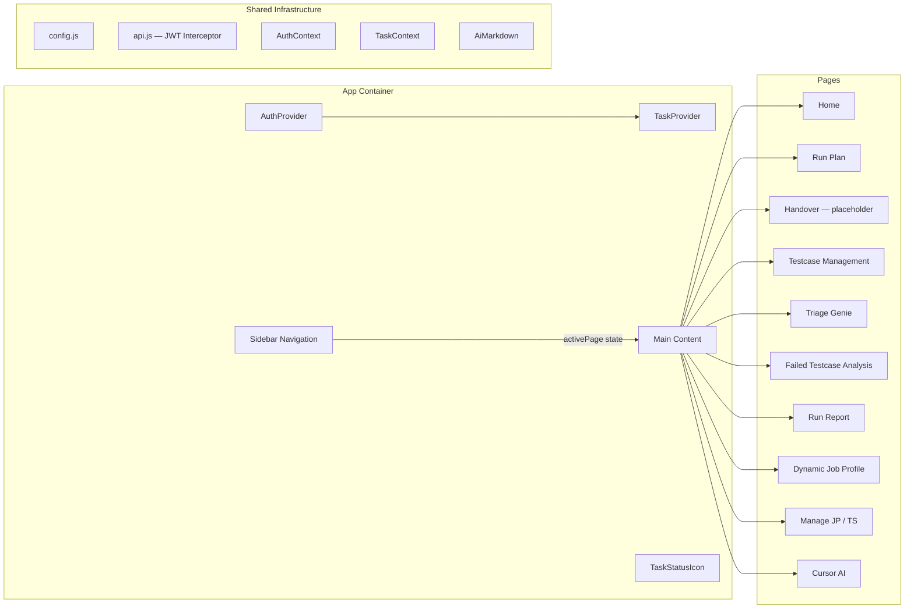
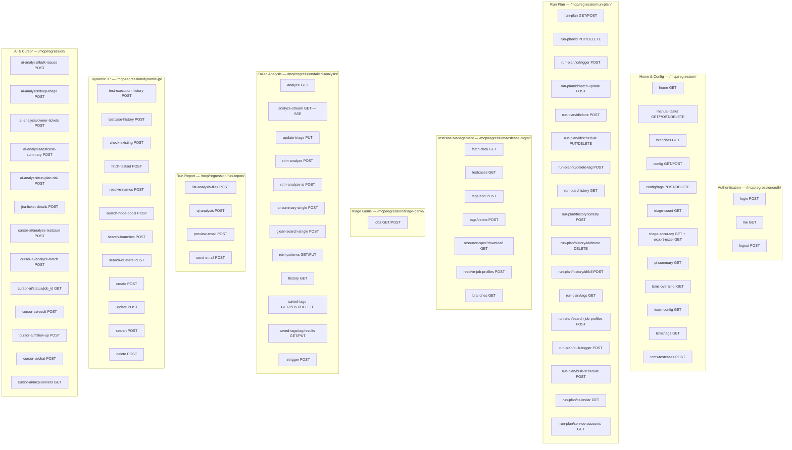
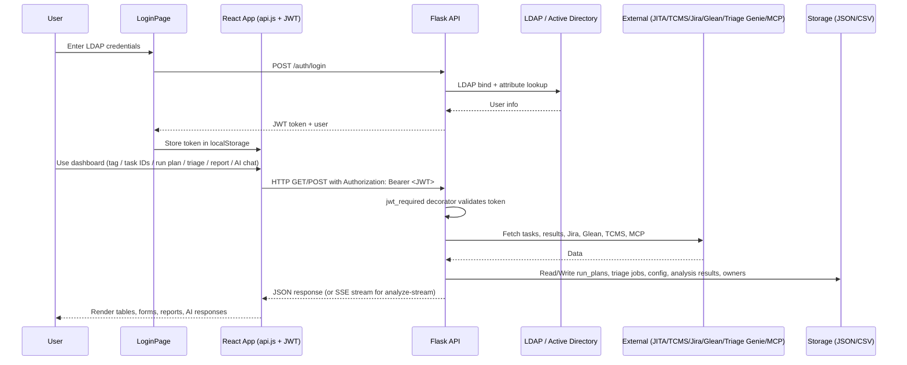
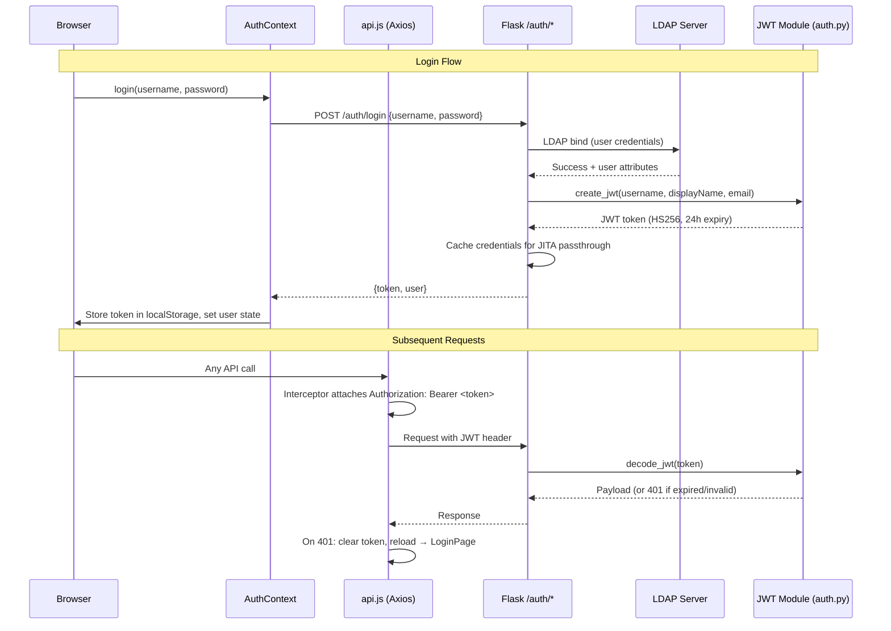
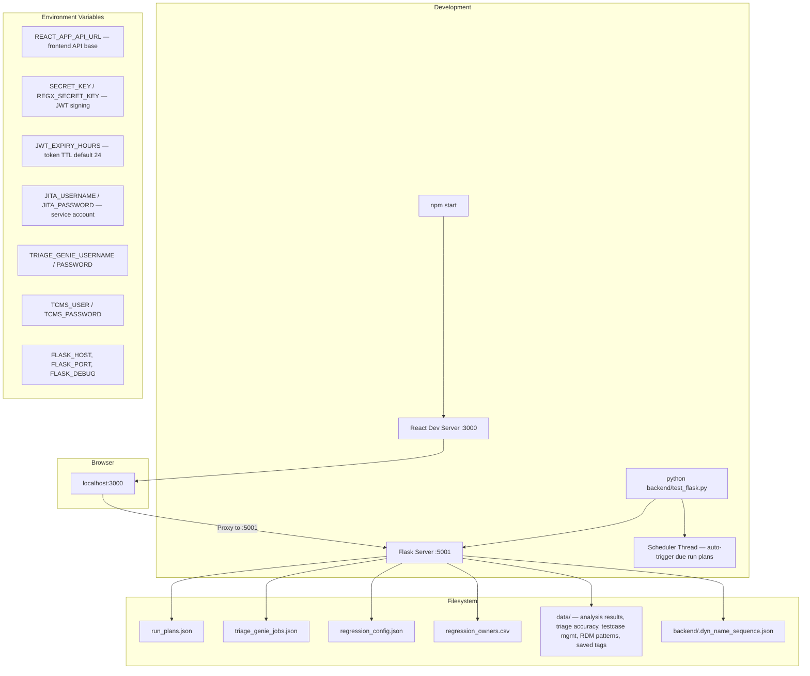
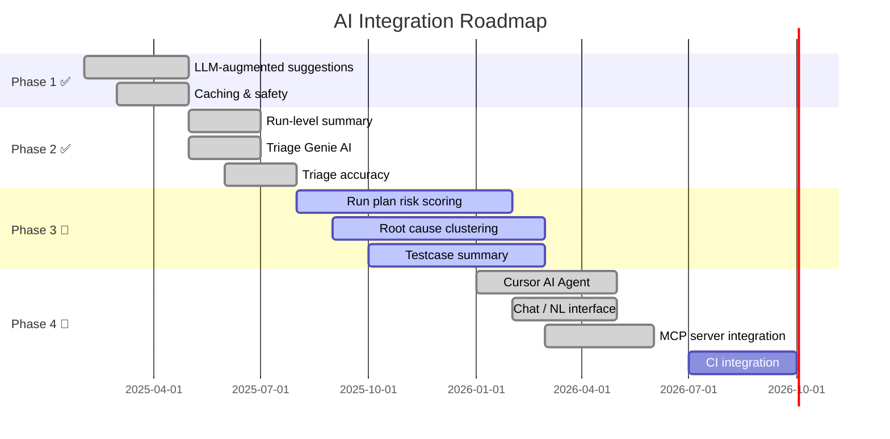

# Regression Dashboard — Project Documentation & Architecture

**Version:** 2.0  
**Last Updated:** June 2026  
**Status:** Living document — current implementation + improvement suggestions + AI roadmap

---

## Table of Contents

1. [Project Overview](#1-project-overview)
2. [Technology Stack](#2-technology-stack)
3. [Features & Modules](#3-features--modules)
4. [Architecture Diagrams](#4-architecture-diagrams)
5. [Authentication](#5-authentication)
6. [Improvement Suggestions](#6-improvement-suggestions)
7. [AI Integration Roadmap](#7-ai-integration-roadmap)
8. [Related Documents](#8-related-documents)

---

## 1. Project Overview

The **Regression Dashboard** is a web application for managing and analyzing regression test runs. It provides:

- **Regression overview** by tag or task IDs (Home) with triage counts, QI summary, triage accuracy, and TCMS overall QI
- **Run planning** and scheduling with job profiles, calendar view, bulk triggers, and automated scheduling
- **Handover** and testcase onboarding (placeholder — coming soon)
- **Testcase management** — browse, tag, resolve job profiles, and download resource specs via TCMS
- **Triage Genie** — automated failure triage jobs
- **Failed Testcase Analysis** — rule-based and AI-powered failure analysis with RDM patterns, streaming results, saved tags, triage updates, retrigger, and Jira/Glean integration
- **Run Report** — QI analysis, email preview and sending
- **Dynamic Job Profile** — job profile and test set creation with execution history, testcase history, and cluster/node pool search
- **Manage JP / TS** — search and bulk-delete job profiles and test sets
- **Cursor AI** — interactive AI chat with multi-model support and MCP server integration (Atlassian, Sourcegraph, JITA, Diamond, Glean, SupportGPT, NuRAG, Slack, Panacea, Live Debug, Auto Handoff)
- **AI Analysis** — bulk issue analysis, deep triage, owner ticket lookup, testcase summarization, and run plan risk scoring

The system follows a **client–server** architecture: a **React** frontend (port 3000) and a **Flask** backend (port 5001), with **LDAP + JWT authentication**, and integrations to JITA/Agave/PHX, TCMS, Jira, Glean, Triage Genie, and Cursor SDK MCP servers.

---

## 2. Technology Stack

| Layer | Technology | Purpose |
|-------|-----------|---------|
| Frontend | React 19, React Scripts 5 | SPA, UI components |
| HTTP client | Axios (centralized `src/api.js` with JWT interceptor) | Authenticated API calls to backend |
| Markdown | react-markdown, remark-gfm | Render AI/markdown responses |
| Excel | xlsx (SheetJS) | Excel export in Testcase Management and Triage Accuracy |
| Styling | CSS (App.css, page-level CSS) | Layout and theming |
| State | React Context (AuthContext, TaskContext) | Authentication state, background task tracking |
| Config | `src/config.js` (`REACT_APP_API_URL` env var) | Centralized API base URL |
| Backend | Flask 3.0, flask-cors | REST API, CORS |
| Auth | ldap3, PyJWT | LDAP authentication, JWT token management |
| Data | pandas, openpyxl | CSV/Excel, data processing |
| HTTP | requests, urllib3 | Outbound API calls |
| Email | smtplib (stdlib) | Send run report emails |
| Storage | JSON files, CSV | Run plans, triage jobs, config, analysis results, owners |

**External services:** JITA API, Agave/PHX API, TCMS API, Jira API, Glean API, Triage Genie API, Cursor SDK MCP servers.

---

## 3. Features & Modules

| Module | Route/Page | Backend APIs (prefix `/mcp/regression/`) | Description |
|--------|-----------|------------------------------------------|-------------|
| Home | `home` | `home`, `manual-tasks`, `branches`, `config`, `config/tags`, `triage-count`, `triage-accuracy`, `triage-accuracy/export-excel`, `qi-summary`, `tcms-overall-qi`, `team-config`, `tcms/tags`, `tcms/testcases` | Overview by tag/task IDs, manual tasks, triage/QI, triage accuracy analyzer, TCMS overall QI, team configuration |
| Run Plan | `run-plan` | `run-plan`, `run-plan/<id>` (PUT/DELETE), `run-plan/<id>/trigger`, `run-plan/<id>/batch-update`, `run-plan/<id>/history`, `run-plan/<id>/clone`, `run-plan/<id>/schedule`, `run-plan/<id>/delete-tag`, `run-plan/search-job-profiles`, `run-plan/tags`, `run-plan/bulk-trigger`, `run-plan/bulk-schedule`, `run-plan/calendar`, `run-plan/history/<id>/retry`, `run-plan/history/<id>/delete`, `run-plan/history/<id>/kill`, `run-plan/service-accounts` | Scheduling, triggers, history with retry/kill, calendar view, bulk operations |
| Handover | `handover` | — | New testcase onboarding (placeholder — coming soon) |
| Testcase Management | `testcase` | `testcase-mgmt/fetch-data`, `testcase-mgmt/testcases`, `testcase-mgmt/tags/add`, `testcase-mgmt/tags/delete`, `testcase-mgmt/resource-spec/download`, `testcase-mgmt/resolve-job-profiles`, `testcase-mgmt/branches` | Browse testcases, tag management, resource spec download, job profile resolution via TCMS |
| Triage Genie | `triage-genie` | `triage-genie/jobs` (GET/POST) | Automated failure triage jobs with prefill from Run Plan |
| Failed Testcase Analysis | `failed-analysis` | `failed-analysis/analyze`, `analyze-stream`, `update-triage`, `rdm-analyze`, `rdm-analyze-ai`, `ai-summary-single`, `glean-search-single`, `rdm-patterns` (GET/PUT), `history`, `saved-tags` (GET/POST/DELETE), `saved-tags/<tag>/results` (GET/PUT), `retrigger` | Failure analysis (rule-based + AI), SSE streaming, RDM pattern management, saved tag history, triage updates, retrigger |
| Run Report | `run-report` | `run-report/list-analysis-files`, `qi-analysis`, `preview-email`, `send-email` | QI analysis, email preview and sending |
| Dynamic Job Profile | `job-profile` | `dynamic-jp/test-execution-history`, `testcase-history`, `check-existing`, `fetch-testset`, `resolve-names`, `search-node-pools`, `search-branches`, `search-clusters`, `create`, `update`, `search`, `delete` | Job profile and test set creation with execution/testcase history |
| Manage JP / TS | `manage-jp` | `dynamic-jp/search`, `dynamic-jp/delete` | Search and bulk-delete job profiles and test sets |
| Cursor AI | `cursor-ai` | `cursor-ai/analyze-testcase`, `analyze-batch`, `status/<job_id>`, `result`, `follow-up`, `chat`, `mcp-servers` | Interactive AI chat, testcase analysis, batch analysis, MCP server integration |
| AI Analysis | (cross-cutting) | `ai-analysis/bulk-issues`, `deep-triage`, `owner-tickets`, `testcase-summary`, `run-plan-risk`, `jira-ticket-details` | Bulk issue analysis, deep triage, owner tickets, testcase summary, run plan risk score |
| Authentication | (login gate) | `auth/login`, `auth/me`, `auth/logout` | LDAP login, JWT token validation, session management |

---

## 4. Architecture Diagrams

### 4.1 Full System Overview

```mermaid
graph TB
    subgraph "Users"
        U[User / Browser]
    end

    subgraph "Frontend - React (Port 3000)"
        APP[App.jsx]
        AUTH_GATE[AppGate — Auth Guard]
        LOGIN[LoginPage]
        DASH[Dashboard]
        AUTH_GATE --> LOGIN
        AUTH_GATE --> DASH
        APP --> AUTH_GATE
        DASH --> HOME[RegressionHome]
        DASH --> RUNPLAN[RunPlan]
        DASH --> HANDOVER[Handover]
        DASH --> TESTCASE[TestcaseManagement]
        DASH --> TRIAGE[TriageGenie]
        DASH --> FAILED[FailedTestcaseAnalysis]
        DASH --> REPORT[RunReport]
        DASH --> JOBPROFILE[DynamicJobProfile]
        DASH --> MANAGEJP[ManageJobProfile]
        DASH --> CURSORAI[CursorAI]
    end

    subgraph "Frontend Infrastructure"
        CONFIG[config.js — API_BASE_URL]
        API_CLIENT[api.js — Axios + JWT Interceptor]
        AUTH_CTX[AuthContext — login/logout/user]
        TASK_CTX[TaskContext — background tasks]
    end

    subgraph "Backend - Flask (Port 5001)"
        FLASK[test_flask.py]
        AUTH_MOD[auth.py — LDAP + JWT]
        FLASK --> AUTH_MOD
        FLASK --> R_AUTH[/auth/*]
        FLASK --> R_HOME[/home, /config, /branches]
        FLASK --> R_MANUAL[/manual-tasks]
        FLASK --> R_RUNPLAN[/run-plan/*]
        FLASK --> R_TRIAGE_COUNT[/triage-count, /triage-accuracy]
        FLASK --> R_QI[/qi-summary, /tcms-overall-qi]
        FLASK --> R_TEAM[/team-config, /tcms/*]
        FLASK --> R_TRIAGE_GENIE[/triage-genie/jobs]
        FLASK --> R_FAILED[/failed-analysis/*]
        FLASK --> R_REPORT[/run-report/*]
        FLASK --> R_TESTCASE_MGMT[/testcase-mgmt/*]
        FLASK --> R_DYNAMIC_JP[/dynamic-jp/*]
        FLASK --> R_AI[/ai-analysis/*, /cursor-ai/*]
        FLASK --> R_JIRA[/jira-ticket-details]
        FLASK --> SCHEDULER[Run Plan Scheduler Thread]
    end

    subgraph "Local Storage"
        JSON1[run_plans.json]
        JSON2[triage_genie_jobs.json]
        JSON3[regression_config.json]
        JSON4[data/failed_analysis_*.json]
        JSON5[data/triage_accuracy_data*.json]
        JSON6[data/testcase_management_*.json]
        JSON7[data/rdm_failure_patterns.json]
        JSON8[data/failed_analysis_saved_tags.json]
        CSV1[regression_owners.csv]
        SEQ[backend/.dyn_name_sequence.json]
    end

    subgraph "External Services"
        JITA[JITA / Agave / PHX API]
        TCMS[TCMS API]
        JIRA[Jira API]
        GLEAN[Glean API]
        TG[Triage Genie API]
        LDAP[LDAP / Active Directory]
        CURSOR_MCP[Cursor SDK MCP Servers]
    end

    U --> APP
    HOME --> API_CLIENT
    RUNPLAN --> API_CLIENT
    TRIAGE --> API_CLIENT
    FAILED --> API_CLIENT
    REPORT --> API_CLIENT
    TESTCASE --> API_CLIENT
    JOBPROFILE --> API_CLIENT
    MANAGEJP --> API_CLIENT
    CURSORAI --> API_CLIENT
    API_CLIENT --> FLASK
    FLASK --> JSON1
    FLASK --> JSON2
    FLASK --> JSON3
    FLASK --> JSON4
    FLASK --> JSON5
    FLASK --> JSON6
    FLASK --> JSON7
    FLASK --> JSON8
    FLASK --> CSV1
    FLASK --> SEQ
    FLASK --> JITA
    FLASK --> TCMS
    FLASK --> JIRA
    FLASK --> GLEAN
    FLASK --> TG
    AUTH_MOD --> LDAP
    FLASK --> CURSOR_MCP
```

---

### 4.2 Frontend Structure & Navigation

```mermaid
graph LR
    subgraph "App Container"
        AUTH_PROVIDER[AuthProvider]
        TASK_PROVIDER[TaskProvider]
        SIDEBAR[Sidebar Navigation]
        MAIN[Main Content]
        TASK_ICON[TaskStatusIcon]
    end

    subgraph "Shared Infrastructure"
        CONFIG[config.js]
        API[api.js — JWT Interceptor]
        AUTH_CTX[AuthContext]
        TASK_CTX[TaskContext]
        AI_MD[AiMarkdown]
    end

    subgraph "Pages"
        P1[Home]
        P2[Run Plan]
        P3[Handover — placeholder]
        P4[Testcase Management]
        P5[Triage Genie]
        P6[Failed Testcase Analysis]
        P7[Run Report]
        P8[Dynamic Job Profile]
        P9[Manage JP / TS]
        P10[Cursor AI]
    end

    AUTH_PROVIDER --> TASK_PROVIDER
    SIDEBAR -->|activePage state| MAIN
    MAIN --> P1
    MAIN --> P2
    MAIN --> P3
    MAIN --> P4
    MAIN --> P5
    MAIN --> P6
    MAIN --> P7
    MAIN --> P8
    MAIN --> P9
    MAIN --> P10
```

---

### 4.3 Backend API Map

```mermaid
graph TD
    subgraph "Authentication — /mcp/regression/auth/"
        AUTH_LOGIN[login POST]
        AUTH_ME[me GET]
        AUTH_LOGOUT[logout POST]
    end

    subgraph "Home & Config — /mcp/regression/"
        A[home GET]
        B[manual-tasks GET/POST/DELETE]
        C[branches GET]
        CFG[config GET/POST]
        CFG_TAGS[config/tags POST/DELETE]
        D[triage-count GET]
        TA[triage-accuracy GET + export-excel GET]
        E[qi-summary GET]
        OQI[tcms-overall-qi GET]
        TC[team-config GET]
        TCMS_T[tcms/tags GET]
        TCMS_TC[tcms/testcases POST]
    end

    subgraph "Run Plan — /mcp/regression/run-plan/"
        F[run-plan GET/POST]
        G[run-plan/id PUT/DELETE]
        G2[run-plan/id/trigger POST]
        G3[run-plan/id/batch-update POST]
        G4[run-plan/id/clone POST]
        G5[run-plan/id/schedule PUT/DELETE]
        G6[run-plan/id/delete-tag POST]
        H[run-plan/history GET]
        H2[run-plan/history/id/retry POST]
        H3[run-plan/history/id/delete DELETE]
        H4[run-plan/history/id/kill POST]
        F2[run-plan/tags GET]
        F3[run-plan/search-job-profiles POST]
        F4[run-plan/bulk-trigger POST]
        F5[run-plan/bulk-schedule POST]
        F6[run-plan/calendar GET]
        F7[run-plan/service-accounts GET]
    end

    subgraph "Testcase Management — /mcp/regression/testcase-mgmt/"
        TM1[fetch-data GET]
        TM2[testcases GET]
        TM3[tags/add POST]
        TM4[tags/delete POST]
        TM5[resource-spec/download GET]
        TM6[resolve-job-profiles POST]
        TM7[branches GET]
    end

    subgraph "Triage Genie — /mcp/regression/triage-genie/"
        I[jobs GET/POST]
    end

    subgraph "Failed Analysis — /mcp/regression/failed-analysis/"
        J[analyze GET]
        J2[analyze-stream GET — SSE]
        J3[update-triage PUT]
        J4[rdm-analyze POST]
        J5[rdm-analyze-ai POST]
        J6[ai-summary-single POST]
        J7[glean-search-single POST]
        J8[rdm-patterns GET/PUT]
        J9[history GET]
        J10[saved-tags GET/POST/DELETE]
        J11[saved-tags/tag/results GET/PUT]
        J12[retrigger POST]
    end

    subgraph "Run Report — /mcp/regression/run-report/"
        K[list-analysis-files POST]
        L[qi-analysis POST]
        M[preview-email POST]
        N[send-email POST]
    end

    subgraph "Dynamic JP — /mcp/regression/dynamic-jp/"
        DJ1[test-execution-history POST]
        DJ2[testcase-history POST]
        DJ3[check-existing POST]
        DJ4[fetch-testset POST]
        DJ5[resolve-names POST]
        DJ6[search-node-pools POST]
        DJ7[search-branches POST]
        DJ8[search-clusters POST]
        DJ9[create POST]
        DJ10[update POST]
        DJ11[search POST]
        DJ12[delete POST]
    end

    subgraph "AI & Cursor — /mcp/regression/"
        AI1[ai-analysis/bulk-issues POST]
        AI2[ai-analysis/deep-triage POST]
        AI3[ai-analysis/owner-tickets POST]
        AI4[ai-analysis/testcase-summary POST]
        AI5[ai-analysis/run-plan-risk POST]
        AI6[jira-ticket-details POST]
        C1[cursor-ai/analyze-testcase POST]
        C2[cursor-ai/analyze-batch POST]
        C3[cursor-ai/status/job_id GET]
        C4[cursor-ai/result POST]
        C5[cursor-ai/follow-up POST]
        C6[cursor-ai/chat POST]
        C7[cursor-ai/mcp-servers GET]
    end
```

---

### 4.4 Data Flow — High Level

```mermaid
sequenceDiagram
    participant U as User
    participant L as LoginPage
    participant R as React App (api.js + JWT)
    participant F as Flask API
    participant AD as LDAP / Active Directory
    participant E as External (JITA/TCMS/Jira/Glean/Triage Genie/MCP)
    participant S as Storage (JSON/CSV)

    U->>L: Enter LDAP credentials
    L->>F: POST /auth/login
    F->>AD: LDAP bind + attribute lookup
    AD-->>F: User info
    F-->>L: JWT token + user
    L->>R: Store token in localStorage

    U->>R: Use dashboard (tag / task IDs / run plan / triage / report / AI chat)
    R->>F: HTTP GET/POST with Authorization: Bearer <JWT>
    F->>F: jwt_required decorator validates token
    F->>E: Fetch tasks, results, Jira, Glean, TCMS, MCP
    E-->>F: Data
    F->>S: Read/Write run_plans, triage jobs, config, analysis results, owners
    F-->>R: JSON response (or SSE stream for analyze-stream)
    R-->>U: Render tables, forms, reports, AI responses
```

---

### 4.5 Authentication Flow

```mermaid
sequenceDiagram
    participant B as Browser
    participant AC as AuthContext
    participant API as api.js (Axios)
    participant F as Flask /auth/*
    participant AD as LDAP Server
    participant JWT as JWT Module (auth.py)

    Note over B,JWT: Login Flow
    B->>AC: login(username, password)
    AC->>F: POST /auth/login {username, password}
    F->>AD: LDAP bind (user credentials)
    AD-->>F: Success + user attributes
    F->>JWT: create_jwt(username, displayName, email)
    JWT-->>F: JWT token (HS256, 24h expiry)
    F->>F: Cache credentials for JITA passthrough
    F-->>AC: {token, user}
    AC->>B: Store token in localStorage, set user state

    Note over B,JWT: Subsequent Requests
    B->>API: Any API call
    API->>API: Interceptor attaches Authorization: Bearer <token>
    API->>F: Request with JWT header
    F->>JWT: decode_jwt(token)
    JWT-->>F: Payload (or 401 if expired/invalid)
    F-->>API: Response
    API->>API: On 401: clear token, reload → LoginPage
```

---

### 4.6 Deployment / Runtime View

```mermaid
graph TB
    subgraph "Development"
        NPM[npm start]
        PY[python backend/test_flask.py]
        NPM --> REACT[React Dev Server :3000]
        PY --> FLASK[Flask Server :5001]
        PY --> SCHEDULER[Scheduler Thread — auto-trigger due run plans]
    end

    subgraph "Browser"
        REACT --> BROWSER[localhost:3000]
        BROWSER -->|Proxy to :5001| FLASK
    end

    subgraph "Environment Variables"
        ENV1[REACT_APP_API_URL — frontend API base]
        ENV2[SECRET_KEY / REGX_SECRET_KEY — JWT signing]
        ENV3[JWT_EXPIRY_HOURS — token TTL default 24]
        ENV4[JITA_USERNAME / JITA_PASSWORD — service account]
        ENV5[TRIAGE_GENIE_USERNAME / PASSWORD]
        ENV6[TCMS_USER / TCMS_PASSWORD]
        ENV7[FLASK_HOST, FLASK_PORT, FLASK_DEBUG]
    end

    subgraph "Filesystem"
        FLASK --> run_plans.json
        FLASK --> triage_genie_jobs.json
        FLASK --> regression_config.json
        FLASK --> regression_owners.csv
        FLASK --> data_dir["data/ — analysis results, triage accuracy, testcase mgmt, RDM patterns, saved tags"]
        FLASK --> dyn_seq["backend/.dyn_name_sequence.json"]
    end
```

---

## 5. Authentication

### 5.1 Overview

The dashboard uses **LDAP (Active Directory) authentication** with **JWT tokens** for session management. All API routes (except `auth/login`) are protected by the `@jwt_required` decorator.

### 5.2 Components

| Component | File | Purpose |
|-----------|------|---------|
| LDAP Auth | `backend/auth.py` → `LDAPAuth` class | Authenticates users against AD, fetches displayName/mail/title |
| JWT helpers | `backend/auth.py` → `create_jwt`, `decode_jwt` | HS256 token creation and verification |
| `@jwt_required` | `backend/auth.py` → decorator | Enforces valid JWT on protected routes, sets `g.current_user` |
| Credential cache | `backend/test_flask.py` | In-memory cache of LDAP passwords for JITA API passthrough (TTL = JWT expiry) |
| AuthContext | `src/context/AuthContext.jsx` | React context: login/logout, token persistence in localStorage, auto-validate on mount |
| LoginPage | `src/components/LoginPage.jsx` | Login form UI |
| api.js | `src/api.js` | Axios instance: attaches `Authorization: Bearer <token>`, clears token + reloads on 401 |

### 5.3 Token Lifecycle

1. User submits credentials → `POST /auth/login` → LDAP bind
2. On success, backend issues JWT (HS256, configurable `JWT_EXPIRY_HOURS`, default 24h)
3. Token stored in `localStorage` under key `regx_auth_token`
4. Every request via `api.js` includes `Authorization: Bearer <token>`
5. On 401 response, token is cleared and page reloads to show login

---

## 6. Improvement Suggestions

### 6.1 Code & Structure

| Area | Suggestion | Benefit |
|------|------------|--------|
| **Backend size** | Split `test_flask.py` (~11K lines) into blueprints or modules (e.g. `routes/home.py`, `routes/run_plan.py`, `routes/failed_analysis.py`, `routes/dynamic_jp.py`, `routes/cursor_ai.py`, `services/jira.py`, `services/glean.py`) | Easier maintenance, testing, and onboarding |
| **Configuration** | Move all config to environment variables or a config module (base URLs, tokens, limits, ports); avoid hardcoded `JITA_BASE`, `TRIAGE_GENIE_BASE`, etc. | Security, different environments (dev/stage/prod) |
| ~~API base URL~~ | ~~Use a single base URL in frontend~~ → **Done:** `src/config.js` with `REACT_APP_API_URL` | ✅ Implemented |
| ~~Duplicate useEffect~~ | ~~Remove duplicate setActivePage listeners~~ → **Done:** single listener in `Dashboard` | ✅ Implemented |
| ~~State management~~ | ~~Use React Context~~ → **Done:** `AuthContext` and `TaskContext` | ✅ Implemented |
| ~~Authentication~~ | ~~Add auth for API~~ → **Done:** LDAP + JWT via `backend/auth.py` | ✅ Implemented |

### 6.2 Security

| Area | Suggestion | Benefit |
|------|------------|--------|
| **Secrets** | Never commit tokens; use `TRIAGE_GENIE_USERNAME/PASSWORD`, `TCMS_USER/PASSWORD`, `SECRET_KEY` from env; document in README | No leaked credentials |
| **CORS** | Restrict CORS in production to known frontend origins instead of open `CORS(app)` | Reduce cross-origin abuse |
| **Credential cache** | The in-memory credential cache stores LDAP passwords; consider encrypting at rest or using a secure vault | Defense in depth |

### 6.3 Testing & Quality

| Area | Suggestion | Benefit |
|------|------------|--------|
| **Backend tests** | Add pytest for critical endpoints: home, run-plan, failed-analysis, run-report, auth | Regression safety, refactoring confidence |
| **Frontend tests** | Add unit tests for key components (e.g. RegressionHome, RunPlan, FailedTestcaseAnalysis) and integration tests for critical flows | Fewer UI regressions |
| **Linting** | Use ESLint and Prettier in frontend; use flake8/black/ruff in backend | Consistent style and early bug detection |

### 6.4 User Experience & Frontend

| Area | Suggestion | Benefit |
|------|------------|--------|
| **Loading & errors** | Consistent loading indicators and error messages (and retry) for all API calls | Clear feedback, fewer "blank" states |
| **Routing** | Use React Router so each page has a URL (e.g. `/run-plan`, `/failed-analysis`); preserve state on refresh | Shareable links, better navigation |

### 6.5 Performance & Scalability

| Area | Suggestion | Benefit |
|------|------------|--------|
| **Pagination** | Use cursor/offset pagination for large lists (e.g. run plan history, failed tests) and lazy load or virtualize long tables | Faster first load, less memory |
| **Caching** | Cache Jira/Glean responses or analysis results (in-memory or Redis) with TTL for repeated tag/task queries | Lower latency, fewer external calls |
| **Async** | For long-running operations (e.g. full analysis, report generation), use background jobs (Celery, RQ) and poll status or WebSockets | No timeouts, better UX |

### 6.6 Data & Storage

| Area | Suggestion | Benefit |
|------|------------|--------|
| **Persistence** | Replace or supplement JSON/CSV with a proper DB (e.g. SQLite for single instance, PostgreSQL for multi-instance) for run plans, triage jobs, and metadata | Durability, queries, backups |
| **Schema** | Version run_plans and triage_genie_jobs schema; support migration if format changes | Safe evolution of stored data |

### 6.7 Observability

| Area | Suggestion | Benefit |
|------|------------|--------|
| **Logging** | Structured logging (JSON) with request id, user/tag, and duration for key endpoints | Easier debugging and analytics |
| **Health** | Add `/health` or `/mcp/regression/health` that checks DB/disk and optionally external services | Monitoring and alerting |
| **Metrics** | Expose basic metrics (request count, latency, error rate) for critical routes | Capacity planning and SLOs |

---

## 7. AI Integration Roadmap

This section tracks the phased plan for integrating AI into the Regression Dashboard.

### 7.1 Current State

- **Failed Testcase Analysis** uses both a **rule-based** engine (keyword matching, scoring, templates) and **AI-powered analysis** (`rdm-analyze-ai`, `ai-summary-single`, `glean-search-single`) for failure stage, issue classification, Jira validation, and suggestions.
- **AI Analysis routes** provide bulk issue analysis, deep triage, owner ticket lookup, testcase summarization, and run plan risk scoring.
- **Cursor AI** module provides an interactive chat interface backed by Cursor SDK with multi-model support (Claude Sonnet 4.6) and MCP server integrations.
- **RDM patterns** provide configurable failure pattern matching with CRUD operations.
- **Triage Accuracy Analyzer** evaluates triage quality across runs with Excel export.

### 7.2 Phase 1 — LLM-Augmented Suggestions ✅ Implemented

| Goal | Status | Implementation |
|------|--------|---------------|
| **Hybrid suggestions** | ✅ Done | Rule-based for simple cases; AI for complex failures via `rdm-analyze-ai`, `ai-summary-single` |
| **Prompt engineering** | ✅ Done | Integrated via Cursor AI chat with model selection |
| **Safety** | ✅ Done | JWT-protected endpoints, configurable models |
| **Caching** | ✅ Done | Saved tags with cached analysis results (`failed_analysis_saved_tags.json`) |

### 7.3 Phase 2 — Smarter Triage & Summarization ✅ Partially Implemented

| Goal | Status | Implementation |
|------|--------|---------------|
| **Run-level summary** | ✅ Done | AI summary in Home (bulk issues, QI impact) |
| **Triage Genie integration** | ✅ Done | Prefill from Run Plan, automated job creation |
| **Triage accuracy** | ✅ Done | Triage Accuracy Analyzer with export |
| **Flaky vs real** | 🔄 In progress | Deep triage via `ai-analysis/deep-triage` |

### 7.4 Phase 3 — Predictive & Proactive (In Progress)

| Goal | Actions | Outcome |
|------|--------|--------|
| **Run plan risk** | `ai-analysis/run-plan-risk` endpoint scores risk for planned runs | Risk indicator on Run Plan |
| **Root cause clustering** | Group failures by root cause via RDM patterns and AI analysis | Less duplicate triage |
| **Recommendations** | Testcase summary via `ai-analysis/testcase-summary` | Smarter test selection |

### 7.5 Phase 4 — Full "AI Regression Agent" (In Progress)

| Goal | Status | Implementation |
|------|--------|---------------|
| **Agent loop** | ✅ Done | Cursor AI with multi-step analysis: analyze → follow-up → result |
| **Chat / natural language** | ✅ Done | Cursor AI page with mode selection (Agent/Plan/Debug/Ask) |
| **MCP server integration** | ✅ Done | 12 MCP servers: RegX Data, Atlassian, Sourcegraph, JITA, Diamond, Glean, SupportGPT, NuRAG, Slack, Panacea, Live Debug, Auto Handoff |
| **CI integration** | Planned | Webhook or API for CI pipeline |

### 7.6 AI Roadmap — Visual Timeline

```mermaid
gantt
    title AI Integration Roadmap
    dateFormat YYYY-MM
    section Phase 1 ✅
    LLM-augmented suggestions     :done, a1, 2025-02, 3M
    Caching & safety              :done, a2, 2025-03, 2M
    section Phase 2 ✅
    Run-level summary             :done, b1, 2025-05, 2M
    Triage Genie AI               :done, b2, 2025-05, 2M
    Triage accuracy               :done, b3, 2025-06, 2M
    section Phase 3 🔄
    Run plan risk scoring         :active, c1, 2025-08, 6M
    Root cause clustering         :active, c2, 2025-09, 6M
    Testcase summary              :active, c3, 2025-10, 5M
    section Phase 4 🔄
    Cursor AI Agent               :done, d1, 2026-01, 4M
    Chat / NL interface           :done, d2, 2026-02, 3M
    MCP server integration        :done, d3, 2026-03, 3M
    CI integration                :d4, 2026-07, 3M
```

### 7.7 Dependencies & Prerequisites

- **Cursor SDK:** Used for AI chat and analysis; requires Cursor bridge setup.
- **MCP Servers:** 12 integrated servers for cross-tool intelligence (Atlassian, Sourcegraph, JITA, Diamond, Glean, SupportGPT, NuRAG, Slack, Panacea, Live Debug, Auto Handoff, RegX Data).
- **API keys:** Managed via environment variables (see Section 4.6 for full list).
- **Governance:** Review usage, cost, and PII; ensure prompts and model outputs align with security and compliance.

---

## 8. Related Documents

| Document | Content |
|----------|--------|
| **README.md** | Setup, run instructions, npm scripts, environment variables. |
| **AGENTS.md** | AI agent orientation: stack, ports, read-first docs, conventions. |
| **.cursor/rules/regx-ai.mdc** | Cursor rule: stack, ports, API prefix, secrets policy, Gerrit conventions. |
| **.cursor/skills/regx-ai/SKILL.md** | Cursor skill for the RegX-AI dashboard. |
| **.cursor/skills/triage-cdp-test-failure/SKILL.md** | Cursor skill for triaging CDP test failures. |

### Frontend File Map

| File / Directory | Purpose |
|-----------------|---------|
| `src/App.jsx` | Root component: AuthProvider → AppGate → Dashboard with sidebar navigation |
| `src/config.js` | Centralized `API_BASE_URL` from `REACT_APP_API_URL` env var |
| `src/api.js` | Axios instance with JWT interceptor (attach token, handle 401) |
| `src/context/AuthContext.jsx` | Authentication context: login, logout, user state, token persistence |
| `src/context/TaskContext.jsx` | Background task tracking context: add/update/clear tasks |
| `src/RegressionHome.jsx` | Home page: regression overview, triage counts, QI, triage accuracy, TCMS QI |
| `src/pages/RunPlan.jsx` | Run plan management: CRUD, trigger, schedule, calendar, bulk ops |
| `src/pages/Handover.jsx` | Placeholder page (coming soon) |
| `src/pages/TestcaseManagement.jsx` | Testcase browsing, tagging, resource spec download, job profile resolution |
| `src/pages/TriageGenie.jsx` | Triage job creation and monitoring |
| `src/pages/FailedTestcaseAnalysis.jsx` | Failure analysis (rule-based + AI), streaming, saved tags, retrigger |
| `src/pages/RunReport.jsx` | QI analysis, email preview and sending |
| `src/pages/DynamicJobProfile.jsx` | Job profile and test set creation with history |
| `src/pages/ManageJobProfile.jsx` | Search and bulk-delete job profiles/test sets |
| `src/pages/CursorAI.jsx` | Interactive AI chat with model/mode selection and MCP servers |
| `src/components/LoginPage.jsx` | LDAP login form |
| `src/components/AiMarkdown.jsx` | Markdown renderer for AI responses (react-markdown + remark-gfm) |
| `src/components/TaskStatusIcon.jsx` | Floating icon showing background task status |

### Backend File Map

| File | Purpose |
|------|---------|
| `backend/test_flask.py` | Flask application (~11K lines): all API routes, scheduler thread, credential cache |
| `backend/auth.py` | LDAP authentication (`LDAPAuth` class), JWT creation/verification, `@jwt_required` decorator |

### Data File Map

| File | Purpose |
|------|---------|
| `run_plans.json` | Run plan definitions and schedules |
| `triage_genie_jobs.json` | Triage Genie job records |
| `regression_config.json` | Dashboard configuration: input mode, default tag, added tags |
| `regression_owners.csv` | Regression test owners mapping |
| `backend/.dyn_name_sequence.json` | Auto-increment sequence for dynamic job profile naming |
| `data/failed_analysis_*.json` | Cached failed testcase analysis results per tag |
| `data/failed_analysis_saved_tags.json` | List of saved analysis tags |
| `data/triage_accuracy_data*.json` | Triage accuracy analysis results per tag |
| `data/testcase_management_*.json` | Testcase management data per branch/product |
| `data/rdm_failure_patterns.json` | RDM failure pattern rules for automated classification |

For **Failed Testcase Analysis** specifically, use the diagrams and tables in **Architecture_Diagrams.md** and **Architecture_and_Enhancement_Plan.md** (if present). This document gives the **full project** view, **improvement suggestions**, and the **AI integration roadmap** with current implementation status.
