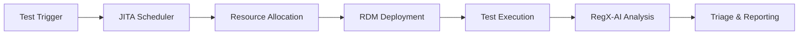
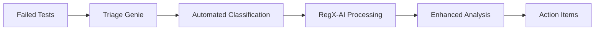
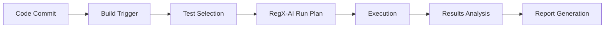
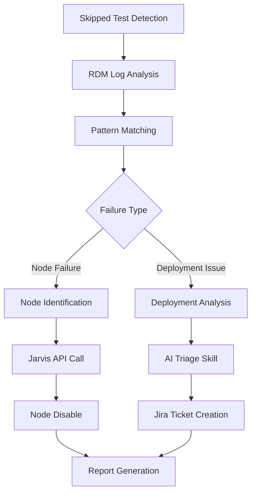
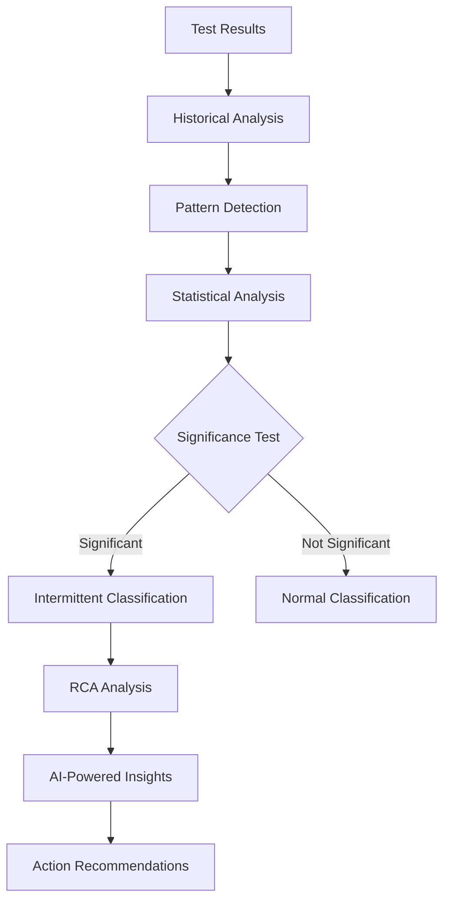

# Software Requirements Specification (SRS)
## RegX-AI Regression Dashboard

**Document Version:** 1.0  
**Created:** July 4, 2026  
**Last Updated:** July 4, 2026  
**Status:** Draft  

---

## Table of Contents

1. [Introduction](#1-introduction)
2. [Overall Description](#2-overall-description)
3. [System Features](#3-system-features)
4. [External Interface Requirements](#4-external-interface-requirements)
5. [System Requirements](#5-system-requirements)
6. [Quality Attributes](#6-quality-attributes)
7. [Pipeline Integration Requirements](#7-pipeline-integration-requirements)
8. [Enhancement Roadmap](#8-enhancement-roadmap)
9. [Use Case Workflows](#9-use-case-workflows)
10. [Constraints and Assumptions](#10-constraints-and-assumptions)
11. [Appendices](#11-appendices)

---

## 1. Introduction

### 1.1 Purpose
This Software Requirements Specification (SRS) defines the functional and non-functional requirements for the RegX-AI Regression Dashboard, a comprehensive web application for managing, analyzing, and automating regression test workflows across multiple teams including CDP, Central Regression Team, DR, and PRISM_CENTRAL.

### 1.2 Document Scope
This document covers the complete system requirements for:
- Current functionality (v2.0 implementation)
- Enhanced team-level access control
- Advanced skipped testcase analysis and RDM deployment failure detection
- Intermittent issue identification and automated resolution
- AI-powered triage and automation workflows

### 1.3 Intended Audience
- Development Teams (CDP, Central Regression, DR, PRISM_CENTRAL)
- Quality Assurance Engineers
- DevOps Engineers
- Product Managers
- System Administrators

### 1.4 Product Overview
RegX-AI is a client-server web application that provides intelligent regression test management, automated failure triage, and comprehensive reporting capabilities. The system integrates with multiple external services (JITA, TCMS, Jira, Glean, Triage Genie, RDM) to provide end-to-end automation for regression workflows.

---

## 2. Overall Description

### 2.1 Product Perspective
The RegX-AI system operates as a centralized dashboard interfacing with:
- **JITA/Agave/PHX**: Test execution and resource management
- **TCMS**: Testcase management and metadata
- **Jira**: Issue tracking and project management
- **Glean**: Internal documentation and knowledge base
- **Triage Genie**: Automated failure classification
- **RDM**: Resource Deployment Manager for cluster provisioning
- **Jarvis**: Node management and infrastructure control

### 2.2 Product Functions
- **Multi-team Regression Management**: Team-specific dashboards and access control
- **Intelligent Test Scheduling**: Run plan creation, scheduling, and bulk operations
- **Failure Analysis & Triage**: Rule-based and AI-powered failure classification
- **Skipped Testcase Analysis**: RDM deployment failure detection and automated resolution
- **Intermittent Issue Detection**: Pattern analysis for flaky test identification
- **Automated Infrastructure Management**: Node failure detection and Jarvis integration
- **Comprehensive Reporting**: QI analysis, email reports, and trend analysis
- **AI-Powered Insights**: Multi-model AI chat, batch analysis, and predictive scoring

### 2.3 User Characteristics
- **QA Engineers**: Primary users for test management and analysis
- **DevOps Engineers**: Infrastructure monitoring and automation
- **Team Leads**: Strategic overview and reporting
- **Developers**: Issue resolution and testcase management
- **Administrators**: System configuration and user management

### 2.4 Operating Environment
- **Frontend**: React 19 SPA running on port 3000
- **Backend**: Flask 3.0 API server on port 5001
- **Authentication**: LDAP/Active Directory with JWT tokens
- **Storage**: JSON/CSV files with planned database migration
- **Deployment**: Linux environments (Rocky Linux, Ubuntu)
- **External Dependencies**: Multiple API integrations (see Section 4)

---

## 3. System Features

### 3.1 Core Dashboard Features (Current Implementation)

#### 3.1.1 Regression Home
**Priority:** High  
**Description:** Central dashboard providing regression overview by tag or task IDs

**Functional Requirements:**
- FR-1.1: Display triage counts and accuracy metrics
- FR-1.2: Show QI (Quality Index) summary across runs
- FR-1.3: Provide TCMS overall QI visualization
- FR-1.4: Support manual task creation and management
- FR-1.5: Enable branch and configuration selection

**Input:** Tag IDs, Task IDs, date ranges  
**Output:** Dashboard widgets, metrics summaries, navigation links

#### 3.1.2 Run Plan Management
**Priority:** High  
**Description:** Comprehensive run planning and scheduling system

**Functional Requirements:**
- FR-2.1: Create, update, delete run plans with job profiles
- FR-2.2: Schedule runs with calendar view and automated scheduling
- FR-2.3: Bulk trigger operations across multiple plans
- FR-2.4: Run history tracking with retry/kill capabilities
- FR-2.5: Service account management for automated execution

**Input:** Job profiles, schedule parameters, resource specifications  
**Output:** Scheduled runs, execution history, trigger confirmations

#### 3.1.3 Failed Testcase Analysis
**Priority:** High  
**Description:** Advanced failure analysis combining rule-based and AI-powered triage

**Functional Requirements:**
- FR-3.1: Real-time streaming analysis with Server-Sent Events
- FR-3.2: RDM pattern matching and automated classification
- FR-3.3: AI-powered failure summarization and root cause analysis
- FR-3.4: Saved tag management for analysis caching
- FR-3.5: Triage updates and retrigger capabilities
- FR-3.6: Glean integration for documentation lookup

**Input:** Task IDs, tags, analysis parameters  
**Output:** Failure classifications, AI summaries, triage recommendations

#### 3.1.4 Testcase Management
**Priority:** Medium  
**Description:** TCMS integration for testcase browsing and management

**Functional Requirements:**
- FR-4.1: Browse and search testcases by branch/product
- FR-4.2: Tag management (add/delete tags)
- FR-4.3: Resource specification download
- FR-4.4: Job profile resolution and validation

**Input:** Branch selection, search criteria, tag operations  
**Output:** Testcase listings, resource specs, job profile mappings

#### 3.1.5 Cursor AI Integration
**Priority:** Medium  
**Description:** Interactive AI chat with multi-model support and MCP server integration

**Functional Requirements:**
- FR-5.1: Multi-model AI chat (Claude Sonnet 4.6, others)
- FR-5.2: Mode selection (Agent/Plan/Debug/Ask)
- FR-5.3: MCP server integration (12 servers: RegX Data, Atlassian, Sourcegraph, JITA, Diamond, Glean, SupportGPT, NuRAG, Slack, Panacea, Live Debug, Auto Handoff)
- FR-5.4: Batch testcase analysis and follow-up queries
- FR-5.5: Background job tracking and result retrieval

**Input:** Natural language queries, testcase IDs, analysis parameters  
**Output:** AI responses, analysis results, actionable recommendations

### 3.2 Enhanced Features (Planned Implementation)

#### 3.2.1 Multi-Team Access Control
**Priority:** High  
**Description:** Team-level access control and customization

**Functional Requirements:**
- FR-6.1: Team-based user authentication and authorization
- FR-6.2: Team-specific dashboard configurations
- FR-6.3: Role-based permissions (Admin, Lead, Member, Viewer)
- FR-6.4: Team-isolated data and run plans
- FR-6.5: Cross-team collaboration features

**Teams Supported:**
- CDP (Cluster Data Path)
- Central Regression Team
- DR (Disaster Recovery)
- PRISM_CENTRAL

#### 3.2.2 Advanced Skipped Testcase Analysis
**Priority:** High  
**Description:** Comprehensive analysis and automated resolution of skipped tests

**Functional Requirements:**
- FR-7.1: RDM deployment failure detection and classification
- FR-7.2: Pattern matching for failure reason identification
- FR-7.3: Node failure identification and correlation
- FR-7.4: Automated Jarvis API integration for node management
- FR-7.5: Cron job for periodic skipped test monitoring
- FR-7.6: AI skill integration for intelligent triage (@triage-rdm-deployment-failure)

**Workflow:**
1. Detect skipped test due to RDM deployment failure
2. Analyze deployment logs for failure patterns
3. Identify problematic nodes
4. Automatically disable faulty nodes via Jarvis API
5. Create/update Jira tickets for Productivity Infrastructure (PI) team
6. Generate comprehensive triage reports

#### 3.2.3 Intermittent Issue Identification
**Priority:** High  
**Description:** AI-powered detection and classification of flaky/intermittent failures

**Functional Requirements:**
- FR-8.1: Historical failure pattern analysis
- FR-8.2: Statistical significance testing for flaky tests
- FR-8.3: Root Cause Analysis (RCA) automation
- FR-8.4: Failure clustering and correlation
- FR-8.5: Predictive modeling for failure probability
- FR-8.6: Automated issue classification and prioritization

**AI Integration:**
- Machine learning models for pattern recognition
- Natural language processing for log analysis
- Correlation analysis across test environments
- Predictive analytics for failure prevention

---

## 4. External Interface Requirements

### 4.1 User Interface Requirements
- **UI-1**: Responsive web interface supporting desktop and tablet devices
- **UI-2**: Modern Material Design or similar design system
- **UI-3**: Accessibility compliance (WCAG 2.1 Level AA)
- **UI-4**: Multi-theme support (light/dark mode)
- **UI-5**: Real-time updates with WebSocket or Server-Sent Events

### 4.2 Hardware Interfaces
- **HW-1**: Standard web browsers (Chrome, Firefox, Safari, Edge)
- **HW-2**: Minimum 4GB RAM for client machines
- **HW-3**: Server deployment on Linux x86_64 architecture

### 4.3 Software Interfaces

#### 4.3.1 External API Integrations
| Service | Purpose | Authentication | API Version |
|---------|---------|----------------|-------------|
| JITA/Agave/PHX | Test execution and resource management | Service account credentials | v2.0 |
| TCMS | Testcase management and metadata | Username/password | v1.0 |
| Jira | Issue tracking and project management | API token | REST v2/v3 |
| Glean | Documentation and knowledge base | API key | v1.0 |
| Triage Genie | Automated failure classification | Username/password | v1.0 |
| RDM | Resource Deployment Manager | API integration | v1.0 |
| Jarvis | Infrastructure node management | API endpoint | v1.0 |

#### 4.3.2 Internal Component Interfaces
- **React Frontend ↔ Flask Backend**: RESTful API over HTTP/HTTPS
- **Authentication**: LDAP integration with JWT token management
- **Data Storage**: JSON/CSV files (current), Database (planned migration)

### 4.4 Communication Interfaces
- **COM-1**: HTTPS for all external API communications
- **COM-2**: WebSocket or SSE for real-time updates
- **COM-3**: SMTP for email notifications and reports
- **COM-4**: Secure credential management for service accounts

---

## 5. System Requirements

### 5.1 Performance Requirements
- **PERF-1**: Page load time < 3 seconds for dashboard views
- **PERF-2**: API response time < 2 seconds for data queries
- **PERF-3**: Support concurrent access for 100+ users
- **PERF-4**: Real-time analysis streaming with < 1 second latency
- **PERF-5**: Batch operations processing within 5 minutes

### 5.2 Security Requirements
- **SEC-1**: Multi-factor authentication support
- **SEC-2**: Role-based access control (RBAC)
- **SEC-3**: Secure credential storage (no plaintext passwords)
- **SEC-4**: API rate limiting and request validation
- **SEC-5**: Audit logging for all critical operations
- **SEC-6**: Data encryption in transit and at rest

### 5.3 Availability Requirements
- **AVAIL-1**: System uptime of 99.5% during business hours
- **AVAIL-2**: Graceful degradation when external services are unavailable
- **AVAIL-3**: Automatic retry mechanisms for transient failures
- **AVAIL-4**: Health check endpoints for monitoring

### 5.4 Scalability Requirements
- **SCALE-1**: Horizontal scaling capability for backend services
- **SCALE-2**: Database migration path for growing data volumes
- **SCALE-3**: CDN support for static asset distribution
- **SCALE-4**: Caching strategies for frequently accessed data

---

## 6. Quality Attributes

### 6.1 Reliability
- Fault tolerance with graceful error handling
- Comprehensive logging and monitoring
- Automated backup and recovery procedures

### 6.2 Usability
- Intuitive user interface with minimal learning curve
- Comprehensive help documentation and tutorials
- Keyboard shortcuts and accessibility features

### 6.3 Maintainability
- Modular architecture with clear separation of concerns
- Comprehensive test coverage (unit, integration, E2E)
- Code quality standards and automated CI/CD pipelines

### 6.4 Portability
- Cross-platform compatibility (Linux, Windows, macOS)
- Container-based deployment with Docker
- Cloud-native architecture for multi-cloud deployment

---

## 7. Pipeline Integration Requirements

### 7.1 Current Pipeline Integration
The RegX-AI system integrates with the following existing pipelines:

#### 7.1.1 JITA Integration Pipeline

**Pipeline Components:**
- **JITA Task Scheduling**: Automated test triggering based on run plans
- **Resource Management**: Integration with Agave/PHX for resource allocation
- **RDM Deployment**: Cluster provisioning and configuration
- **Result Collection**: Automated ingestion of test results and logs

#### 7.1.2 Triage Genie Pipeline

**Pipeline Features:**
- Automated failure classification
- Integration with RegX-AI for enhanced analysis
- Bulk triage job processing
- Results integration with main dashboard

#### 7.1.3 CI/CD Integration Pipeline

### 7.2 Enhanced Pipeline Requirements

#### 7.2.1 Skipped Testcase Analysis Pipeline
**Priority:** High

**Pipeline Components:**
1. **Monitoring Service**: Cron job checking for skipped tests every 15 minutes
2. **Pattern Analyzer**: Real-time analysis of RDM deployment failures
3. **Node Manager**: Automated Jarvis integration for node control
4. **Ticket Manager**: Automated Jira ticket creation for PI team
5. **Reporting Service**: Comprehensive failure analysis reports

#### 7.2.2 Intermittent Issue Detection Pipeline
**Priority:** High

**Pipeline Features:**
- Continuous monitoring of test execution patterns
- Machine learning models for flaky test detection
- Automated root cause analysis workflow
- Integration with existing triage processes

---

## 8. Enhancement Roadmap

### 8.1 Phase 1: Multi-Team Foundation (Q3 2026)
**Duration:** 3 months  
**Priority:** High

**Deliverables:**
- Team-based user management and authentication
- Team-specific dashboard configurations
- Role-based access control implementation
- Team data isolation and security

**Success Criteria:**
- All four teams (CDP, Central Regression, DR, PRISM_CENTRAL) can access team-specific dashboards
- Users can switch between authorized teams
- Data isolation prevents cross-team information leakage

### 8.2 Phase 2: Skipped Testcase Analysis (Q4 2026)
**Duration:** 4 months  
**Priority:** High

**Deliverables:**
- RDM deployment failure detection system
- Pattern matching engine for failure classification
- Jarvis API integration for automated node management
- Cron job implementation for continuous monitoring
- AI skill integration for intelligent triage

**Success Criteria:**
- 90% accuracy in RDM failure pattern detection
- Automated node disabling within 15 minutes of detection
- Reduced manual intervention by 70%

### 8.3 Phase 3: Intermittent Issue Intelligence (Q1 2027)
**Duration:** 3 months  
**Priority:** High

**Deliverables:**
- Machine learning models for flaky test detection
- Historical pattern analysis system
- Automated RCA workflow
- Predictive analytics dashboard
- Integration with existing AI systems

**Success Criteria:**
- Identify 85% of intermittent issues within 5 test runs
- Reduce false positive rate below 10%
- Automated RCA completion within 30 minutes

### 8.4 Phase 4: Advanced Automation & Intelligence (Q2 2027)
**Duration:** 3 months  
**Priority:** Medium

**Deliverables:**
- Enhanced AI-powered insights
- Predictive test selection algorithms
- Advanced reporting and analytics
- Performance optimization
- Database migration completion

**Success Criteria:**
- 40% improvement in test execution efficiency
- Real-time dashboard performance under 1 second
- Complete migration to scalable database system

---

## 9. Use Case Workflows

### 9.1 Primary Use Cases

#### 9.1.1 Regression Test Management Workflow
**Actor:** QA Engineer  
**Goal:** Execute comprehensive regression testing for a release

**Main Success Scenario:**
1. QA Engineer logs into team-specific dashboard
2. Creates new run plan with appropriate test selection
3. Configures resource requirements and scheduling
4. Triggers bulk execution across multiple environments
5. Monitors real-time execution progress
6. Reviews automated triage results
7. Validates AI-generated failure analysis
8. Approves/modifies recommended actions
9. Generates and distributes QI report

**Alternative Flows:**
- A1: Test failures require manual investigation
- A2: Resource constraints delay execution
- A3: External service unavailability

#### 9.1.2 Skipped Testcase Triage Workflow
**Actor:** System (Automated) / DevOps Engineer  
**Goal:** Automatically detect and resolve skipped tests due to infrastructure issues

**Main Success Scenario:**
1. Cron job detects skipped tests in recent runs
2. System analyzes RDM deployment logs
3. Pattern matching identifies node failure
4. System correlates failure with specific hardware node
5. Automated Jarvis API call disables problematic node
6. System creates Jira ticket for PI team with detailed analysis
7. AI skill generates comprehensive triage report
8. DevOps engineer reviews and approves automated actions
9. System schedules re-execution of affected tests

**Exception Flows:**
- E1: Jarvis API unavailable - manual notification sent
- E2: Pattern matching confidence below threshold - escalate to human
- E3: Multiple node failures - trigger alert for infrastructure review

#### 9.1.3 Intermittent Issue Investigation Workflow
**Actor:** QA Engineer / AI System  
**Goal:** Identify and classify flaky/intermittent test failures

**Main Success Scenario:**
1. AI system continuously monitors test execution patterns
2. Statistical analysis identifies tests with inconsistent results
3. System performs historical correlation analysis
4. Machine learning models classify failure patterns
5. Automated RCA workflow analyzes root causes
6. System generates actionable insights and recommendations
7. QA Engineer reviews AI findings and approves actions
8. System implements recommended fixes or escalates to development team
9. Continuous monitoring validates resolution effectiveness

### 9.2 Administrative Use Cases

#### 9.2.1 Team Onboarding Workflow
**Actor:** System Administrator  
**Goal:** Onboard new team to RegX-AI platform

**Main Success Scenario:**
1. Administrator creates team configuration
2. Sets up team-specific LDAP groups and permissions
3. Configures team dashboard layout and features
4. Creates initial run plan templates
5. Establishes integration with team-specific external services
6. Conducts team training and knowledge transfer
7. Monitors initial usage and performance
8. Adjusts configuration based on team feedback

---

## 10. Constraints and Assumptions

### 10.1 Technical Constraints
- **CONST-1**: Must maintain backward compatibility with existing API clients
- **CONST-2**: LDAP authentication integration is mandatory
- **CONST-3**: JSON/CSV data migration must be completed without data loss
- **CONST-4**: External service dependencies limit offline functionality
- **CONST-5**: Browser compatibility limited to evergreen browsers

### 10.2 Business Constraints
- **CONST-6**: Development timeline cannot exceed 12 months for full implementation
- **CONST-7**: System must support existing team workflows without disruption
- **CONST-8**: Licensing costs for AI services must remain within budget
- **CONST-9**: Compliance with corporate security and privacy policies

### 10.3 Assumptions
- **ASSUM-1**: External APIs will maintain stable interfaces during development
- **ASSUM-2**: Infrastructure teams will provide necessary Jarvis API access
- **ASSUM-3**: Teams are willing to adopt new workflow processes
- **ASSUM-4**: Sufficient compute resources available for AI processing
- **ASSUM-5**: Network connectivity to external services remains reliable

---

## 11. Appendices

### 11.1 Glossary
| Term | Definition |
|------|------------|
| CDP | Cluster Data Path - team responsible for data path functionality |
| DR | Disaster Recovery - team managing backup and recovery systems |
| JITA | Job Integrated Test Automation - test execution framework |
| QI | Quality Index - metric measuring test execution quality |
| RCA | Root Cause Analysis - systematic problem analysis method |
| RDM | Resource Deployment Manager - cluster provisioning system |
| TCMS | Test Case Management System - testcase repository and management |

### 11.2 Reference Documents
- [PROJECT_DOCUMENTATION_AND_ARCHITECTURE.md](PROJECT_DOCUMENTATION_AND_ARCHITECTURE.md)
- [AGENTS.md](AGENTS.md)
- [README.md](README.md)
- [.cursor/skills/triage-rdm-deployment-failure/SKILL.md](.cursor/skills/triage-rdm-deployment-failure/SKILL.md)
- [.cursor/skills/regx-ai/SKILL.md](.cursor/skills/regx-ai/SKILL.md)

### 11.3 API Endpoint Summary
Current API endpoints (prefix: `/mcp/regression/`):

**Authentication:**
- `POST /auth/login` - User authentication
- `GET /auth/me` - Token validation
- `POST /auth/logout` - Session termination

**Dashboard & Configuration:**
- `GET /home` - Dashboard data
- `GET|POST /config` - System configuration
- `GET /branches` - Available branches
- `GET /triage-count` - Triage metrics
- `GET /qi-summary` - Quality index data

**Run Management:**
- `GET|POST /run-plan` - Run plan CRUD operations
- `POST /run-plan/bulk-trigger` - Bulk execution
- `GET /run-plan/calendar` - Calendar view
- `GET /run-plan/history` - Execution history

**Analysis & Triage:**
- `GET /failed-analysis/analyze` - Failure analysis
- `GET /failed-analysis/analyze-stream` - Streaming analysis (SSE)
- `POST /failed-analysis/rdm-analyze-ai` - AI-powered RDM analysis
- `PUT /failed-analysis/update-triage` - Triage updates

**AI Integration:**
- `POST /cursor-ai/chat` - AI chat interface
- `GET /cursor-ai/mcp-servers` - MCP server status
- `POST /ai-analysis/bulk-issues` - Batch analysis
- `POST /ai-analysis/deep-triage` - Advanced triage

### 11.4 Technology Stack Details
| Layer | Technology | Version | Purpose |
|-------|------------|---------|---------|
| Frontend | React | 19.2.3 | User interface framework |
| Frontend | Axios | 1.6.0 | HTTP client library |
| Frontend | React Markdown | 10.1.0 | Markdown rendering |
| Backend | Flask | 3.0.0 | Web application framework |
| Backend | Flask-CORS | 4.0.0 | Cross-origin resource sharing |
| Backend | Pandas | 2.1.4 | Data processing and analysis |
| Authentication | ldap3 | ≥2.9.1 | LDAP client library |
| Authentication | PyJWT | ≥2.8.0 | JWT token handling |
| Data Processing | openpyxl | 3.1.2 | Excel file handling |
| HTTP Client | requests | 2.31.0 | External API integration |

---

**Document Control:**
- **Author:** RegX-AI Development Team
- **Reviewers:** QA Team Leads, DevOps Engineers, Product Managers  
- **Approval:** [To be assigned]
- **Distribution:** All stakeholder teams and development personnel

**Change History:**
| Version | Date | Author | Changes |
|---------|------|--------|---------|
| 1.0 | July 4, 2026 | AI Assistant | Initial SRS document creation |

---

*This document serves as the comprehensive requirements specification for the RegX-AI Regression Dashboard enhancement project. All requirements are subject to stakeholder review and approval before implementation.*