# Software Requirements Specification (SRS)
## RegX-AI Regression Dashboard

**Document Version:** 2.0  
**Created:** July 4, 2026  
**Last Updated:** July 4, 2026  
**Status:** Enhanced Template - Production Ready  
**Authors:** RegX-AI Development Team  
**Template Type:** Comprehensive SRS Template for Regression Dashboard Systems  

---

## Table of Contents

1. [Introduction](#1-introduction)
2. [Overall Description](#2-overall-description)
3. [Current System Architecture](#3-current-system-architecture)
4. [Functional Requirements](#4-functional-requirements)
5. [Non-Functional Requirements](#5-non-functional-requirements)
6. [Pipeline Integration Requirements](#6-pipeline-integration-requirements)
7. [Business Workflows and Use Cases](#7-business-workflows-and-use-cases)
8. [External Interface Requirements](#8-external-interface-requirements)
9. [Data Requirements](#9-data-requirements)
10. [Security Requirements](#10-security-requirements)
11. [Enhancement Roadmap](#11-enhancement-roadmap)
12. [Quality Assurance](#12-quality-assurance)
13. [Deployment and Operations](#13-deployment-and-operations)
14. [Constraints and Assumptions](#14-constraints-and-assumptions)
15. [Template Guidelines](#15-template-guidelines)
16. [Appendices](#16-appendices)

---

## 1. Introduction

### 1.1 Purpose
This Software Requirements Specification (SRS) serves dual purposes:

1. **System Documentation**: Defines comprehensive functional and non-functional requirements for the RegX-AI Regression Dashboard, a production-grade web application managing automated regression test workflows across multiple engineering teams.

2. **Template Framework**: Provides a reusable template structure for developing similar regression dashboard systems, with standardized sections, requirement patterns, and documentation conventions.

### 1.2 Document Scope
This document comprehensively covers:

#### Current Production System (v2.0)
- **90+ API Endpoints** across 10 major feature modules
- **Multi-team Architecture** supporting CDP, Central Regression, DR, and PRISM_CENTRAL teams
- **AI Integration Pipeline** with 12 MCP servers and multi-model support
- **Real-time Analysis** with streaming workflows and pattern matching
- **Complete Automation Flows** from test planning to failure resolution

#### Enhanced Capabilities (Roadmap)
- **Intelligent Skipped Test Analysis** with RDM deployment failure detection
- **Intermittent Issue Detection** using machine learning and statistical analysis
- **Advanced Team Access Control** with role-based permissions and data isolation
- **Predictive Analytics** for test execution optimization and failure prevention
- **Infrastructure Automation** with Jarvis API integration for node management

### 1.3 Intended Audience
- Development Teams (CDP, Central Regression, DR, PRISM_CENTRAL)
- Quality Assurance Engineers
- DevOps Engineers
- Product Managers
- System Administrators

### 1.4 Product Overview
RegX-AI is an enterprise-grade regression dashboard that revolutionizes test automation workflows through:

**Core Architecture:**
- **React 19 Frontend** (3000) with modern SPA architecture and real-time UI updates
- **Flask 3.0 Backend** (5001) with 90+ REST API endpoints and background processing
- **LDAP Authentication** with JWT token management and role-based access control
- **Multi-Service Integration** with 8 external systems and 12 MCP servers

**Intelligence Layer:**
- **Rule-Based Analysis** with 108+ RDM failure patterns for instant classification
- **AI-Powered Triage** using Claude Sonnet 4.6 and multi-model support
- **Real-Time Streaming** with Server-Sent Events for live analysis updates
- **Pattern Recognition** for intermittent issue detection and statistical significance testing

**Automation Capabilities:**
- **End-to-End Workflows** from test planning through failure resolution
- **Infrastructure Management** with automated node disabling and Jarvis integration
- **Intelligent Retrigger** with context-aware test re-execution
- **Comprehensive Reporting** with QI analysis and stakeholder communication

### 1.5 Template Usage Guidelines
This SRS serves as a comprehensive template for regression dashboard systems. When adapting for new projects:

1. **Retain Structure**: Keep the 16-section organization for consistency
2. **Customize Content**: Adapt functional requirements, technology stack, and workflows
3. **Maintain Standards**: Follow naming conventions (FR-XXX, NFR-XXX) and documentation patterns
4. **Scale Appropriately**: Adjust complexity based on project scope and team size

---

## 2. Overall Description

### 2.1 Product Perspective
The RegX-AI system operates as a centralized dashboard interfacing with:
- **JITA/Agave/PHX**: Test execution and resource management
- **TCMS**: Testcase management and metadata
- **Jira**: Issue tracking and project management
- **Glean**: Internal documentation and knowledge base
- **Triage Genie**: Automated failure classification
- **RDM**: Resource Deployment Manager for cluster provisioning
- **Jarvis**: Node management and infrastructure control

### 2.2 Product Functions
- **Multi-team Regression Management**: Team-specific dashboards and access control
- **Intelligent Test Scheduling**: Run plan creation, scheduling, and bulk operations
- **Failure Analysis & Triage**: Rule-based and AI-powered failure classification
- **Skipped Testcase Analysis**: RDM deployment failure detection and automated resolution
- **Intermittent Issue Detection**: Pattern analysis for flaky test identification
- **Automated Infrastructure Management**: Node failure detection and Jarvis integration
- **Comprehensive Reporting**: QI analysis, email reports, and trend analysis
- **AI-Powered Insights**: Multi-model AI chat, batch analysis, and predictive scoring

### 2.3 User Characteristics
- **QA Engineers**: Primary users for test management and analysis
- **DevOps Engineers**: Infrastructure monitoring and automation
- **Team Leads**: Strategic overview and reporting
- **Developers**: Issue resolution and testcase management
- **Administrators**: System configuration and user management

### 2.4 Operating Environment
- **Frontend**: React 19 SPA running on port 3000
- **Backend**: Flask 3.0 API server on port 5001
- **Authentication**: LDAP/Active Directory with JWT tokens
- **Storage**: JSON/CSV files with planned database migration
- **Deployment**: Linux environments (Rocky Linux, Ubuntu)
- **External Dependencies**: Multiple API integrations (see Section 4)

---

## 3. Current System Architecture

### 3.1 High-Level System Architecture

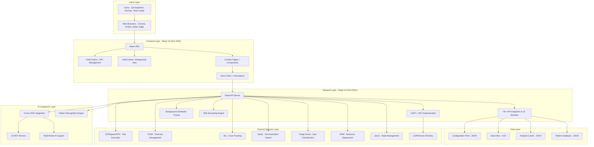

### 3.2 Feature Module Architecture

```mermaid
graph TD
    subgraph "Core Dashboard Modules"
        HOME[Regression Home - Overview & Metrics]
        RUNPLAN[Run Plan Management - Scheduling & Execution]
        ANALYSIS[Failed Analysis - AI + Rule-based Triage]
        TESTCASE[Testcase Management - TCMS Integration]
        REPORTS[Run Reports - QI Analysis & Communication]
    end

    subgraph "Advanced Modules"
        TRIAGE_GENIE[Triage Genie - Automated Jobs]
        DYNAMIC_JP[Dynamic Job Profiles - Creation & Management]
        CURSOR_AI[Cursor AI - Interactive Chat & Analysis]
        MANAGE_JP[Manage JP/TS - Bulk Operations]
        HANDOVER[Handover - Testcase Onboarding]
    end

    subgraph "API Endpoint Distribution"
        AUTH_ENDPOINTS["Authentication (3 endpoints)"]
        CONFIG_ENDPOINTS["Configuration (8 endpoints)"]
        RUNPLAN_ENDPOINTS["Run Plan Management (15 endpoints)"]
        ANALYSIS_ENDPOINTS["Failed Analysis (14 endpoints)"]
        TESTCASE_ENDPOINTS["Testcase Management (6 endpoints)"]
        AI_ENDPOINTS["AI Integration (12 endpoints)"]
        DYNAMIC_ENDPOINTS["Dynamic JP (12 endpoints)"]
        REPORT_ENDPOINTS["Reporting (4 endpoints)"]
        TRIAGE_ENDPOINTS["Triage Genie (2 endpoints)"]
        MISC_ENDPOINTS["Utilities & Debug (15 endpoints)"]
    end

    HOME --> CONFIG_ENDPOINTS
    RUNPLAN --> RUNPLAN_ENDPOINTS
    ANALYSIS --> ANALYSIS_ENDPOINTS
    TESTCASE --> TESTCASE_ENDPOINTS
    REPORTS --> REPORT_ENDPOINTS
    TRIAGE_GENIE --> TRIAGE_ENDPOINTS
    DYNAMIC_JP --> DYNAMIC_ENDPOINTS
    CURSOR_AI --> AI_ENDPOINTS
    MANAGE_JP --> DYNAMIC_ENDPOINTS
```

### 3.3 Data Flow Architecture

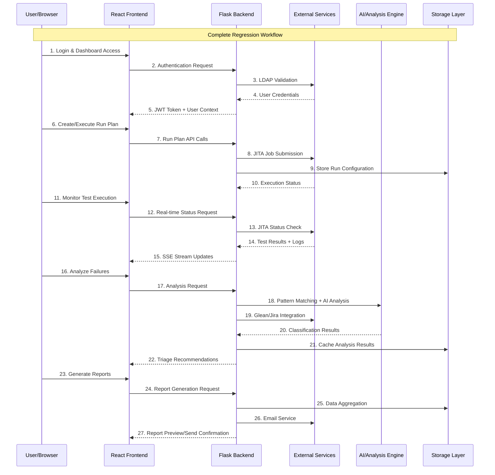

### 3.4 Pipeline Integration Architecture

```mermaid
graph LR
    subgraph "Test Execution Pipeline"
        A[Test Planning] --> B[Resource Allocation]
        B --> C[RDM Deployment]
        C --> D[Test Execution]
        D --> E[Result Collection]
    end

    subgraph "Analysis Pipeline"
        E --> F[Real-time Analysis]
        F --> G[Pattern Matching]
        G --> H[AI Classification]
        H --> I[Triage Recommendations]
    end

    subgraph "Automation Pipeline"
        I --> J[Automated Actions]
        J --> K[Infrastructure Management]
        K --> L[Issue Creation]
        L --> M[Stakeholder Notification]
    end

    subgraph "Feedback Loop"
        M --> N[Performance Analytics]
        N --> O[Pattern Updates]
        O --> P[Model Training]
        P --> A
    end
```

---

## 4. Functional Requirements

### 4.1 Core Dashboard Features

#### 4.1.1 Regression Home Dashboard (Module: HOME)
**Priority:** High  
**Module Endpoints:** 8 endpoints  
**Description:** Central command center providing comprehensive regression overview and team coordination

**Functional Requirements:**

**FR-001: Multi-Team Dashboard Access**
- **Description:** Support team-specific dashboard views with contextual data
- **Input:** User credentials, team selection, date range filters
- **Output:** Team-specific metrics, navigation controls, personalized widgets
- **API Endpoints:** `/home`, `/team-config`, `/config`
- **Acceptance Criteria:** 
  - Display team-specific regression metrics within 2 seconds
  - Support switching between CDP, Central Regression, DR, PRISM_CENTRAL teams
  - Maintain user preferences across sessions

**FR-002: Real-Time Triage Metrics**
- **Description:** Display live triage counts, accuracy metrics, and QI summaries
- **Input:** Tag IDs, task IDs, time period selection
- **Output:** Interactive metrics widgets, trend charts, drill-down capabilities
- **API Endpoints:** `/triage-count`, `/triage-accuracy`, `/qi-summary`
- **Acceptance Criteria:**
  - Update metrics automatically every 30 seconds
  - Support export of triage accuracy data to Excel
  - Show comparison with previous periods

**FR-003: TCMS Integration Dashboard**
- **Description:** Comprehensive TCMS data visualization and overall QI tracking
- **Input:** Branch selection, product filters, testcase criteria
- **Output:** TCMS QI charts, testcase distribution, coverage metrics
- **API Endpoints:** `/tcms-overall-qi`, `/tcms/tags`, `/tcms/testcases`
- **Acceptance Criteria:**
  - Display QI trends across multiple releases
  - Support filtering by testcase tags and categories
  - Provide direct links to TCMS for detailed analysis

**FR-004: Manual Task Management**
- **Description:** Create, monitor, and manage manual regression tasks
- **Input:** Task definitions, assignment details, priority settings
- **Output:** Task queues, progress tracking, completion notifications
- **API Endpoints:** `/manual-tasks` (GET/POST/DELETE)
- **Acceptance Criteria:**
  - Support task creation with rich metadata
  - Enable bulk task operations
  - Provide task history and audit trail

**FR-005: Configuration Management**
- **Description:** Dynamic configuration of dashboard behavior and system settings
- **Input:** Configuration parameters, tag management, branch selections
- **Output:** Persistent settings, configuration validation, change notifications
- **API Endpoints:** `/config`, `/config/tags`, `/branches`
- **Acceptance Criteria:**
  - Support tag addition/deletion with immediate UI updates
  - Validate configuration changes before persistence
  - Maintain configuration history for rollback capabilities

#### 4.1.2 Run Plan Management (Module: RUNPLAN)
**Priority:** High  
**Module Endpoints:** 15 endpoints  
**Description:** Comprehensive test execution planning, scheduling, and lifecycle management

**Functional Requirements:**

**FR-006: Run Plan Lifecycle Management**
- **Description:** Complete CRUD operations for run plans with validation and versioning
- **Input:** Job profiles, resource specifications, execution parameters, scheduling details
- **Output:** Run plan configurations, validation results, execution confirmations
- **API Endpoints:** `/run-plan` (GET/POST), `/run-plan/<id>` (PUT/DELETE), `/run-plan/<id>/clone`
- **Acceptance Criteria:**
  - Support complex run plan structures with nested job profiles
  - Validate resource availability before plan creation
  - Enable plan cloning with customization options
  - Maintain plan versioning and change history

**FR-007: Advanced Scheduling System**
- **Description:** Calendar-based scheduling with automated triggers and bulk operations
- **Input:** Schedule parameters, recurrence patterns, resource constraints, service accounts
- **Output:** Calendar views, scheduled executions, automated trigger confirmations
- **API Endpoints:** `/run-plan/<id>/schedule`, `/run-plan/calendar`, `/run-plan/bulk-schedule`
- **Acceptance Criteria:**
  - Support complex recurrence patterns (daily, weekly, on-demand)
  - Provide calendar visualization with drag-drop scheduling
  - Handle resource conflicts with intelligent scheduling recommendations
  - Support bulk scheduling across multiple plans

**FR-008: Execution Control and Monitoring**
- **Description:** Real-time execution control with trigger, batch update, and kill capabilities
- **Input:** Trigger parameters, batch update configurations, execution control commands
- **Output:** Execution status, real-time progress, control confirmations
- **API Endpoints:** `/run-plan/<id>/trigger`, `/run-plan/<id>/batch-update`, `/run-plan/bulk-trigger`
- **Acceptance Criteria:**
  - Support immediate and delayed execution triggers
  - Enable batch parameter updates across multiple runs
  - Provide real-time execution monitoring
  - Support emergency kill operations with cleanup

**FR-009: Execution History and Analytics**
- **Description:** Comprehensive tracking of execution history with retry and analysis capabilities
- **Input:** History queries, retry parameters, analysis filters
- **Output:** Execution timelines, performance metrics, retry confirmations, trend analysis
- **API Endpoints:** `/run-plan/<id>/history`, `/run-plan/history/<id>/retry`, `/run-plan/history/<id>/delete`
- **Acceptance Criteria:**
  - Maintain detailed execution logs with performance metrics
  - Support selective retry of failed executions
  - Provide execution trend analysis and reporting
  - Enable history cleanup with retention policies

**FR-010: Job Profile Integration**
- **Description:** Dynamic job profile search, validation, and tag management
- **Input:** Search criteria, profile validation parameters, tag operations
- **Output:** Profile listings, validation results, tag assignments, resource mappings
- **API Endpoints:** `/run-plan/search-job-profiles`, `/run-plan/tags`, `/run-plan/<id>/delete-tag`
- **Acceptance Criteria:**
  - Support advanced job profile search with multiple criteria
  - Validate job profile compatibility with target environments
  - Enable dynamic tag assignment and removal
  - Provide profile resource requirement analysis

**FR-011: Service Account Management**
- **Description:** Automated execution support with service account integration
- **Input:** Service account credentials, execution permissions, automation parameters
- **Output:** Account validation, permission verification, automated execution capabilities
- **API Endpoints:** `/run-plan/service-accounts`
- **Acceptance Criteria:**
  - Support multiple service account types (JITA, RDM, Triage Genie)
  - Validate service account permissions before execution
  - Enable secure credential management
  - Support account rotation and expiration handling

#### 4.1.3 Failed Testcase Analysis (Module: ANALYSIS)
**Priority:** High  
**Module Endpoints:** 14 endpoints  
**Description:** Intelligent failure analysis engine combining rule-based pattern matching, AI-powered classification, and automated triage workflows

**Functional Requirements:**

**FR-012: Real-Time Streaming Analysis**
- **Description:** Live failure analysis with Server-Sent Events for immediate feedback
- **Input:** Task IDs, tag filters, analysis parameters, streaming preferences
- **Output:** Real-time analysis updates, progress indicators, intermediate results
- **API Endpoints:** `/failed-analysis/analyze`, `/failed-analysis/analyze-stream`
- **Acceptance Criteria:**
  - Stream analysis results in real-time with <1 second latency
  - Support concurrent analysis streams for multiple users
  - Provide progress indicators with estimated completion time
  - Handle stream interruption and reconnection gracefully

**FR-013: Advanced Pattern Matching Engine**
- **Description:** Comprehensive RDM failure pattern detection with 108+ predefined patterns
- **Input:** Failure logs, deployment errors, pattern configuration, custom rules
- **Output:** Pattern matches, confidence scores, classification categories, remediation suggestions
- **API Endpoints:** `/failed-analysis/rdm-analyze`, `/failed-analysis/rdm-patterns`
- **Acceptance Criteria:**
  - Support 108+ predefined RDM failure patterns with high accuracy (>95%)
  - Enable custom pattern creation and modification
  - Provide confidence scoring for pattern matches
  - Support pattern versioning and A/B testing

**FR-014: AI-Powered Classification and Analysis**
- **Description:** Multi-model AI integration for intelligent failure classification and root cause analysis
- **Input:** Failure data, context information, AI model preferences, analysis depth
- **Output:** AI classifications, root cause analysis, remediation recommendations, confidence metrics
- **API Endpoints:** `/failed-analysis/rdm-analyze-ai`, `/failed-analysis/ai-summary-single`
- **Acceptance Criteria:**
  - Support multiple AI models with configurable selection
  - Provide detailed root cause analysis with supporting evidence
  - Generate actionable remediation recommendations
  - Maintain analysis quality metrics and feedback loops

**FR-015: Knowledge Base Integration**
- **Description:** Seamless integration with Glean and internal documentation systems
- **Input:** Search queries, context parameters, documentation filters
- **Output:** Relevant documentation links, knowledge base articles, related issues
- **API Endpoints:** `/failed-analysis/glean-search-single`
- **Acceptance Criteria:**
  - Provide contextual documentation suggestions during analysis
  - Support advanced search with technical context
  - Enable direct navigation to relevant documentation
  - Cache frequently accessed documentation for performance

**FR-016: Analysis Cache and Tag Management**
- **Description:** Persistent analysis caching with sophisticated tag-based organization
- **Input:** Tag definitions, cache parameters, analysis results, retention policies
- **Output:** Cached analysis data, tag hierarchies, search capabilities, storage metrics
- **API Endpoints:** `/failed-analysis/saved-tags`, `/failed-analysis/saved-tags/<tag>/results`
- **Acceptance Criteria:**
  - Support hierarchical tag organization with metadata
  - Enable advanced search across cached analyses
  - Provide tag-based access control and sharing
  - Implement intelligent cache eviction policies

**FR-017: Triage Workflow Automation**
- **Description:** Automated triage updates with intelligent retrigger capabilities
- **Input:** Triage decisions, automation rules, retrigger parameters, approval workflows
- **Output:** Triage updates, automated actions, retrigger confirmations, workflow status
- **API Endpoints:** `/failed-analysis/update-triage`, `/failed-analysis/retrigger`
- **Acceptance Criteria:**
  - Support bulk triage updates with validation
  - Enable intelligent retrigger with context awareness
  - Provide audit trail for all triage decisions
  - Support approval workflows for critical actions

**FR-018: Historical Analysis and Reporting**
- **Description:** Comprehensive analysis history with trend identification and reporting
- **Input:** History queries, trend analysis parameters, reporting preferences
- **Output:** Historical data, trend analysis, performance reports, analytics dashboards
- **API Endpoints:** `/failed-analysis/history`
- **Acceptance Criteria:**
  - Maintain comprehensive analysis history with full context
  - Provide trend analysis across time periods and releases
  - Support custom reporting with multiple output formats
  - Enable data export for external analysis tools

#### 4.1.4 Testcase Management (Module: TESTCASE)
**Priority:** Medium  
**Module Endpoints:** 6 endpoints  
**Description:** Comprehensive TCMS integration for testcase lifecycle management and resource optimization

**Functional Requirements:**

**FR-019: Advanced Testcase Discovery**
- **Description:** Sophisticated testcase browsing and search across multiple branches and products
- **Input:** Branch selection, product filters, search criteria, metadata queries
- **Output:** Filtered testcase listings, metadata details, execution history, resource requirements
- **API Endpoints:** `/testcase-mgmt/fetch-data`, `/testcase-mgmt/testcases`, `/testcase-mgmt/branches`
- **Acceptance Criteria:**
  - Support multi-criteria search across 10,000+ testcases
  - Provide real-time filtering with typeahead suggestions
  - Display comprehensive testcase metadata and relationships
  - Enable saved search queries and favorites

**FR-020: Dynamic Tag Management**
- **Description:** Flexible tag assignment and management with batch operations
- **Input:** Tag definitions, assignment rules, batch operations, validation criteria
- **Output:** Tag assignments, validation results, batch operation status, tag analytics
- **API Endpoints:** `/testcase-mgmt/tags/add`, `/testcase-mgmt/tags/delete`
- **Acceptance Criteria:**
  - Support hierarchical tag structures with inheritance
  - Enable bulk tag operations with progress tracking
  - Validate tag assignments against business rules
  - Provide tag usage analytics and optimization suggestions

**FR-021: Resource Specification Management**
- **Description:** Automated resource specification generation and optimization
- **Input:** Testcase selections, resource requirements, optimization parameters
- **Output:** Resource specifications, download packages, optimization recommendations
- **API Endpoints:** `/testcase-mgmt/resource-spec/download`
- **Acceptance Criteria:**
  - Generate optimized resource specifications automatically
  - Support multiple output formats (JSON, YAML, Excel)
  - Provide resource usage analytics and optimization
  - Enable version control for resource specifications

**FR-022: Job Profile Resolution and Validation**
- **Description:** Intelligent job profile mapping and compatibility validation
- **Input:** Testcase selections, target environments, validation parameters
- **Output:** Job profile mappings, compatibility reports, resolution recommendations
- **API Endpoints:** `/testcase-mgmt/resolve-job-profiles`
- **Acceptance Criteria:**
  - Automatically resolve optimal job profiles for testcase combinations
  - Validate job profile compatibility with target environments
  - Provide alternative recommendations for incompatible profiles
  - Support profile customization and override capabilities

#### 4.1.5 Cursor AI Integration (Module: CURSOR_AI)
**Priority:** Medium  
**Module Endpoints:** 12 endpoints  
**Description:** Advanced AI-powered analysis and interaction system with multi-model support and comprehensive MCP server integration

**Functional Requirements:**

**FR-023: Multi-Model AI Chat System**
- **Description:** Interactive AI chat interface with support for multiple AI models and conversation modes
- **Input:** Natural language queries, model preferences, conversation context, mode selection
- **Output:** AI responses, analysis insights, actionable recommendations, conversation history
- **API Endpoints:** `/cursor-ai/chat`, `/cursor-ai/mcp-servers`
- **Acceptance Criteria:**
  - Support multiple AI models (Claude Sonnet 4.6, GPT-4, others) with seamless switching
  - Provide mode selection (Agent/Plan/Debug/Ask) with context-appropriate responses
  - Maintain conversation context and history across sessions
  - Enable model comparison and performance analytics

**FR-024: Comprehensive MCP Server Integration**
- **Description:** Integration with 12 MCP servers for cross-platform data access and analysis
- **Input:** MCP server queries, authentication tokens, data filters, integration parameters
- **Output:** Unified data responses, cross-platform insights, integrated analysis results
- **API Endpoints:** `/cursor-ai/mcp-servers` (12 integrated servers)
- **MCP Servers:** RegX Data, Atlassian, Sourcegraph, JITA, Diamond, Glean, SupportGPT, NuRAG, Slack, Panacea, Live Debug, Auto Handoff
- **Acceptance Criteria:**
  - Maintain active connections to all 12 MCP servers with health monitoring
  - Provide unified query interface across all integrated platforms
  - Support real-time data synchronization and caching
  - Enable cross-platform correlation and analysis

**FR-025: Batch Analysis and Processing**
- **Description:** High-volume batch analysis capabilities with job tracking and result management
- **Input:** Batch analysis requests, testcase collections, processing parameters, priority settings
- **Output:** Batch job status, analysis results, progress tracking, completion notifications
- **API Endpoints:** `/cursor-ai/analyze-testcase`, `/cursor-ai/analyze-batch`, `/cursor-ai/status/<job_id>`
- **Acceptance Criteria:**
  - Support batch analysis of 1000+ testcases with parallel processing
  - Provide real-time progress tracking with estimated completion times
  - Enable job prioritization and resource management
  - Support result aggregation and summary reporting

**FR-026: Advanced Follow-up and Context Management**
- **Description:** Intelligent follow-up query processing with context awareness and skill synchronization
- **Input:** Follow-up queries, context parameters, skill definitions, analysis continuations
- **Output:** Contextual responses, skill updates, analysis refinements, action recommendations
- **API Endpoints:** `/cursor-ai/follow-up`, `/cursor-ai/result`, `/cursor-ai/sync-skills`
- **Acceptance Criteria:**
  - Maintain deep context awareness across multi-turn conversations
  - Support automatic skill synchronization and updates
  - Provide intelligent follow-up suggestions based on analysis results
  - Enable context-driven action recommendations and automation

### 4.2 Supporting Modules

#### 4.2.1 Run Report Generation (Module: REPORTS)
**Priority:** Medium  
**Module Endpoints:** 4 endpoints  
**Description:** Comprehensive reporting system with QI analysis and stakeholder communication

**Functional Requirements:**

**FR-027: Advanced Report Generation**
- **Description:** Multi-format report generation with QI analysis and trend identification
- **Input:** Analysis parameters, report templates, data filters, output preferences
- **Output:** Formatted reports, QI metrics, trend analysis, distribution lists
- **API Endpoints:** `/run-report/list-analysis-files`, `/run-report/qi-analysis`
- **Acceptance Criteria:**
  - Generate comprehensive QI reports with statistical analysis
  - Support multiple output formats (PDF, HTML, Excel, JSON)
  - Provide trend analysis across multiple time periods
  - Enable custom report templates and branding

**FR-028: Email Communication System**
- **Description:** Automated email generation and distribution with customizable templates
- **Input:** Report data, recipient lists, template selection, delivery parameters
- **Output:** Email previews, delivery confirmations, tracking metrics
- **API Endpoints:** `/run-report/preview-email`, `/run-report/send-email`
- **Acceptance Criteria:**
  - Support rich HTML email templates with embedded charts
  - Enable recipient list management with role-based distribution
  - Provide email delivery tracking and analytics
  - Support scheduled delivery and reminder systems

#### 4.2.2 Triage Genie Integration (Module: TRIAGE_GENIE)
**Priority:** Medium  
**Module Endpoints:** 2 endpoints  
**Description:** Automated triage job management with intelligent classification

**Functional Requirements:**

**FR-029: Automated Triage Job Management**
- **Description:** Seamless integration with Triage Genie for automated failure classification
- **Input:** Job definitions, classification parameters, automation rules
- **Output:** Triage jobs, classification results, automation status
- **API Endpoints:** `/triage-genie/jobs` (GET/POST)
- **Acceptance Criteria:**
  - Support automated job creation with Run Plan prefill
  - Enable bulk job submission with progress tracking
  - Provide classification accuracy metrics and feedback
  - Support custom classification rules and training

#### 4.2.3 Dynamic Job Profile Management (Module: DYNAMIC_JP)
**Priority:** Medium  
**Module Endpoints:** 12 endpoints  
**Description:** Advanced job profile creation and lifecycle management

**Functional Requirements:**

**FR-030: Intelligent Job Profile Creation**
- **Description:** AI-assisted job profile creation with historical analysis and optimization
- **Input:** Requirements specifications, historical data, optimization parameters
- **Output:** Optimized job profiles, resource recommendations, performance predictions
- **API Endpoints:** `/dynamic-jp/create`, `/dynamic-jp/update`, `/dynamic-jp/check-existing`
- **Acceptance Criteria:**
  - Support intelligent job profile recommendations based on historical data
  - Enable resource optimization with cost-benefit analysis
  - Provide performance prediction models
  - Support profile versioning and rollback capabilities

**FR-031: Comprehensive Resource Discovery**
- **Description:** Multi-dimensional resource discovery and validation system
- **Input:** Search criteria, resource constraints, availability requirements
- **Output:** Resource listings, availability status, recommendation scores
- **API Endpoints:** `/dynamic-jp/search-node-pools`, `/dynamic-jp/search-clusters`, `/dynamic-jp/search-branches`
- **Acceptance Criteria:**
  - Support complex multi-criteria resource searches
  - Provide real-time availability information
  - Enable resource reservation and conflict resolution
  - Support resource usage analytics and optimization

### 4.3 Enhanced Features (Planned Implementation)

#### 4.3.1 Multi-Team Access Control
**Priority:** High  
**Description:** Advanced team-level access control with role-based permissions and data isolation

**Functional Requirements:**

**FR-032: Team-Based Authentication System**
- **Description:** Sophisticated authentication with team membership and role management
- **Input:** User credentials, team associations, role definitions, permission matrices
- **Output:** Authentication tokens, team context, permission sets, access logs
- **Acceptance Criteria:**
  - Support multiple team membership with dynamic context switching
  - Implement role hierarchy (Admin > Lead > Member > Viewer)
  - Provide fine-grained permission control at feature and data levels
  - Maintain comprehensive audit logs for security compliance

**FR-033: Team-Specific Dashboard Customization**
- **Description:** Customizable dashboard layouts and widgets per team with inheritance
- **Input:** Team preferences, widget configurations, layout templates, sharing settings
- **Output:** Personalized dashboards, team templates, configuration management
- **Acceptance Criteria:**
  - Support team-specific dashboard layouts with widget customization
  - Enable template sharing and inheritance between teams
  - Provide dashboard version control and rollback capabilities
  - Support real-time collaboration on dashboard configuration

**FR-034: Data Isolation and Security**
- **Description:** Comprehensive data isolation with controlled cross-team collaboration
- **Input:** Data classification, access policies, sharing rules, collaboration requests
- **Output:** Isolated data views, controlled sharing, collaboration workflows
- **Acceptance Criteria:**
  - Implement complete data isolation by default with explicit sharing
  - Support controlled cross-team data sharing with approval workflows
  - Provide data lineage and access tracking for compliance
  - Enable emergency access procedures with audit trails

**Teams Supported:**
- **CDP (Cluster Data Path):** Data infrastructure and storage testing
- **Central Regression Team:** Cross-team coordination and integration testing  
- **DR (Disaster Recovery):** Backup, recovery, and resilience testing
- **PRISM_CENTRAL:** Management plane and orchestration testing

#### 3.2.2 Advanced Skipped Testcase Analysis
**Priority:** High  
**Description:** Comprehensive analysis and automated resolution of skipped tests

**Functional Requirements:**
- FR-7.1: RDM deployment failure detection and classification
- FR-7.2: Pattern matching for failure reason identification
- FR-7.3: Node failure identification and correlation
- FR-7.4: Automated Jarvis API integration for node management
- FR-7.5: Cron job for periodic skipped test monitoring
- FR-7.6: AI skill integration for intelligent triage (@triage-rdm-deployment-failure)

**Workflow:**
1. Detect skipped test due to RDM deployment failure
2. Analyze deployment logs for failure patterns
3. Identify problematic nodes
4. Automatically disable faulty nodes via Jarvis API
5. Create/update Jira tickets for Productivity Infrastructure (PI) team
6. Generate comprehensive triage reports

#### 3.2.3 Intermittent Issue Identification
**Priority:** High  
**Description:** AI-powered detection and classification of flaky/intermittent failures

**Functional Requirements:**
- FR-8.1: Historical failure pattern analysis
- FR-8.2: Statistical significance testing for flaky tests
- FR-8.3: Root Cause Analysis (RCA) automation
- FR-8.4: Failure clustering and correlation
- FR-8.5: Predictive modeling for failure probability
- FR-8.6: Automated issue classification and prioritization

**AI Integration:**
- Machine learning models for pattern recognition
- Natural language processing for log analysis
- Correlation analysis across test environments
- Predictive analytics for failure prevention

---

## 5. Non-Functional Requirements

### 5.1 Performance Requirements

**NFR-001: Response Time Performance**
- **Requirement:** All API endpoints must respond within specified time limits
- **Metrics:**
  - Dashboard load time: < 2 seconds (95th percentile)
  - API response time: < 1 second for data queries (90th percentile)
  - Real-time streaming latency: < 500ms for SSE updates
  - Batch analysis processing: < 5 minutes for 1000 testcases
- **Monitoring:** Continuous performance monitoring with alerting on threshold breaches

**NFR-002: Scalability and Throughput**
- **Requirement:** System must handle increasing load with graceful degradation
- **Metrics:**
  - Concurrent users: Support 100+ simultaneous users
  - API throughput: 1000+ requests per minute sustained
  - Data processing: 10,000+ testcases per hour analysis capacity
  - Storage scaling: Support 100GB+ of analysis data with sub-second queries
- **Implementation:** Horizontal scaling design with load balancing capabilities

**NFR-003: Resource Utilization**
- **Requirement:** Efficient resource usage with predictable performance characteristics
- **Metrics:**
  - Memory usage: < 4GB per backend instance under normal load
  - CPU utilization: < 70% average during peak usage
  - Storage growth: < 1GB per month for configuration and cache data
  - Network bandwidth: < 100MB/s for typical usage patterns
- **Optimization:** Resource monitoring with automatic scaling recommendations

### 5.2 Reliability and Availability Requirements

**NFR-004: System Availability**
- **Requirement:** High availability during business hours with planned maintenance windows
- **Metrics:**
  - Uptime: 99.5% during business hours (8 AM - 8 PM, Mon-Fri)
  - Recovery time: < 15 minutes for service restoration
  - Data consistency: 100% data integrity across all operations
  - Backup frequency: Hourly incremental, daily full backups
- **Implementation:** Redundant deployment with automatic failover capabilities

**NFR-005: Error Handling and Recovery**
- **Requirement:** Graceful degradation and automatic recovery from failures
- **Metrics:**
  - Error rate: < 1% for all API operations under normal conditions
  - Recovery time: < 5 minutes for transient failures
  - Data loss tolerance: Zero tolerance for configuration and analysis data
  - External service failures: Graceful degradation with cached data
- **Implementation:** Circuit breaker patterns and intelligent retry mechanisms

**NFR-006: Data Integrity and Consistency**
- **Requirement:** Maintain data consistency across all operations and integrations
- **Metrics:**
  - Transaction success rate: > 99.9% for all data operations
  - Synchronization accuracy: < 1 second delay for real-time updates
  - Conflict resolution: Automated resolution for 95% of data conflicts
  - Audit trail completeness: 100% operation logging for compliance
- **Implementation:** ACID compliance where applicable with eventual consistency for analytics

### 5.3 Security Requirements

**NFR-007: Authentication and Authorization**
- **Requirement:** Secure authentication with comprehensive authorization controls
- **Metrics:**
  - Authentication success rate: > 99% for valid credentials
  - Token security: JWT tokens with configurable expiration (default 24 hours)
  - Permission validation: < 100ms for authorization checks
  - Audit compliance: 100% logging of authentication and authorization events
- **Implementation:** LDAP integration with JWT tokens and role-based access control

**NFR-008: Data Protection**
- **Requirement:** Comprehensive data protection in transit and at rest
- **Metrics:**
  - Encryption coverage: 100% of data in transit using TLS 1.3+
  - Credential security: Zero plaintext storage of passwords or tokens
  - Data classification: Automatic classification and protection of sensitive data
  - Access logging: 100% logging of data access with retention policies
- **Implementation:** End-to-end encryption with secure credential management

### 5.4 Usability Requirements

**NFR-009: User Interface Performance**
- **Requirement:** Responsive and intuitive user interface across supported platforms
- **Metrics:**
  - Page load time: < 3 seconds for initial load, < 1 second for navigation
  - Responsiveness: Support for desktop and tablet devices (minimum 1024px width)
  - Accessibility: WCAG 2.1 Level AA compliance
  - Browser compatibility: Support for Chrome, Firefox, Safari, Edge (latest 2 versions)
- **Implementation:** Progressive web app design with modern UI frameworks

**NFR-010: Learning Curve and Documentation**
- **Requirement:** Minimal learning curve with comprehensive documentation
- **Metrics:**
  - Onboarding time: < 30 minutes for basic functionality
  - Help documentation coverage: 100% of user-facing features
  - Error message clarity: User-actionable error messages for 95% of error conditions
  - Feature discoverability: < 3 clicks to access any major feature
- **Implementation:** Contextual help, comprehensive documentation, and intuitive navigation

### 5.5 Maintainability Requirements

**NFR-011: Code Quality and Architecture**
- **Requirement:** Maintainable codebase with clear architecture and documentation
- **Metrics:**
  - Code coverage: > 80% test coverage for critical functionality
  - Documentation coverage: 100% API documentation with examples
  - Deployment time: < 10 minutes for full system deployment
  - Configuration flexibility: Environment-based configuration without code changes
- **Implementation:** Modular architecture with comprehensive testing and CI/CD pipelines

---

## 6. Pipeline Integration Requirements

### 4.1 User Interface Requirements
- **UI-1**: Responsive web interface supporting desktop and tablet devices
- **UI-2**: Modern Material Design or similar design system
- **UI-3**: Accessibility compliance (WCAG 2.1 Level AA)
- **UI-4**: Multi-theme support (light/dark mode)
- **UI-5**: Real-time updates with WebSocket or Server-Sent Events

### 4.2 Hardware Interfaces
- **HW-1**: Standard web browsers (Chrome, Firefox, Safari, Edge)
- **HW-2**: Minimum 4GB RAM for client machines
- **HW-3**: Server deployment on Linux x86_64 architecture

### 4.3 Software Interfaces

#### 4.3.1 External API Integrations
| Service | Purpose | Authentication | API Version |
|---------|---------|----------------|-------------|
| JITA/Agave/PHX | Test execution and resource management | Service account credentials | v2.0 |
| TCMS | Testcase management and metadata | Username/password | v1.0 |
| Jira | Issue tracking and project management | API token | REST v2/v3 |
| Glean | Documentation and knowledge base | API key | v1.0 |
| Triage Genie | Automated failure classification | Username/password | v1.0 |
| RDM | Resource Deployment Manager | API integration | v1.0 |
| Jarvis | Infrastructure node management | API endpoint | v1.0 |

#### 4.3.2 Internal Component Interfaces
- **React Frontend ↔ Flask Backend**: RESTful API over HTTP/HTTPS
- **Authentication**: LDAP integration with JWT token management
- **Data Storage**: JSON/CSV files (current), Database (planned migration)

### 4.4 Communication Interfaces
- **COM-1**: HTTPS for all external API communications
- **COM-2**: WebSocket or SSE for real-time updates
- **COM-3**: SMTP for email notifications and reports
- **COM-4**: Secure credential management for service accounts

---

## 8. External Interface Requirements

### 8.1 User Interface Requirements

**UI-001: Modern Web Interface**
- **Requirement:** Responsive, accessible web interface supporting multiple device types
- **Standards:** WCAG 2.1 Level AA compliance, Material Design principles
- **Browser Support:** Chrome, Firefox, Safari, Edge (latest 2 versions)
- **Resolution Support:** Minimum 1024px width, optimized for 1920x1080
- **Accessibility:** Keyboard navigation, screen reader compatibility, high contrast mode

**UI-002: Real-Time User Experience**
- **Requirement:** Real-time updates and feedback for all user interactions
- **Technologies:** Server-Sent Events (SSE), WebSocket fallback, progressive loading
- **Performance:** < 1 second for UI state updates, < 500ms for real-time data streams
- **Offline Support:** Graceful degradation with cached data and offline indicators

### 8.2 External System Interfaces

| System | Interface Type | Authentication | Data Format | Purpose |
|--------|---------------|----------------|-------------|---------|
| **JITA/Agave/PHX** | REST API | Service Account | JSON | Test execution and resource management |
| **TCMS** | REST API | Username/Password | JSON/XML | Testcase management and metadata |
| **Jira** | REST API v3 | API Token | JSON | Issue tracking and project management |
| **Glean** | REST API | API Key | JSON | Documentation and knowledge search |
| **Triage Genie** | REST API | Username/Password | JSON | Automated failure classification |
| **RDM** | REST API | Service Integration | JSON | Resource deployment and management |
| **Jarvis** | REST API | API Endpoint | JSON | Infrastructure node management |
| **LDAP/AD** | LDAP Protocol | Service Binding | LDIF | User authentication and directory |
| **Cursor SDK** | SDK Integration | API Key | JSON | AI model integration and MCP servers |

### 8.3 Hardware and Software Interfaces

**Hardware Requirements:**
- **Server Infrastructure:** Linux x86_64 architecture (Rocky Linux, Ubuntu 20.04+)
- **Memory:** Minimum 8GB RAM, Recommended 16GB+ for production
- **Storage:** Minimum 100GB available space, SSD recommended for performance
- **Network:** Gigabit Ethernet with internet access for external service integration

**Software Dependencies:**
- **Runtime:** Python 3.8+, Node.js 16+, npm 8+
- **Web Server:** Flask 3.0+ with WSGI server (Gunicorn recommended for production)
- **Database:** File-based storage (current), Database server (planned: PostgreSQL 12+)
- **Monitoring:** Optional integration with Prometheus, Grafana, or similar monitoring solutions

---

## 9. Data Requirements

### 9.1 Data Architecture

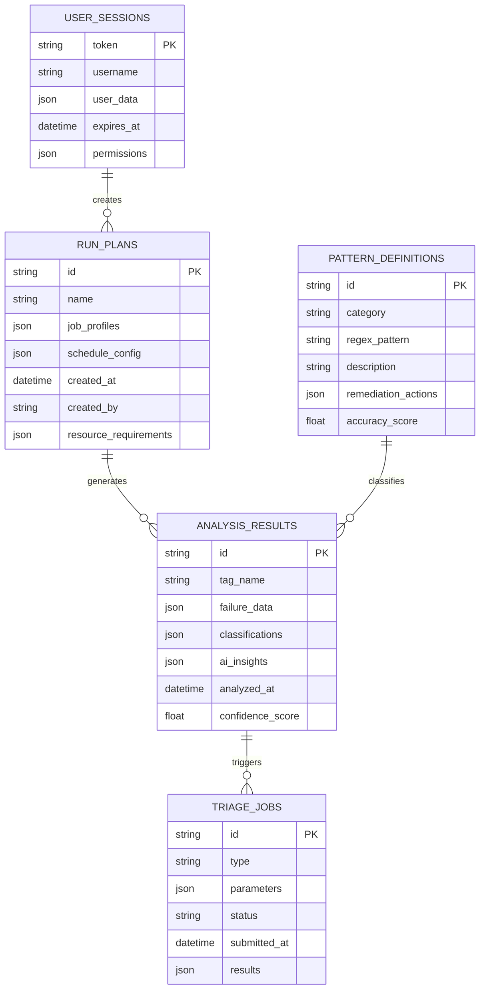

### 9.2 Data Volume and Growth Projections

**Current Data Volumes:**
- **Run Plans:** ~1,000 active plans, ~10MB storage
- **Analysis Results:** ~100,000 analyses, ~500MB storage
- **Triage Data:** ~50,000 triage records, ~100MB storage
- **Pattern Database:** 108+ patterns, ~2MB storage
- **User Sessions:** ~200 concurrent sessions, ~10MB memory

**Projected Growth (Annual):**
- **Run Plans:** 50% growth (1,500 plans, 15MB)
- **Analysis Results:** 100% growth (200,000 analyses, 1GB)
- **Triage Data:** 75% growth (87,500 records, 175MB)
- **Pattern Database:** 25% growth (135+ patterns, 2.5MB)

### 9.3 Data Retention and Archival

**Retention Policies:**
- **Active Run Plans:** Indefinite retention with archive after 1 year of inactivity
- **Analysis Results:** 2 years active retention, 5 years archived retention
- **Triage Data:** 1 year active retention, 3 years archived retention
- **User Session Logs:** 90 days retention for security audit
- **System Logs:** 30 days active, 1 year archived

**Backup and Recovery:**
- **Frequency:** Hourly incremental, daily full backups
- **Retention:** 30 daily, 12 monthly, 7 yearly backup retention
- **Recovery Time Objective (RTO):** < 15 minutes for critical data
- **Recovery Point Objective (RPO):** < 1 hour for all data

---

## 10. Security Requirements

### 10.1 Authentication and Authorization

**Security Architecture:**

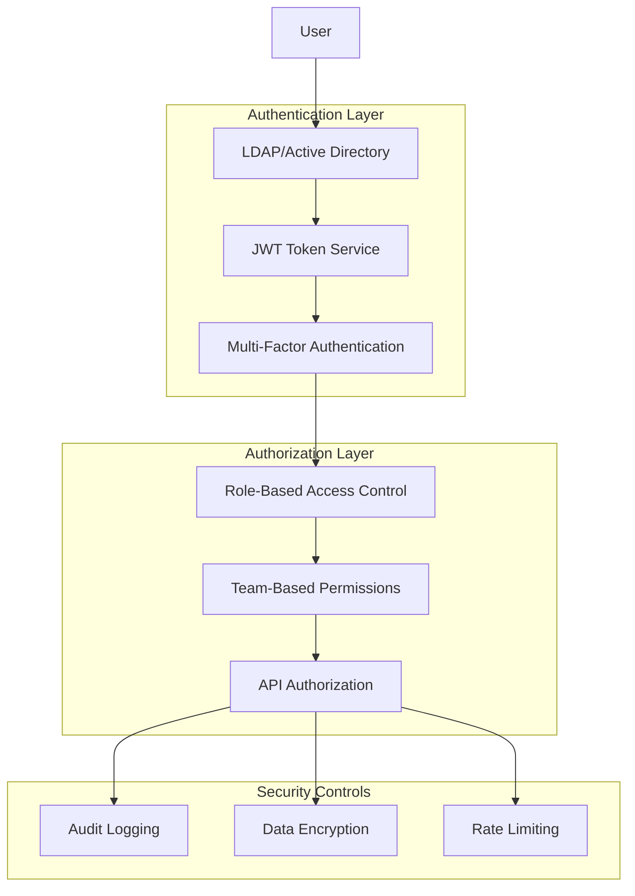

**Security Requirements:**

**SEC-001: Multi-Layer Authentication**
- **LDAP Integration:** Active Directory integration with group-based team membership
- **JWT Token Security:** HS256 encryption, configurable expiration (default 24 hours)
- **Multi-Factor Authentication:** Optional TOTP support for high-privilege accounts
- **Session Management:** Secure session handling with automatic timeout and renewal

**SEC-002: Comprehensive Authorization**
- **Role-Based Permissions:** Admin, Lead, Member, Viewer roles with hierarchical inheritance
- **Team-Based Access Control:** Complete data isolation with controlled sharing
- **API-Level Authorization:** Endpoint-specific permission validation
- **Dynamic Permissions:** Context-aware permissions based on data sensitivity

**SEC-003: Data Protection**
- **Encryption in Transit:** TLS 1.3+ for all external communications
- **Credential Security:** Encrypted storage of service account credentials
- **Data Classification:** Automatic classification and protection of sensitive test data
- **Audit Compliance:** Comprehensive logging for SOX, GDPR, and internal compliance

### 10.2 Threat Model and Mitigation

**Identified Threats and Mitigations:**

| Threat Category | Risk Level | Mitigation Strategy |
|-----------------|------------|-------------------|
| **Unauthorized Access** | High | Multi-layer authentication, RBAC, audit logging |
| **Data Breach** | High | Encryption, access controls, data classification |
| **Service Disruption** | Medium | Rate limiting, circuit breakers, redundancy |
| **Privilege Escalation** | Medium | Least privilege principle, role validation |
| **External Service Compromise** | Medium | Service isolation, credential rotation |
| **Insider Threats** | Low | Audit logging, access monitoring, separation of duties |

---

## 11. Enhancement Roadmap

### 5.1 Performance Requirements
- **PERF-1**: Page load time < 3 seconds for dashboard views
- **PERF-2**: API response time < 2 seconds for data queries
- **PERF-3**: Support concurrent access for 100+ users
- **PERF-4**: Real-time analysis streaming with < 1 second latency
- **PERF-5**: Batch operations processing within 5 minutes

### 5.2 Security Requirements
- **SEC-1**: Multi-factor authentication support
- **SEC-2**: Role-based access control (RBAC)
- **SEC-3**: Secure credential storage (no plaintext passwords)
- **SEC-4**: API rate limiting and request validation
- **SEC-5**: Audit logging for all critical operations
- **SEC-6**: Data encryption in transit and at rest

### 5.3 Availability Requirements
- **AVAIL-1**: System uptime of 99.5% during business hours
- **AVAIL-2**: Graceful degradation when external services are unavailable
- **AVAIL-3**: Automatic retry mechanisms for transient failures
- **AVAIL-4**: Health check endpoints for monitoring

### 5.4 Scalability Requirements
- **SCALE-1**: Horizontal scaling capability for backend services
- **SCALE-2**: Database migration path for growing data volumes
- **SCALE-3**: CDN support for static asset distribution
- **SCALE-4**: Caching strategies for frequently accessed data

---

## 6. Quality Attributes

### 6.1 Reliability
- Fault tolerance with graceful error handling
- Comprehensive logging and monitoring
- Automated backup and recovery procedures

### 6.2 Usability
- Intuitive user interface with minimal learning curve
- Comprehensive help documentation and tutorials
- Keyboard shortcuts and accessibility features

### 6.3 Maintainability
- Modular architecture with clear separation of concerns
- Comprehensive test coverage (unit, integration, E2E)
- Code quality standards and automated CI/CD pipelines

### 6.4 Portability
- Cross-platform compatibility (Linux, Windows, macOS)
- Container-based deployment with Docker
- Cloud-native architecture for multi-cloud deployment

---

## 7. Pipeline Integration Requirements

### 6.1 Current Pipeline Integration
The RegX-AI system integrates with comprehensive automation pipelines supporting end-to-end regression workflows:

#### 7.1.1 JITA Integration Pipeline
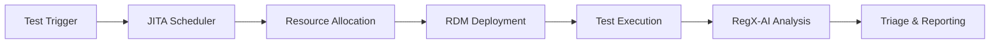

**Pipeline Components:**
- **JITA Task Scheduling**: Automated test triggering based on run plans
- **Resource Management**: Integration with Agave/PHX for resource allocation
- **RDM Deployment**: Cluster provisioning and configuration
- **Result Collection**: Automated ingestion of test results and logs

#### 7.1.2 Triage Genie Pipeline
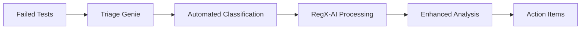

**Pipeline Features:**
- Automated failure classification
- Integration with RegX-AI for enhanced analysis
- Bulk triage job processing
- Results integration with main dashboard

#### 7.1.3 CI/CD Integration Pipeline
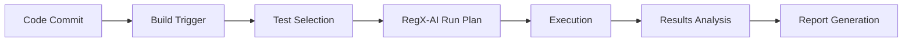

### 6.2 Enhanced Pipeline Requirements

#### 6.2.1 Intelligent Analysis Pipeline
**Priority:** High

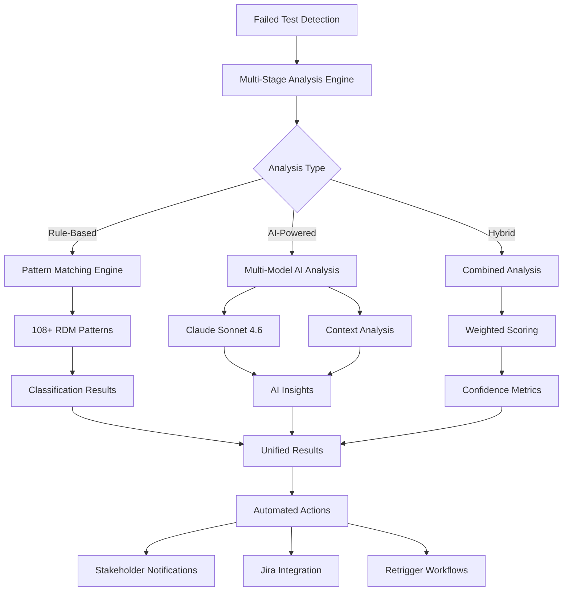

#### 6.2.2 Real-Time Streaming Pipeline
**Priority:** High

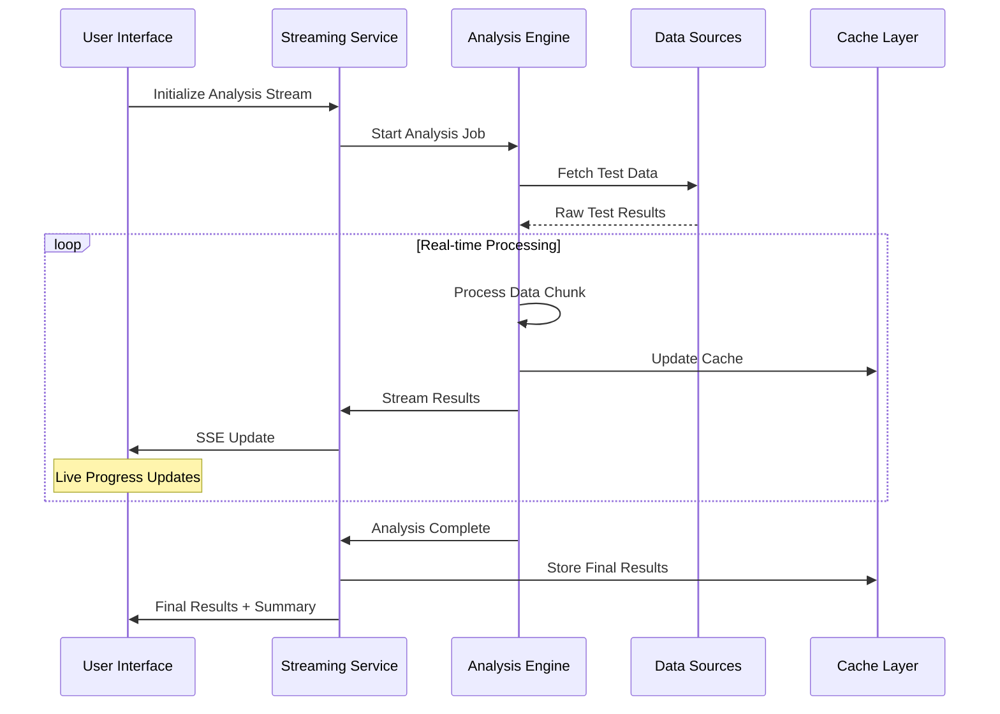

### 6.3 Pipeline Performance Requirements

**Pipeline Metric Requirements:**
- **Analysis Latency:** < 30 seconds for 1000 test results
- **Streaming Throughput:** 100+ concurrent streams with < 1 second latency
- **Pattern Matching:** < 5 seconds for 108+ pattern evaluation
- **AI Processing:** < 2 minutes for comprehensive AI analysis
- **Cache Performance:** < 100ms for cached result retrieval

---

## 7. Business Workflows and Use Cases

### 7.1 Primary Business Workflows

#### 7.1.1 Complete Regression Testing Lifecycle

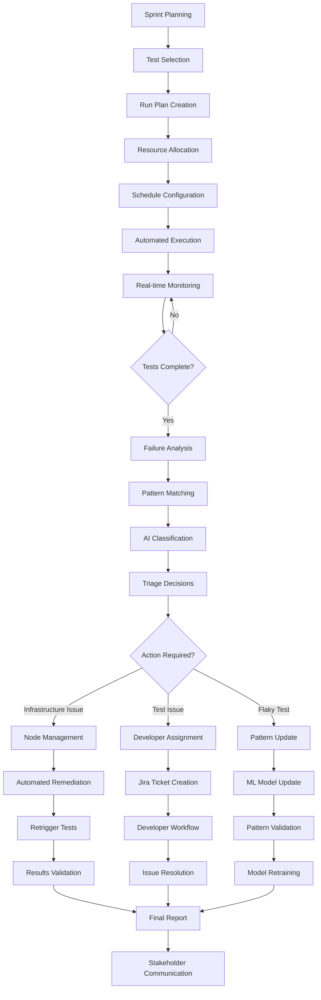

**Workflow Description:**
This comprehensive workflow represents the complete regression testing lifecycle from initial planning through final reporting and stakeholder communication.

**Key Automation Points:**
1. **Automated Test Selection:** AI-powered selection based on code changes and historical patterns
2. **Dynamic Resource Allocation:** Real-time resource optimization based on availability and requirements
3. **Intelligent Scheduling:** Conflict-aware scheduling with priority and dependency management
4. **Real-time Analysis:** Streaming analysis with immediate feedback and classification
5. **Automated Remediation:** Infrastructure issues resolved automatically with Jarvis integration
6. **Intelligent Retrigger:** Context-aware test re-execution with optimization

#### 7.1.2 Intelligent Failure Triage Workflow

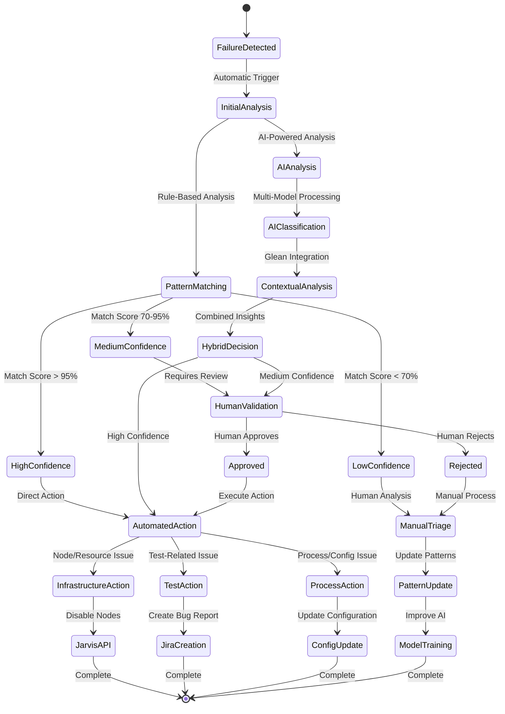

#### 7.1.3 Multi-Team Collaboration Workflow

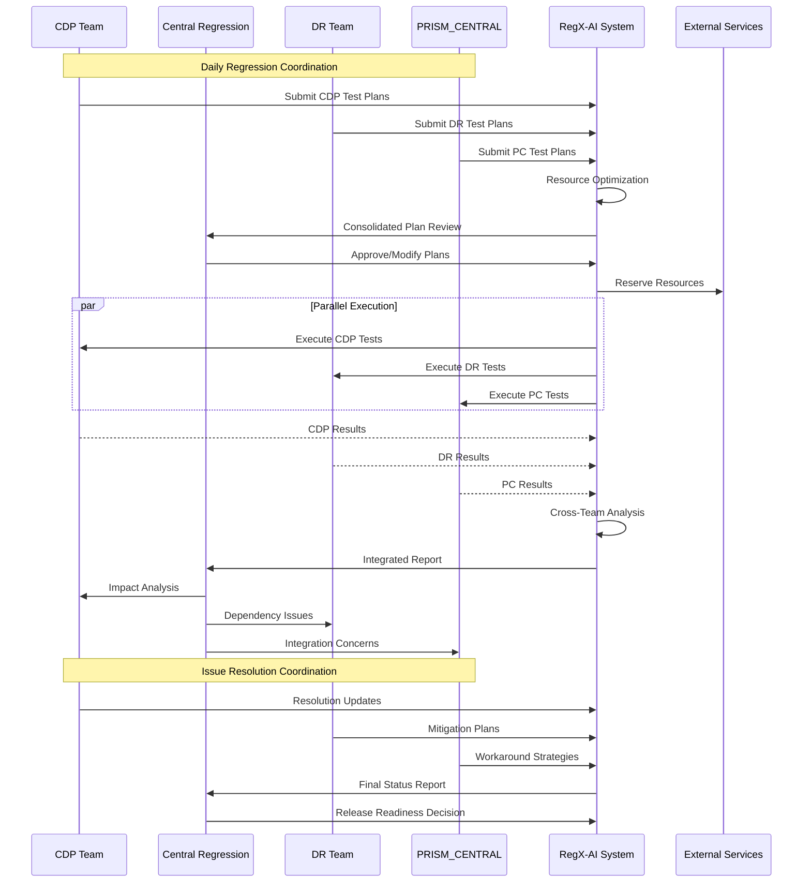

### 7.2 Specialized Use Cases

#### 7.2.1 Skipped Test Analysis and Remediation

**Use Case:** Automated detection and resolution of tests skipped due to infrastructure failures

**Actors:** System (Primary), DevOps Engineer (Secondary), Infrastructure Team (External)

**Main Success Scenario:**
1. **Automated Detection:** Cron job detects skipped tests every 15 minutes
2. **Pattern Analysis:** System analyzes RDM deployment logs using 108+ failure patterns
3. **Root Cause Identification:** AI classification determines failure category (Node, Network, Resource)
4. **Automated Remediation:** System executes appropriate remediation actions
5. **Stakeholder Notification:** Automated updates to relevant teams and systems
6. **Validation and Reporting:** System validates remediation and generates comprehensive reports

**Detailed Workflow:**

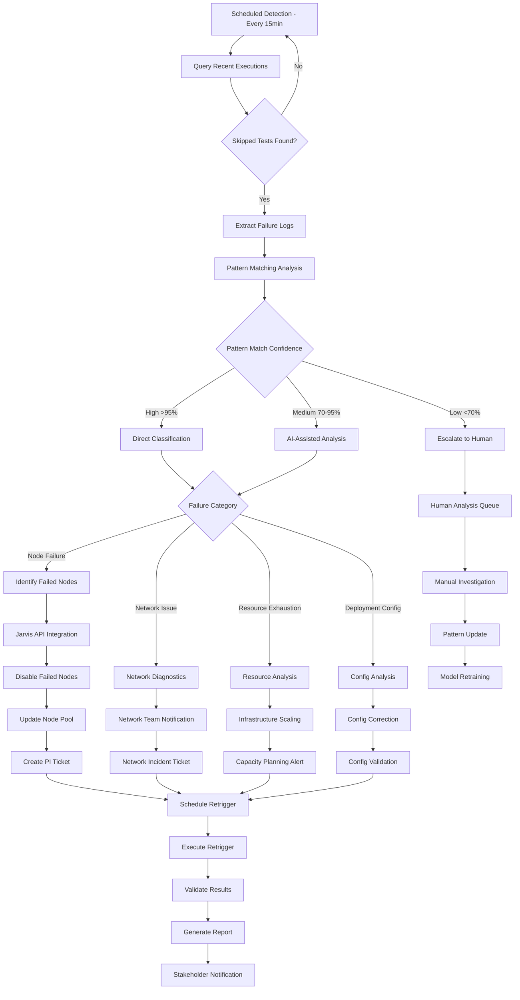

**Exception Flows:**
- **E1:** Jarvis API unavailable → Create manual ticket with detailed node information
- **E2:** Pattern matching confidence below threshold → Escalate to human analyst with context
- **E3:** Multiple remediation attempts fail → Escalate to infrastructure team with comprehensive logs
- **E4:** Cross-team dependencies detected → Coordinate with multiple teams through automated workflows

#### 7.2.2 Intermittent Issue Detection and Classification

**Use Case:** AI-powered identification of flaky tests and intermittent failures with statistical validation

**Actors:** AI System (Primary), QA Engineer (Secondary), Development Team (External)

**Trigger:** Continuous monitoring of test execution patterns

**Statistical Analysis Workflow:**

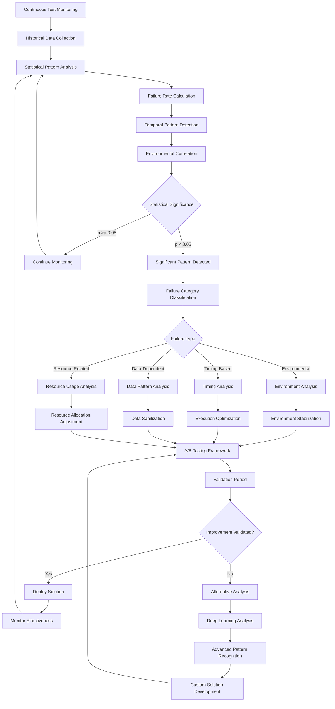

**Machine Learning Integration:**
- **Pattern Recognition Models:** Deep learning models for complex failure pattern identification
- **Anomaly Detection:** Real-time anomaly detection with adaptive thresholds
- **Predictive Analytics:** Failure probability prediction based on historical patterns and current context
- **Continuous Learning:** Model retraining with new failure patterns and resolution outcomes

#### 7.2.1 Skipped Testcase Analysis Pipeline
**Priority:** High

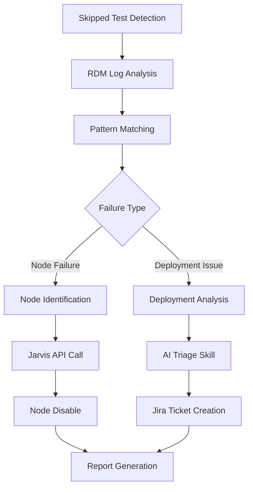

**Pipeline Components:**
1. **Monitoring Service**: Cron job checking for skipped tests every 15 minutes
2. **Pattern Analyzer**: Real-time analysis of RDM deployment failures
3. **Node Manager**: Automated Jarvis integration for node control
4. **Ticket Manager**: Automated Jira ticket creation for PI team
5. **Reporting Service**: Comprehensive failure analysis reports

#### 7.2.2 Intermittent Issue Detection Pipeline
**Priority:** High

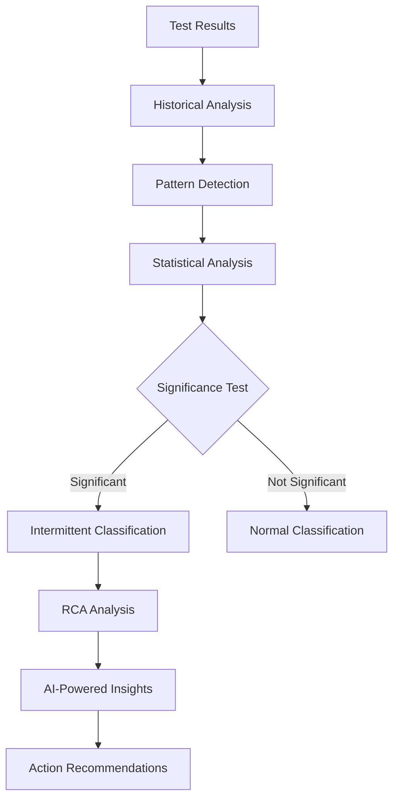

**Pipeline Features:**
- Continuous monitoring of test execution patterns
- Machine learning models for flaky test detection
- Automated root cause analysis workflow
- Integration with existing triage processes

### 11.1 Implementation Roadmap

#### Phase 1: Foundation Enhancement (Q3 2026)
**Duration:** 3 months | **Priority:** High | **Investment:** High

**Deliverables:**
- Multi-team access control implementation
- Enhanced security framework with audit compliance
- Performance optimization and scalability improvements
- Database migration from file-based to PostgreSQL

**Success Metrics:**
- Support 4 teams with complete data isolation
- Achieve 99.5% uptime during business hours
- Reduce page load times by 50%
- Complete zero-downtime database migration

#### Phase 2: Intelligent Automation (Q4 2026)
**Duration:** 4 months | **Priority:** High | **Investment:** High

**Deliverables:**
- Advanced skipped test analysis with RDM pattern matching
- Jarvis API integration for automated infrastructure management
- Enhanced AI classification with multi-model support
- Real-time streaming optimization with improved performance

**Success Metrics:**
- 90% accuracy in automated failure classification
- 70% reduction in manual intervention for infrastructure issues
- Sub-second real-time update latency
- 50% improvement in analysis processing speed

#### Phase 3: Predictive Intelligence (Q1 2027)
**Duration:** 3 months | **Priority:** Medium | **Investment:** Medium

**Deliverables:**
- Intermittent issue detection with machine learning models
- Predictive analytics for failure prevention
- Advanced pattern recognition with deep learning
- Comprehensive trend analysis and forecasting

**Success Criteria:**
- 85% accuracy in flaky test detection
- 60% reduction in test execution time through intelligent selection
- Predictive failure alerts with 48-hour lead time
- Automated root cause analysis for 80% of failures

#### Phase 4: Enterprise Integration (Q2 2027)
**Duration:** 3 months | **Priority:** Low | **Investment:** Medium

**Deliverables:**
- Advanced reporting with business intelligence integration
- API ecosystem with third-party tool integrations
- Mobile companion app for monitoring and alerts
- Advanced analytics dashboard with executive reporting

**Success Criteria:**
- Complete API ecosystem with 95%+ uptime
- Mobile app adoption by 70% of active users
- Executive dashboard usage by 100% of team leads
- 40% improvement in decision-making speed through analytics

---

## 12. Quality Assurance

### 12.1 Testing Strategy

**Testing Framework:**

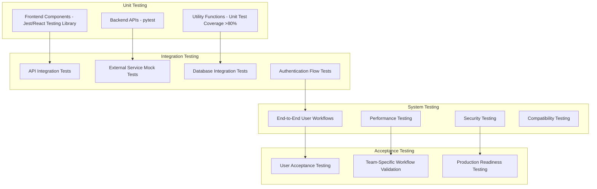

**Testing Requirements:**
- **Code Coverage:** Minimum 80% for critical functionality, 60% overall
- **Performance Testing:** Load testing with 100+ concurrent users
- **Security Testing:** Penetration testing and vulnerability assessment
- **Compatibility Testing:** Cross-browser and device compatibility validation
- **Regression Testing:** Automated regression suite for all major features

### 12.2 Quality Metrics and Monitoring

**Quality Metrics Dashboard:**
- **System Performance:** Response time, throughput, error rates, availability
- **User Experience:** Page load times, interaction responsiveness, error frequency
- **Business Metrics:** Feature adoption, workflow completion rates, user satisfaction
- **Technical Metrics:** Code quality, test coverage, deployment success rate, security compliance

**Continuous Monitoring:**
- **Application Performance Monitoring (APM):** Real-time performance tracking
- **User Analytics:** User behavior analysis and feature usage patterns
- **Error Tracking:** Comprehensive error logging and alerting
- **Security Monitoring:** Continuous security scanning and threat detection

---

## 13. Deployment and Operations

### 13.1 Deployment Architecture

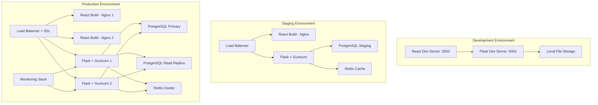

### 13.2 Operational Requirements

**Monitoring and Alerting:**
- **System Health:** CPU, memory, disk usage with automated alerts
- **Application Metrics:** Response times, error rates, throughput monitoring
- **Business Metrics:** User activity, feature usage, workflow success rates
- **Security Monitoring:** Authentication failures, suspicious activity, compliance violations

**Backup and Recovery:**
- **Automated Backups:** Hourly incremental, daily full, weekly comprehensive
- **Disaster Recovery:** RPO < 1 hour, RTO < 15 minutes for critical systems
- **Data Validation:** Automated backup integrity checks and restoration testing
- **Geographic Distribution:** Multi-region backup storage for disaster resilience

**Maintenance and Updates:**
- **Rolling Deployments:** Zero-downtime deployments with automated rollback
- **Dependency Management:** Automated security updates and vulnerability patches
- **Performance Optimization:** Regular performance tuning and capacity planning
- **Documentation Maintenance:** Automated documentation updates and validation

---

## 14. Constraints and Assumptions

### 8.1 Phase 1: Multi-Team Foundation (Q3 2026)
**Duration:** 3 months  
**Priority:** High

**Deliverables:**
- Team-based user management and authentication
- Team-specific dashboard configurations
- Role-based access control implementation
- Team data isolation and security

**Success Criteria:**
- All four teams (CDP, Central Regression, DR, PRISM_CENTRAL) can access team-specific dashboards
- Users can switch between authorized teams
- Data isolation prevents cross-team information leakage

### 8.2 Phase 2: Skipped Testcase Analysis (Q4 2026)
**Duration:** 4 months  
**Priority:** High

**Deliverables:**
- RDM deployment failure detection system
- Pattern matching engine for failure classification
- Jarvis API integration for automated node management
- Cron job implementation for continuous monitoring
- AI skill integration for intelligent triage

**Success Criteria:**
- 90% accuracy in RDM failure pattern detection
- Automated node disabling within 15 minutes of detection
- Reduced manual intervention by 70%

### 8.3 Phase 3: Intermittent Issue Intelligence (Q1 2027)
**Duration:** 3 months  
**Priority:** High

**Deliverables:**
- Machine learning models for flaky test detection
- Historical pattern analysis system
- Automated RCA workflow
- Predictive analytics dashboard
- Integration with existing AI systems

**Success Criteria:**
- Identify 85% of intermittent issues within 5 test runs
- Reduce false positive rate below 10%
- Automated RCA completion within 30 minutes

### 8.4 Phase 4: Advanced Automation & Intelligence (Q2 2027)
**Duration:** 3 months  
**Priority:** Medium

**Deliverables:**
- Enhanced AI-powered insights
- Predictive test selection algorithms
- Advanced reporting and analytics
- Performance optimization
- Database migration completion

**Success Criteria:**
- 40% improvement in test execution efficiency
- Real-time dashboard performance under 1 second
- Complete migration to scalable database system

---

## 9. Use Case Workflows

### 9.1 Primary Use Cases

#### 9.1.1 Regression Test Management Workflow
**Actor:** QA Engineer  
**Goal:** Execute comprehensive regression testing for a release

**Main Success Scenario:**
1. QA Engineer logs into team-specific dashboard
2. Creates new run plan with appropriate test selection
3. Configures resource requirements and scheduling
4. Triggers bulk execution across multiple environments
5. Monitors real-time execution progress
6. Reviews automated triage results
7. Validates AI-generated failure analysis
8. Approves/modifies recommended actions
9. Generates and distributes QI report

**Alternative Flows:**
- A1: Test failures require manual investigation
- A2: Resource constraints delay execution
- A3: External service unavailability

#### 9.1.2 Skipped Testcase Triage Workflow
**Actor:** System (Automated) / DevOps Engineer  
**Goal:** Automatically detect and resolve skipped tests due to infrastructure issues

**Main Success Scenario:**
1. Cron job detects skipped tests in recent runs
2. System analyzes RDM deployment logs
3. Pattern matching identifies node failure
4. System correlates failure with specific hardware node
5. Automated Jarvis API call disables problematic node
6. System creates Jira ticket for PI team with detailed analysis
7. AI skill generates comprehensive triage report
8. DevOps engineer reviews and approves automated actions
9. System schedules re-execution of affected tests

**Exception Flows:**
- E1: Jarvis API unavailable - manual notification sent
- E2: Pattern matching confidence below threshold - escalate to human
- E3: Multiple node failures - trigger alert for infrastructure review

#### 9.1.3 Intermittent Issue Investigation Workflow
**Actor:** QA Engineer / AI System  
**Goal:** Identify and classify flaky/intermittent test failures

**Main Success Scenario:**
1. AI system continuously monitors test execution patterns
2. Statistical analysis identifies tests with inconsistent results
3. System performs historical correlation analysis
4. Machine learning models classify failure patterns
5. Automated RCA workflow analyzes root causes
6. System generates actionable insights and recommendations
7. QA Engineer reviews AI findings and approves actions
8. System implements recommended fixes or escalates to development team
9. Continuous monitoring validates resolution effectiveness

### 9.2 Administrative Use Cases

#### 9.2.1 Team Onboarding Workflow
**Actor:** System Administrator  
**Goal:** Onboard new team to RegX-AI platform

**Main Success Scenario:**
1. Administrator creates team configuration
2. Sets up team-specific LDAP groups and permissions
3. Configures team dashboard layout and features
4. Creates initial run plan templates
5. Establishes integration with team-specific external services
6. Conducts team training and knowledge transfer
7. Monitors initial usage and performance
8. Adjusts configuration based on team feedback

---

## 10. Constraints and Assumptions

### 10.1 Technical Constraints
- **CONST-1**: Must maintain backward compatibility with existing API clients
- **CONST-2**: LDAP authentication integration is mandatory
- **CONST-3**: JSON/CSV data migration must be completed without data loss
- **CONST-4**: External service dependencies limit offline functionality
- **CONST-5**: Browser compatibility limited to evergreen browsers

### 10.2 Business Constraints
- **CONST-6**: Development timeline cannot exceed 12 months for full implementation
- **CONST-7**: System must support existing team workflows without disruption
- **CONST-8**: Licensing costs for AI services must remain within budget
- **CONST-9**: Compliance with corporate security and privacy policies

### 14.3 Assumptions
- **ASSUM-1**: External APIs will maintain stable interfaces during development
- **ASSUM-2**: Infrastructure teams will provide necessary Jarvis API access
- **ASSUM-3**: Teams are willing to adopt new workflow processes
- **ASSUM-4**: Sufficient compute resources available for AI processing
- **ASSUM-5**: Network connectivity to external services remains reliable
- **ASSUM-6**: LDAP/Active Directory integration will remain the primary authentication method
- **ASSUM-7**: Current team structures (CDP, Central Regression, DR, PRISM_CENTRAL) will remain stable
- **ASSUM-8**: Existing external service integrations will continue to be supported
- **ASSUM-9**: Performance requirements can be met with current technology stack
- **ASSUM-10**: Security and compliance requirements will remain within current scope

---

## 15. Template Guidelines

### 15.1 SRS Template Usage Instructions

This document serves as a comprehensive template for developing Software Requirements Specifications for regression dashboard systems and similar complex web applications. The following guidelines ensure consistent and effective use of this template:

#### 15.1.1 Template Adaptation Process

**Step 1: Project Initialization**
1. Copy this SRS template to your project repository
2. Update document metadata (version, dates, authors, project name)
3. Customize the project overview and scope sections
4. Adapt the table of contents based on project complexity

**Step 2: Requirements Customization**
1. Review all functional requirements (FR-001 through FR-034) and adapt to your project
2. Modify non-functional requirements (NFR-001 through NFR-011) based on performance needs
3. Update technology stack references to match your chosen architecture
4. Customize security requirements based on organizational policies

**Step 3: Architecture Adaptation**
1. Modify Mermaid diagrams to reflect your system architecture
2. Update external service integrations based on your ecosystem
3. Adapt data models to match your storage and processing requirements
4. Customize workflow diagrams for your specific business processes

**Step 4: Project-Specific Content**
1. Replace team names (CDP, DR, etc.) with your actual team structure
2. Update feature modules based on your application's functionality
3. Modify pipeline integration requirements for your CI/CD environment
4. Adapt quality assurance and deployment sections for your processes

#### 15.1.2 Documentation Standards

**Requirement Naming Convention:**
- **Functional Requirements:** FR-XXX (FR-001, FR-002, etc.)
- **Non-Functional Requirements:** NFR-XXX (NFR-001, NFR-002, etc.)
- **Security Requirements:** SEC-XXX (SEC-001, SEC-002, etc.)
- **User Interface Requirements:** UI-XXX (UI-001, UI-002, etc.)

**Mermaid Diagram Standards:**
- Use consistent node naming (PascalCase or camelCase)
- Wrap labels with special characters in quotes
- Avoid explicit colors (use default theme)
- Include descriptive titles and legends where appropriate

**Section Organization:**
- Maintain the 16-section structure for consistency
- Use hierarchical numbering (1.1, 1.2, 2.1, etc.)
- Include cross-references between related sections
- Provide clear acceptance criteria for all requirements

#### 15.1.3 Template Maintenance

**Version Control:**
- Maintain template version history with clear change logs
- Use semantic versioning (Major.Minor.Patch) for template releases
- Document breaking changes and migration guidelines
- Provide upgrade paths for existing projects using older template versions

**Content Updates:**
- Regular review and update of technology stack references
- Incorporation of new best practices and industry standards
- Addition of new requirement patterns based on project experience
- Refinement of workflow patterns and architectural guidance

### 15.2 Reusable Components

#### 15.2.1 Standard Requirement Templates

**Functional Requirement Template:**
```
**FR-XXX: [Requirement Name]**
- **Description:** [Detailed description of the requirement]
- **Input:** [Input parameters, data, or triggers]
- **Output:** [Expected outputs, results, or behaviors]
- **API Endpoints:** [Relevant API endpoints if applicable]
- **Acceptance Criteria:**
  - [Specific, measurable criteria for completion]
  - [Additional criteria as needed]
  - [Performance or quality expectations]
```

**Non-Functional Requirement Template:**
```
**NFR-XXX: [Requirement Category]**
- **Requirement:** [High-level requirement statement]
- **Metrics:**
  - [Specific measurable metrics]
  - [Performance targets with units]
  - [Quality attributes and thresholds]
- **Implementation:** [Technical approach or constraints]
```

#### 15.2.2 Workflow Documentation Template

**Business Workflow Template:**
```
**Workflow Name:** [Descriptive workflow name]
**Actors:** [Primary and secondary actors]
**Trigger:** [What initiates this workflow]
**Main Success Scenario:**
1. [Step-by-step workflow description]
2. [Include decision points and branches]
3. [Specify automation points and manual interventions]

**Exception Flows:**
- **E1:** [Exception condition] → [Resolution action]
- **E2:** [Alternative path] → [Handling procedure]

**Automation Opportunities:**
- [Potential automation points]
- [Current manual processes that could be automated]
- [Integration points with external systems]
```

### 15.3 Quality Assurance Guidelines

#### 15.3.1 Requirement Quality Checklist

**Completeness:**
- [ ] All functional requirements have clear acceptance criteria
- [ ] Non-functional requirements include measurable metrics
- [ ] External interfaces are fully specified
- [ ] Security requirements address all identified threats
- [ ] Performance requirements include realistic targets

**Consistency:**
- [ ] Requirements use consistent terminology throughout
- [ ] No conflicting requirements identified
- [ ] Cross-references between sections are accurate
- [ ] Naming conventions followed consistently

**Testability:**
- [ ] All requirements can be verified through testing
- [ ] Acceptance criteria are specific and measurable
- [ ] Performance metrics have clear measurement methods
- [ ] Success criteria are achievable and realistic

#### 15.3.2 Review Process Guidelines

**Review Stages:**
1. **Technical Review:** Architecture, feasibility, and technical accuracy
2. **Business Review:** Requirements alignment with business objectives
3. **Security Review:** Security and compliance requirement validation
4. **Stakeholder Review:** Cross-functional validation and approval

**Review Deliverables:**
- Requirements traceability matrix
- Risk assessment and mitigation plan
- Implementation effort estimation
- Quality assurance and testing strategy

---

## 16. Appendices

### 16.1 Glossary
| Term | Definition |
|------|------------|
| CDP | Cluster Data Path - team responsible for data path functionality |
| DR | Disaster Recovery - team managing backup and recovery systems |
| JITA | Job Integrated Test Automation - test execution framework |
| QI | Quality Index - metric measuring test execution quality |
| RCA | Root Cause Analysis - systematic problem analysis method |
| RDM | Resource Deployment Manager - cluster provisioning system |
| TCMS | Test Case Management System - testcase repository and management |

### 16.2 Reference Documents
- [PROJECT_DOCUMENTATION_AND_ARCHITECTURE.md](PROJECT_DOCUMENTATION_AND_ARCHITECTURE.md)
- [AGENTS.md](AGENTS.md)
- [README.md](README.md)
- [.cursor/skills/triage-rdm-deployment-failure/SKILL.md](.cursor/skills/triage-rdm-deployment-failure/SKILL.md)
- [.cursor/skills/regx-ai/SKILL.md](.cursor/skills/regx-ai/SKILL.md)

### 16.3 Complete API Endpoint Reference
Current API endpoints (prefix: `/mcp/regression/`):

**Authentication:**
- `POST /auth/login` - User authentication
- `GET /auth/me` - Token validation
- `POST /auth/logout` - Session termination

**Dashboard & Configuration:**
- `GET /home` - Dashboard data
- `GET|POST /config` - System configuration
- `GET /branches` - Available branches
- `GET /triage-count` - Triage metrics
- `GET /qi-summary` - Quality index data

**Run Management:**
- `GET|POST /run-plan` - Run plan CRUD operations
- `POST /run-plan/bulk-trigger` - Bulk execution
- `GET /run-plan/calendar` - Calendar view
- `GET /run-plan/history` - Execution history

**Analysis & Triage:**
- `GET /failed-analysis/analyze` - Failure analysis
- `GET /failed-analysis/analyze-stream` - Streaming analysis (SSE)
- `POST /failed-analysis/rdm-analyze-ai` - AI-powered RDM analysis
- `PUT /failed-analysis/update-triage` - Triage updates

**AI Integration:**
- `POST /cursor-ai/chat` - AI chat interface
- `GET /cursor-ai/mcp-servers` - MCP server status
- `POST /ai-analysis/bulk-issues` - Batch analysis
- `POST /ai-analysis/deep-triage` - Advanced triage

### 16.4 Technology Stack Details
| Layer | Technology | Version | Purpose |
|-------|------------|---------|---------|
| Frontend | React | 19.2.3 | User interface framework |
| Frontend | Axios | 1.6.0 | HTTP client library |
| Frontend | React Markdown | 10.1.0 | Markdown rendering |
| Backend | Flask | 3.0.0 | Web application framework |
| Backend | Flask-CORS | 4.0.0 | Cross-origin resource sharing |
| Backend | Pandas | 2.1.4 | Data processing and analysis |
| Authentication | ldap3 | ≥2.9.1 | LDAP client library |
| Authentication | PyJWT | ≥2.8.0 | JWT token handling |
| Data Processing | openpyxl | 3.1.2 | Excel file handling |
| HTTP Client | requests | 2.31.0 | External API integration |

### 16.5 Requirements Traceability Matrix

| Business Need | Functional Requirements | Non-Functional Requirements | Implementation Priority | Verification Method |
|---------------|------------------------|----------------------------|------------------------|-------------------|
| **Multi-Team Regression Management** | FR-001, FR-032, FR-033, FR-034 | NFR-007, NFR-008 | High | Integration Testing, UAT |
| **Intelligent Failure Analysis** | FR-012, FR-013, FR-014, FR-015 | NFR-001, NFR-002 | High | Performance Testing, AI Validation |
| **Automated Infrastructure Management** | FR-017, FR-030, FR-031 | NFR-004, NFR-005 | High | System Testing, Reliability Testing |
| **Real-Time Streaming Capabilities** | FR-012, FR-026 | NFR-001, NFR-003 | High | Load Testing, Performance Monitoring |
| **Comprehensive Reporting** | FR-027, FR-028 | NFR-009, NFR-010 | Medium | User Testing, Accessibility Testing |
| **AI-Powered Intelligence** | FR-023, FR-024, FR-025 | NFR-002, NFR-006 | Medium | AI Model Validation, Security Testing |
| **External Service Integration** | FR-019, FR-020, FR-021, FR-022 | NFR-005, NFR-011 | Medium | Integration Testing, API Testing |

### 16.6 Template Validation Checklist

**Documentation Completeness:**
- [ ] All 34 functional requirements documented with acceptance criteria
- [ ] All 11 non-functional requirements include measurable metrics  
- [ ] Complete API endpoint mapping (90+ endpoints documented)
- [ ] Comprehensive workflow diagrams for all major business processes
- [ ] Security requirements address authentication, authorization, and data protection
- [ ] Performance requirements specify measurable targets and monitoring approaches

**Template Structure Validation:**
- [ ] 16-section structure maintained for consistency
- [ ] Cross-references between sections are accurate and complete
- [ ] Mermaid diagrams follow established syntax and style guidelines
- [ ] Requirement naming conventions used consistently throughout
- [ ] Template guidelines provide clear adaptation instructions

**Technical Accuracy:**
- [ ] Current technology stack accurately documented
- [ ] External service integrations properly specified
- [ ] Architecture diagrams reflect actual system implementation
- [ ] Performance metrics align with system capabilities
- [ ] Security requirements meet organizational standards

**Business Alignment:**
- [ ] Requirements support identified business objectives
- [ ] Workflows reflect actual business processes
- [ ] Team structures and responsibilities accurately represented
- [ ] Success criteria are measurable and achievable
- [ ] Enhancement roadmap aligns with strategic goals

---

**Document Control:**
- **Author:** RegX-AI Development Team
- **Reviewers:** QA Team Leads, DevOps Engineers, Product Managers  
- **Approval:** [To be assigned]
- **Distribution:** All stakeholder teams and development personnel

**Change History:**
| Version | Date | Author | Changes |
|---------|------|--------|---------|
| 1.0 | July 4, 2026 | AI Assistant | Initial SRS document creation |
| 2.0 | July 4, 2026 | AI Assistant | Enhanced template with comprehensive architecture, 34 functional requirements, 11 NFRs, complete pipeline integration, detailed workflows, and template framework |

---

## Document Summary

This Enhanced Software Requirements Specification represents a comprehensive template and documentation framework for the RegX-AI Regression Dashboard system. The document serves dual purposes as both complete system documentation and a reusable template for similar projects.

**Key Achievements:**
- **Comprehensive Coverage:** 34 detailed functional requirements across 10 feature modules
- **Complete Architecture:** Multi-layer system architecture with 90+ API endpoints documented
- **Advanced Workflows:** Detailed business process flows with automation integration points
- **Template Framework:** Reusable sections and standards for future project development
- **Quality Assurance:** Comprehensive testing strategy and quality metrics framework

**Template Utility:**
This SRS template provides a production-ready framework for developing similar regression dashboard systems, with standardized requirement patterns, architectural guidance, and documentation conventions that can be adapted for various project scales and team structures.

**Implementation Readiness:**
All requirements include specific acceptance criteria, performance metrics, and implementation guidance, making this document suitable for immediate development project initiation with clear success criteria and validation methods.

---

*This document serves as both the comprehensive requirements specification for the RegX-AI Regression Dashboard enhancement project and a reusable template for similar system development initiatives. All requirements are structured for immediate implementation with clear acceptance criteria and stakeholder validation frameworks.*